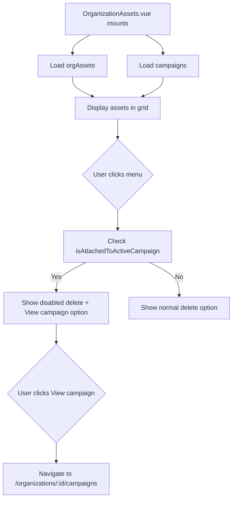

# Campaign Asset Delete Protection

## Problem

When an organization creates a campaign, the cover image is uploaded as an organization asset (type 'image') and stored in `cover_image_url`. If that asset is later deleted from the Organization Assets page, the campaign's cover image will break across the app (CampaignsPage.vue, CampaignDetailDialog.vue, etc.).

## Solution Overview

Modify [OrganizationAssets.vue](client/src/pages/organization/OrganizationAssets.vue) to:

1. Load organization campaigns on mount
2. Detect which assets are attached to active/running campaigns by comparing URLs
3. Disable delete functionality for attached assets with clear messaging
4. Add a "View attached campaign" button to navigate to the campaign

## Key Files to Modify

- **[client/src/pages/organization/OrganizationAssets.vue](client/src/pages/organization/OrganizationAssets.vue)** - Main file to modify

## Implementation Details

### 1. Import Campaign API and Load Campaigns

Add imports from `@/services/campaignApi`:

- `listOrganizationCampaigns`
- `type Campaign`

Add reactive state:

- `campaigns: ref<Campaign[]>([])`
- `campaignsLoaded: ref(false)`

Load campaigns in `onMounted` using `listOrganizationCampaigns(organizationId.value)`.

### 2. Create URL Matching Logic

Campaign cover images are stored without query params, but API responses may include presigned URL params. Create a helper function to strip query params for comparison:

```typescript
function getBaseUrl(url: string | null | undefined): string {
  if (!url) return '';
  try {
    const parsed = new URL(url);
    return parsed.origin + parsed.pathname;
  } catch {
    return url.split('?')[0];
  }
}
```

### 3. Create Campaign Detection Functions

```typescript
function getAttachedCampaign(asset: ServerOrganizationAsset): Campaign | null {
  if (asset.asset_type !== 'image') return null;
  const assetBaseUrl = getBaseUrl(asset.url);
  return campaigns.value.find(c => 
    c.status === 'active' && 
    getBaseUrl(c.cover_image_url) === assetBaseUrl
  ) || null;
}

function isAttachedToActiveCampaign(asset: ServerOrganizationAsset): boolean {
  return getAttachedCampaign(asset) !== null;
}
```

### 4. Modify Delete Button (Line ~169-178)

Current delete button in dropdown:

```vue
<button
  class="org-assets__dropdown-item org-assets__dropdown-item--danger"
  @click.stop="confirmDeleteAsset(asset); closeAssetMenu();"
>
  <Trash2 class="org-assets__dropdown-icon" />
  <span>Delete Asset</span>
</button>
```

Change to conditionally disable and style when attached to a campaign:

```vue
<button
  class="org-assets__dropdown-item"
  :class="{
    'org-assets__dropdown-item--danger': !isAttachedToActiveCampaign(asset),
    'org-assets__dropdown-item--disabled': isAttachedToActiveCampaign(asset)
  }"
  :disabled="isAttachedToActiveCampaign(asset)"
  @click.stop="!isAttachedToActiveCampaign(asset) && (confirmDeleteAsset(asset), closeAssetMenu())"
>
  <Trash2 class="org-assets__dropdown-icon" />
  <span v-if="isAttachedToActiveCampaign(asset)">In use by campaign</span>
  <span v-else>Delete Asset</span>
</button>
```

### 5. Add "View Attached Campaign" Button

Add a new button in the dropdown menu (after the divider, before delete):

```vue
<template v-if="getAttachedCampaign(asset)">
  <button
    class="org-assets__dropdown-item"
    @click.stop="viewAttachedCampaign(asset); closeAssetMenu();"
  >
    <Megaphone class="org-assets__dropdown-icon" />
    <span>View attached campaign</span>
  </button>
  <div class="org-assets__dropdown-divider"></div>
</template>
```

Add navigation function:

```typescript
function viewAttachedCampaign(asset: ServerOrganizationAsset) {
  const campaign = getAttachedCampaign(asset);
  if (campaign && organizationId.value) {
    router.push(`/organizations/${organizationId.value}/campaigns`);
  }
}
```

Import `Megaphone` icon from lucide-vue-next and add `useRouter`.

### 6. Add Disabled Styling

Add CSS for the disabled state:

```css
.org-assets__dropdown-item--disabled {
  opacity: 0.5;
  cursor: not-allowed;
  color: var(--sidebar-text-muted);
}

.org-assets__dropdown-item--disabled:hover {
  background-color: transparent;
  color: var(--sidebar-text-muted);
}
```

## Data Flow



## Edge Cases Handled

- Assets that are not images (always deletable)
- Campaigns that are not active (paused/completed/draft - assets deletable)
- URL comparison handles presigned URLs with query params
- Assets uploaded but not yet attached to any campaign