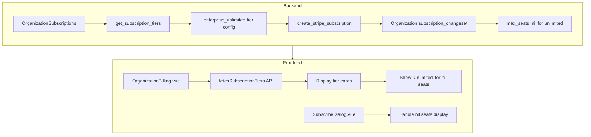

# Enterprise Unlimited Subscription Tier

## Summary

Add a new top-tier organization subscription plan called "Enterprise Unlimited" with the following specifications:

- **Price**: $1,800/month
- **Seats**: Unlimited (represented as `nil` in the system)
- **Monthly Credits**: 100,000

## Current Tier Structure

The existing organization subscription tiers are defined in [server/lib/clippster_server/organization_subscriptions.ex](server/lib/clippster_server/organization_subscriptions.ex):

```elixir
@org_subscription_tiers %{
  "enterprise_base" => %{name: "Enterprise Base", seats: 5, monthly_credits: 0, usd: 300},
  "enterprise_ai" => %{name: "Enterprise AI", seats: 5, monthly_credits: 20_000, usd: 500}
}
```

## Backend Changes

### 1. Add Tier Definition

File: `server/lib/clippster_server/organization_subscriptions.ex`

Add the new tier to `@org_subscription_tiers`:

```elixir
"enterprise_unlimited" => %{name: "Enterprise Unlimited", seats: nil, monthly_credits: 100_000, usd: 1800}
```

Note: `seats: nil` represents unlimited seats in this system (same as legacy organizations).

### 2. Update Organization Schema Validation

File: `server/lib/clippster_server/organizations/organization.ex`

Update the `subscription_changeset/2` validation to include the new tier:

```elixir
|> validate_inclusion(:subscription_tier, ["enterprise_base", "enterprise_ai", "enterprise_unlimited", nil])
```

### 3. Update Promo Code Validation

File: `server/lib/clippster_server/promo_codes/promo_code.ex`

Update `valid_org_tiers` in `validate_allowed_org_tiers/1` to include the new tier:

```elixir
valid_org_tiers = [
  "enterprise",
  "enterprise_ai",
  "enterprise_unlimited",  # Add this
  "addon_5_seats",
  ...
]
```

## Frontend Changes

### 4. Handle Unlimited Seats Display in Billing Page

File: `client/src/pages/organization/OrganizationBilling.vue`

Update the plan card feature to handle unlimited seats:

- Change `{{ tier.seats }} team seats` to display "Unlimited team seats" when `tier.seats` is `nil`

### 5. Handle Unlimited Seats in Subscribe Dialog

File: `client/src/components/SubscribeDialog.vue`

Update the seats display logic:

- Currently: `v-if="context === 'organization' && plan.seats"` hides the section when seats is nil
- Should display "Unlimited Team Seats" when `plan.seats` is `nil` for the unlimited tier

### 6. Handle Subscription Status Display

The billing page subscription card already handles unlimited seats gracefully:

```vue
{{ subscription?.total_seats || '∞' }}
```

This will show the infinity symbol for unlimited seats.

## Data Flow



## Testing Considerations

- Verify that organizations with the new tier can add members without hitting seat limits
- Verify that 100,000 credits are granted on subscription creation and renewal
- Verify that the Stripe checkout flow works with the new tier pricing
- Verify promo codes can be applied to the new tier if configured