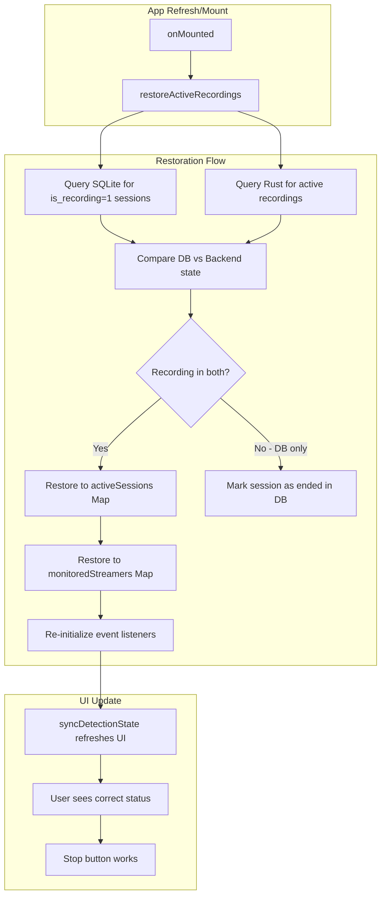

# Fix UI Session State After Refresh

## Problem

When the user refreshes the app during an active auto-detection or recording session:

- The frontend Vue reactive state (`activeSessions`, `monitoredStreamers`, `dvrSessions`) is lost
- The Rust backend continues running the recording processes
- The UI shows nothing is happening, and users cannot stop the processes

## Solution Architecture



## Implementation Steps

### 1. Add Tauri Commands to Query Active Recordings

Add new commands in the Rust backend to expose which recordings are currently active:

**[client/src-tauri/src/pumpfun.rs](client/src-tauri/src/pumpfun.rs)**

```rust
#[tauri::command]
pub fn get_active_pumpfun_recordings() -> Vec<String> {
    ACTIVE_RECORDINGS.lock().unwrap().keys().cloned().collect()
}
```

**[client/src-tauri/src/kick.rs](client/src-tauri/src/kick.rs)**

```rust
#[tauri::command]
pub fn get_active_kick_recordings() -> Vec<String> {
    KICK_ACTIVE_RECORDINGS.lock().unwrap().keys().cloned().collect()
}
```

**[client/src-tauri/src/twitch.rs](client/src-tauri/src/twitch.rs)**

```rust
#[tauri::command]
pub fn get_active_twitch_recordings() -> Vec<String> {
    TWITCH_ACTIVE_RECORDINGS.lock().unwrap().keys().cloned().collect()
}
```

**[client/src-tauri/src/lib.rs](client/src-tauri/src/lib.rs)** - Register the new commands in the invoke handler.

### 2. Add Restoration Function in useLivestreamMonitoring

**[client/src/composables/useLivestreamMonitoring.ts](client/src/composables/useLivestreamMonitoring.ts)**

Add a new `restoreActiveRecordings()` function that:

1. Queries `getActiveLivestreamSessions()` from SQLite (sessions where `is_recording = 1`)
2. Invokes the Rust commands to get actually running recordings
3. For each session in the database:

   - If the recording is still running in Rust: restore it to `activeSessions` and `monitoredStreamers`
   - If the recording is NOT running in Rust: call `endLivestreamSession()` to mark it as ended

4. Re-initialize Tauri event listeners if needed

Key code additions:

```typescript
async function restoreActiveRecordings(): Promise<void> {
  // 1. Get sessions marked as recording in DB
  const dbSessions = await getActiveLivestreamSessions();
  
  // 2. Get actually running recordings from Rust
  const [pumpfunActive, kickActive, twitchActive] = await Promise.all([
    invoke<string[]>('get_active_pumpfun_recordings'),
    invoke<string[]>('get_active_kick_recordings'),
    invoke<string[]>('get_active_twitch_recordings'),
  ]);
  
  // 3. Create lookup sets
  const activeInBackend = new Set([...pumpfunActive, ...kickActive, ...twitchActive]);
  
  // 4. Process each DB session
  for (const session of dbSessions) {
    if (activeInBackend.has(session.mint_id)) {
      // Restore to frontend state
      const streamer = await getMonitoredStreamer(session.monitored_streamer_id);
      if (streamer) {
        // Restore to monitoredStreamers and activeSessions maps
        // ...
      }
    } else {
      // Recording stopped but DB wasn't updated - clean up
      await endLivestreamSession(session.id);
    }
  }
  
  // 5. Re-initialize event listeners
  await initializeListeners();
}
```

### 3. Call Restoration on App Mount

**[client/src/pages/LiveClip.vue](client/src/pages/LiveClip.vue)**

Modify `onMounted` to call restoration before other initialization:

```typescript
onMounted(async () => {
  await restoreActiveRecordings(); // NEW: Restore state from backend
  await loadStreamers();
  refreshStreamerMetadata();
  syncDetectionState();
  // ... rest of initialization
});
```

### 4. Export New Function from Composable

Update the return object of `useLivestreamMonitoring()` to include `restoreActiveRecordings`.

## Files to Modify

- `client/src-tauri/src/pumpfun.rs` - Add `get_active_pumpfun_recordings` command
- `client/src-tauri/src/kick.rs` - Add `get_active_kick_recordings` command  
- `client/src-tauri/src/twitch.rs` - Add `get_active_twitch_recordings` command
- `client/src-tauri/src/lib.rs` - Register new commands
- `client/src/composables/useLivestreamMonitoring.ts` - Add `restoreActiveRecordings` function
- `client/src/pages/LiveClip.vue` - Call restoration on mount

## Edge Cases Handled

- **Recording crashed between sessions**: DB shows `is_recording=1` but Rust has no active recording - clean up DB state
- **Multiple streamers**: Each streamer's session is individually checked and restored
- **Platform-specific recordings**: PumpFun, Kick, and Twitch each have their own tracking
- **Event listeners**: Re-initialized to ensure segment-ready and other events are captured