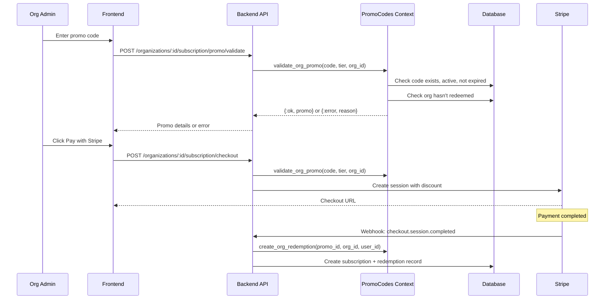

# Add Discount Codes to Organization Purchasing Flows

## Current Architecture

The existing promo code system is user-scoped:

- `promo_codes` table stores codes with `allowed_tiers` for user subscription tiers
- `promo_redemptions` tracks usage by `user_id`
- Stripe integration creates coupons and promotion codes
- Frontend only shows promo input when `context === 'user'`

## Implementation Plan

### 1. Database Schema Changes

**Extend `promo_codes` table** in [server/lib/clippster_server/promo_codes/promo_code.ex](server/lib/clippster_server/promo_codes/promo_code.ex):

- Add `allowed_org_tiers` field (array of strings) for organization subscription tiers
- Add `allowed_credit_packs` field (array of strings) for credit pack types
- Update validation to accept org tier IDs: `["enterprise", "enterprise_ai", "addon_5_seats", etc.]`

**Extend `promo_redemptions` table** in [server/lib/clippster_server/promo_codes/promo_redemption.ex](server/lib/clippster_server/promo_codes/promo_redemption.ex):

- Add `organization_id` field (nullable, for org redemptions)
- Add unique constraint on `(promo_code_id, organization_id)` for org-level tracking

**Migration file** to add new columns:

```elixir
alter table(:promo_codes) do
  add :allowed_org_tiers, {:array, :string}, default: []
  add :allowed_credit_packs, {:array, :string}, default: []
end

alter table(:promo_redemptions) do
  add :organization_id, references(:organizations, on_delete: :nilify_all)
end

create unique_index(:promo_redemptions, [:promo_code_id, :organization_id], 
  where: "organization_id IS NOT NULL", name: :promo_redemptions_org_unique)
```

### 2. Backend Context Changes

**Update `ClippsterServer.PromoCodes`** in [server/lib/clippster_server/promo_codes.ex](server/lib/clippster_server/promo_codes.ex):

Add new validation function:

```elixir
def validate_org_promo(code, tier_or_pack, organization_id, type \\ :subscription)
```

Where `type` is `:subscription` or `:credit_pack`, checking:

- `allowed_org_tiers` for subscriptions
- `allowed_credit_packs` for credit packs
- `org_already_redeemed?(promo.id, organization_id)` instead of user check

Add redemption tracking:

```elixir
def create_org_redemption(promo_code_id, organization_id, user_id, stripe_data \\ %{})
```

### 3. Backend Controller Changes

**OrganizationSubscriptionController** in [server/lib/clippster_server_web/controllers/organization_subscription_controller.ex](server/lib/clippster_server_web/controllers/organization_subscription_controller.ex):

- `checkout/2`: Accept `promo_code` param, validate, add discount to Stripe session
- `addon_checkout/2`: Accept `promo_code` param, validate, add discount
- `crypto_quote/2`: Accept `promo_code`, return discounted price
- `crypto_confirm/2`: Accept `promo_code`, create org redemption record

**StripeController** in [server/lib/clippster_server_web/controllers/stripe_controller.ex](server/lib/clippster_server_web/controllers/stripe_controller.ex):

- `create_org_checkout_session/2`: Accept `promo_code` param for credit packs

**PaymentController** in [server/lib/clippster_server_web/controllers/payment_controller.ex](server/lib/clippster_server_web/controllers/payment_controller.ex):

- `get_org_quote/2`: Accept `promo_code`, return discounted price
- `confirm_org_payment/2`: Accept `promo_code`, create org redemption

### 4. Frontend Changes

**SubscribeDialog.vue** in [client/src/components/SubscribeDialog.vue](client/src/components/SubscribeDialog.vue):

- Remove `v-if="context === 'user'"` condition on promo code section (line 159)
- Update `validatePromoCode()` to pass organization context when applicable
- Update `initiateStripePayment()` to include promo code for org context
- Update `initiateCryptoPayment()` to include promo code for org context

**BuyCreditsModal.vue** in [client/src/components/organization/BuyCreditsModal.vue](client/src/components/organization/BuyCreditsModal.vue):

Add promo code section (similar to SubscribeDialog):

- Add promo code input UI in confirm step
- Add state: `showPromoCode`, `promoCode`, `validatedPromo`, `validatingPromo`, `promoError`
- Add `validatePromoCode()` function calling new API endpoint
- Update `initiateStripePayment()` to pass promo code
- Update `initiateCryptoPayment()` to pass promo code
- Show discounted price when promo applied

**promoCodesApi.ts** in [client/src/services/promoCodesApi.ts](client/src/services/promoCodesApi.ts):

Add new function:

```typescript
export async function validateOrgPromoCode(
  code: string,
  organizationId: string,
  tier: string,
  type: 'subscription' | 'credit_pack'
): Promise<ValidatePromoResponse>
```

### 5. Admin Panel Updates

**AdminDiscountCodes.vue** (or equivalent admin page):

- Add UI to configure `allowed_org_tiers` when creating/editing promo codes
- Add UI to configure `allowed_credit_packs`
- Show organization redemptions in redemption history

**AdminController** in [server/lib/clippster_server_web/controllers/admin_controller.ex](server/lib/clippster_server_web/controllers/admin_controller.ex):

- Update `create_promo/2` to accept `allowed_org_tiers` and `allowed_credit_packs`
- Update promo listing to include new fields

## Data Flow Diagram



## Key Files to Modify

**Backend:**

- `server/lib/clippster_server/promo_codes.ex` - Add org validation and redemption
- `server/lib/clippster_server/promo_codes/promo_code.ex` - Add new fields
- `server/lib/clippster_server/promo_codes/promo_redemption.ex` - Add org_id field
- `server/lib/clippster_server_web/controllers/organization_subscription_controller.ex` - Add promo support
- `server/lib/clippster_server_web/controllers/stripe_controller.ex` - Add promo to org checkout
- `server/lib/clippster_server_web/controllers/payment_controller.ex` - Add promo to org payments
- `server/lib/clippster_server_web/controllers/admin_controller.ex` - Update promo CRUD
- `server/lib/clippster_server_web/router.ex` - Add validation endpoint

**Frontend:**

- `client/src/components/SubscribeDialog.vue` - Enable promo for org context
- `client/src/components/organization/BuyCreditsModal.vue` - Add promo code UI
- `client/src/services/promoCodesApi.ts` - Add org validation function

**New Migration:**

- `server/priv/repo/migrations/YYYYMMDDHHMMSS_add_org_promo_support.exs`