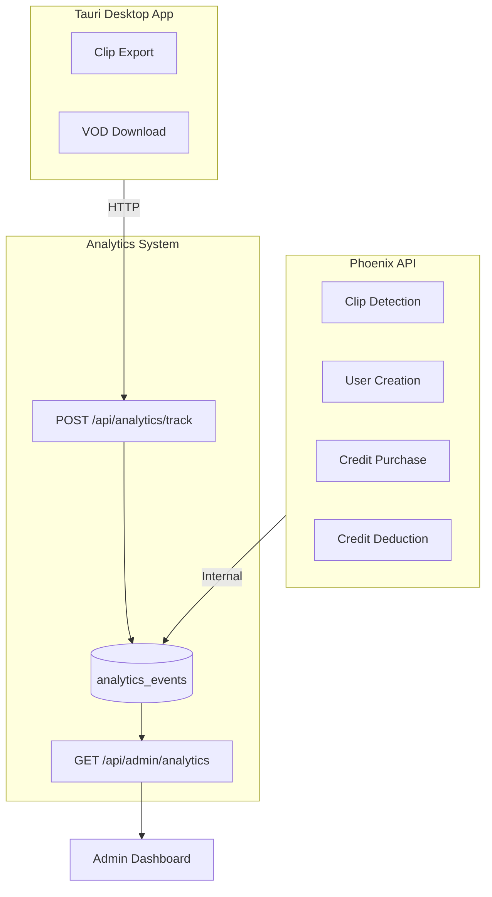

# Action Tracking Analytics Implementation Plan

## Overview

Implement a centralized analytics tracking system that captures key user actions from both client-side (Tauri desktop app) and server-side operations, storing them in PostgreSQL and displaying counts in the admin dashboard.

## Current State Analysis

The codebase already has some tracking infrastructure:

- `ai_usage_logs` table tracks AI operations (transcription, clip generation)
- `credit_transactions` tracks credit purchases
- `processing_jobs` tracks job processing
- No unified analytics for exports, downloads, or user registration events

## Architecture




## Database Schema

Create a new `analytics_events` table:

```sql
analytics_events:
- id (bigint, primary key)
- event_type (string, indexed) -- 'clip_detection', 'clip_export', 'vod_download', 'user_created', 'credits_purchased', 'credits_spent'
- user_id (bigint, foreign key, nullable) -- null for anonymous events
- metadata (jsonb) -- flexible data: duration, amount, platform, etc.
- inserted_at (utc_datetime)
```


## Implementation Steps

### 1. Backend - Database Migration and Schema

Create migration at [`server/priv/repo/migrations/TIMESTAMP_create_analytics_events.exs`](server/priv/repo/migrations)Create Ecto schema at [`server/lib/clippster_server/analytics/analytics_event.ex`](server/lib/clippster_server/analytics/analytics_event.ex)Create context module at [`server/lib/clippster_server/analytics.ex`](server/lib/clippster_server/analytics.ex) with:

- `track_event/3` - Record an event
- `get_event_counts/0` - Get counts for all event types
- `get_event_counts_by_date_range/2` - Get counts with date filtering

### 2. Backend - API Endpoints

Add to [`server/lib/clippster_server_web/router.ex`](server/lib/clippster_server_web/router.ex):

- `POST /api/analytics/track` - Client-facing event tracking endpoint
- `GET /api/admin/analytics` - Admin dashboard stats endpoint

Create controller at [`server/lib/clippster_server_web/controllers/analytics_controller.ex`](server/lib/clippster_server_web/controllers/analytics_controller.ex)

### 3. Backend - Instrument Existing Code

Modify these files to call `Analytics.track_event/3`:| File | Event Type | Trigger Point ||------|------------|---------------|| [`accounts.ex`](server/lib/clippster_server/accounts.ex) | `user_created` | After `create_user/1` and `create_oauth_user/3` || [`clips_controller.ex`](server/lib/clippster_server_web/controllers/clips_controller.ex) | `clip_detection` | After successful clip detection || [`credits.ex`](server/lib/clippster_server/credits.ex) | `credits_purchased` | In `create_stripe_transaction/1` || [`credits.ex`](server/lib/clippster_server/credits.ex) | `credits_spent` | In `deduct_credits/2` |

### 4. Frontend - Analytics Service

Create [`client/src/services/analytics.ts`](client/src/services/analytics.ts):

- `trackEvent(eventType, metadata)` function that POSTs to `/api/analytics/track`

### 5. Frontend - Instrument Client Actions

| File | Event Type | Trigger Point ||------|------------|---------------|| [`ExportTab.vue`](client/src/components/clip-editor/tabs/ExportTab.vue) | `clip_export` | After successful `handleExport()` || [`useDownloads.ts`](client/src/composables/useDownloads.ts) | `vod_download` | After successful `startDownload()` |

### 6. Frontend - Admin Dashboard Update

Update [`Admin.vue`](client/src/pages/Admin.vue):

- Add new "Analytics" tab
- Display stat cards for each event type count
- Show recent trends (optional: daily/weekly breakdown)

## API Response Format

```json
GET /api/admin/analytics
{
  "success": true,
  "stats": {
    "clip_detection": { "total": 1250, "today": 45, "this_week": 312 },
    "clip_export": { "total": 890, "today": 32, "this_week": 198 },
    "vod_download": { "total": 2100, "today": 78, "this_week": 456 },
    "user_created": { "total": 156, "today": 3, "this_week": 12 },
    "credits_purchased": { "total": 89, "today": 2, "this_week": 8 },
    "credits_spent": { "total": 4500, "today": 120, "this_week": 890 }
  }
}
```


## Files to Create/Modify

**New Files:**

- `server/priv/repo/migrations/*_create_analytics_events.exs`
- `server/lib/clippster_server/analytics/analytics_event.ex`
- `server/lib/clippster_server/analytics.ex`
- `server/lib/clippster_server_web/controllers/analytics_controller.ex`
- `client/src/services/analytics.ts`

**Modified Files:**

- `server/lib/clippster_server_web/router.ex` (add routes)
- `server/lib/clippster_server/accounts.ex` (track user_created)
- `server/lib/clippster_server_web/controllers/clips_controller.ex` (track clip_detection)
- `server/lib/clippster_server/credits.ex` (track credits_purchased, credits_spent)
- `client/src/components/clip-editor/tabs/ExportTab.vue` (track clip_export)