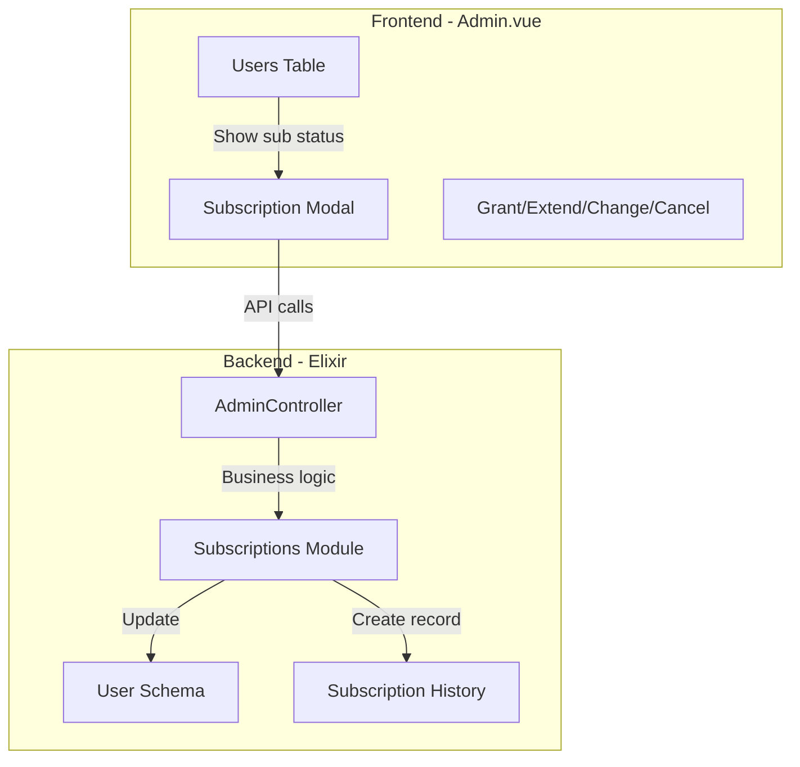

# Admin Subscription Management

## Overview

Add comprehensive admin subscription controls to allow manually managing user subscriptions (grant, extend, change tier, cancel) similar to the existing credit management functionality, with an optional checkbox to include monthly credits.

## Current State

- Users table shows ID, account, role, credits, and created date
- Credits can be manually added via "Add Credits" button
- No subscription information is displayed or manageable
- Subscription tiers: starter (600 credits), creator (1800 credits), pro (9000 credits)

## Architecture




## Backend Changes

### 1. Add Admin Functions to Subscriptions Module

File: [`server/lib/clippster_server/subscriptions.ex`](server/lib/clippster_server/subscriptions.ex)Add new admin functions:

```elixir
# Admin-initiated subscription grant
def admin_grant_subscription(user_id, tier, days \\ 30, grant_credits \\ false)

# Admin-initiated subscription extension  
def admin_extend_subscription(user_id, days, grant_credits \\ false)

# Admin-initiated tier change
def admin_change_tier(user_id, new_tier, grant_credits \\ false)

# Admin-initiated cancellation
def admin_cancel_subscription(user_id)
```


### 2. Add Admin Controller Endpoints

File: [`server/lib/clippster_server_web/controllers/admin_controller.ex`](server/lib/clippster_server_web/controllers/admin_controller.ex)Add endpoints:

- `grant_subscription/2` - POST with tier, days, grant_credits params
- `extend_subscription/2` - PUT with days, grant_credits params
- `change_subscription_tier/2` - PUT with tier, grant_credits params
- `cancel_user_subscription/2` - POST to cancel
- `get_subscription_history/2` - GET subscription history

Update `list_users/2` to include subscription info in response.

### 3. Add Admin Routes

File: [`server/lib/clippster_server_web/router.ex`](server/lib/clippster_server_web/router.ex)Add to admin scope:

```elixir
post "/admin/users/:user_id/subscription", AdminController, :grant_subscription
put "/admin/users/:user_id/subscription/extend", AdminController, :extend_subscription
put "/admin/users/:user_id/subscription/tier", AdminController, :change_subscription_tier
post "/admin/users/:user_id/subscription/cancel", AdminController, :cancel_user_subscription
get "/admin/users/:user_id/subscription/history", AdminController, :get_subscription_history
```


## Frontend Changes

### 1. Update Users Table Display

File: [`client/src/pages/Admin.vue`](client/src/pages/Admin.vue)Add "Subscription" column to users table showing:

- Tier badge (Starter/Creator/Pro or "None")
- Status indicator (Active/Cancelled/Expired)
- Days remaining

### 2. Add Subscription Management Modal

Add a new modal component with:

- Current subscription status display
- **Grant Section**: Tier dropdown, days input (default 30), "Include Credits" checkbox
- **Extend Section**: Days input, "Include Credits" checkbox  
- **Tier Change Section**: New tier dropdown, "Include Credits" checkbox
- **Cancel Button**: With confirmation
- **History Section**: Table of past subscription records

### 3. Update User Interface Type

Add subscription fields to the User interface:

```typescript
interface User {
  // ... existing fields
  subscription: {
    status: string;
    tier: string | null;
    tier_name: string | null;
    start_date: string | null;
    end_date: string | null;
    days_remaining: number;
  };
}
```


## Implementation Order

1. Backend: Add admin functions to subscriptions.ex
2. Backend: Add controller endpoints and routes
3. Frontend: Update User interface and list_users response handling
4. Frontend: Add subscription column to users table