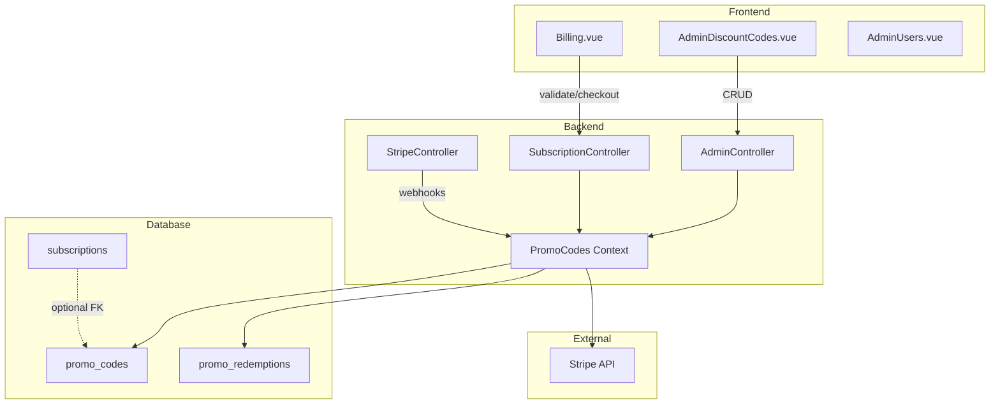

# Discount Codes Implementation Plan

This plan implements the discount/promo code feature as specified in [DISCOUNT_CODES_IMPLEMENTATION_PLAN.md](docs/DISCOUNT_CODES_IMPLEMENTATION_PLAN.md).

## Architecture Overview



---

## Phase 1: Database Schema

Create two new tables and optionally extend subscriptions.

### Migration: `promo_codes` table

```elixir
# priv/repo/migrations/TIMESTAMP_create_promo_codes.exs
create table(:promo_codes, primary_key: false) do
  add :id, :binary_id, primary_key: true
  add :code, :string, null: false
  add :name, :string
  add :percent_off, :integer, null: false
  add :duration_kind, :string, null: false, default: "repeating"
  add :duration_months, :integer
  add :allowed_tiers, {:array, :string}, null: false
  add :max_redemptions, :integer
  add :redeem_by, :utc_datetime
  add :is_active, :boolean, null: false, default: true
  add :created_by_admin_id, references(:users), null: false
  add :stripe_coupon_id, :string
  add :stripe_promo_code_id, :string
  add :notes, :text
  timestamps(type: :utc_datetime)
end

create unique_index(:promo_codes, [:code])
create index(:promo_codes, [:is_active, :redeem_by])
create index(:promo_codes, [:stripe_coupon_id])
```

### Migration: `promo_redemptions` table

```elixir
# priv/repo/migrations/TIMESTAMP_create_promo_redemptions.exs
create table(:promo_redemptions, primary_key: false) do
  add :id, :binary_id, primary_key: true
  add :promo_code_id, references(:promo_codes, type: :binary_id), null: false
  add :user_id, references(:users), null: false
  add :stripe_customer_id, :string
  add :stripe_subscription_id, :string
  add :stripe_invoice_id, :string
  add :redeemed_at, :utc_datetime, null: false
  add :status, :string, null: false, default: "active"
  timestamps(type: :utc_datetime)
end

create index(:promo_redemptions, [:promo_code_id, :status])
create index(:promo_redemptions, [:user_id])
create index(:promo_redemptions, [:stripe_subscription_id])
```

### Optional: Add `promo_code_id` to subscriptions

```elixir
alter table(:subscriptions) do
  add :promo_code_id, references(:promo_codes, type: :binary_id)
end
```

---

## Phase 2: Backend Context and Schemas

### New files to create:

- `lib/clippster_server/promo_codes/promo_code.ex` - Schema for promo codes
- `lib/clippster_server/promo_codes/promo_redemption.ex` - Schema for redemptions  
- `lib/clippster_server/promo_codes.ex` - Context module with business logic

### Key functions in `PromoCodes` context:

```elixir
# Core validation
def validate_promo(code, tier, user_id)

# Admin CRUD
def create_promo_code(attrs, admin_id)
def update_promo_code(promo, attrs)
def toggle_active(promo, active)
def list_promo_codes(filters)
def get_promo_code(id)
def get_promo_with_stats(id)

# Redemption tracking
def create_redemption(promo_code_id, user_id, stripe_data)
def update_redemption_status(redemption, status)
def get_redemption_by_subscription(stripe_subscription_id)
```

### Stripe helper functions (in `PromoCodes` or separate module):

```elixir
def create_stripe_coupon(percent_off, duration_kind, duration_months)
def create_stripe_promotion_code(coupon_id, code, max_redemptions, expires_at)
def deactivate_stripe_promotion_code(promo_code_id)
```

---

## Phase 3: Admin API Endpoints

Add to [router.ex](server/lib/clippster_server_web/router.ex) in the `api_admin` scope:

```elixir
# Admin promo code management
get "/admin/promos", AdminController, :list_promos
get "/admin/promos/:id", AdminController, :get_promo
post "/admin/promos", AdminController, :create_promo
patch "/admin/promos/:id", AdminController, :update_promo
```

### Controller functions in `AdminController`:

- `list_promos/2` - Filters: `is_active`, `tier`, `expired`, `search`; includes usage stats
- `get_promo/2` - Detail view with paginated redemption list
- `create_promo/2` - Creates Stripe coupon + promotion code, stores IDs, audit log
- `update_promo/2` - Toggle active, edit limits/expiry/notes, sync to Stripe

---

## Phase 4: Public API Endpoints

Add to [router.ex](server/lib/clippster_server_web/router.ex) in `api_auth` scope:

```elixir
# Promo validation (rate-limited)
post "/billing/promo/validate", SubscriptionController, :validate_promo
```

### Modify existing checkout endpoint

Update `create_checkout/2` in [subscription_controller.ex](server/lib/clippster_server_web/controllers/subscription_controller.ex):

- Accept optional `promo_code` parameter
- Validate promo code if provided (tier match, active, not expired, not maxed)
- Add `discounts: [%{promotion_code: stripe_promo_code_id}]` to Stripe session
- Add `promo_code_id` and `promo_code` to metadata

---

## Phase 5: Webhook Handling

Update [stripe_controller.ex](server/lib/clippster_server_web/controllers/stripe_controller.ex):

### `checkout.session.completed`

- Read `promo_code_id` from metadata
- Create `promo_redemptions` row with status `active`

### `invoice.payment_succeeded`

- If discount present: keep redemption `active`
- If no discount and redemption exists: mark `ended`

### `customer.subscription.deleted`

- Mark redemption `cancelled` or `ended`

### `customer.subscription.updated`

- Handle discount changes if needed

---

## Phase 6: Frontend - Billing Page

Update [Billing.vue](client/src/pages/Billing.vue):

### Add promo code input section:

- "Have a code?" expandable input field
- Apply button that calls `/billing/promo/validate`
- Success: Show discount summary ("50% off Creator for 3 months")
- Error: Show reason (invalid/expired/wrong tier/maxed out)
- Store validated promo in state, pass to checkout

### Modify checkout flow:

- Include `promo_code` in `/subscription/checkout` request

### Display active discount:

- On current plan card, show discount badge if active
- Show "X discounted renewals remaining" if applicable

---

## Phase 7: Frontend - Admin Discount Codes Page

Create new `AdminDiscountCodes.vue` (based on [AdminBetaCodes.vue](client/src/pages/admin/AdminBetaCodes.vue) pattern):

### Create/Edit form:

- Code input (with auto-generate option)
- Name (description)
- Percent off (0-100 slider/input)
- Duration kind: once / repeating / forever (radio buttons)
- Duration months (if repeating, number input)
- Allowed tiers (checkboxes: starter, creator, pro)
- Max redemptions (optional number)
- Expiry date/time (optional datetime picker)
- Active toggle
- Notes textarea

### Table view:

- Columns: Code, % Off, Duration, Tiers, Used/Max, Expires, Status, Created By, Actions
- Actions: Copy, Edit, Activate/Deactivate
- Filters: Active/Expired/Exhausted, Tier, Search by code/name

### Stats cards:

- Total codes
- Active codes
- Total redemptions

---

## Phase 8: Frontend - Admin Users Enhancement

Update [AdminUsers.vue](client/src/pages/admin/AdminUsers.vue):

- Show discount badge if user's subscription has an active promo code
- Optional: Quick action to create single-use code scoped to user

---

## Phase 9: API Service Layer

Create `client/src/services/promoCodesApi.ts`:

```typescript
// Admin endpoints
export async function listPromoCodes(filters)
export async function getPromoCode(id)
export async function createPromoCode(data)
export async function updatePromoCode(id, data)

// Public endpoints
export async function validatePromoCode(code: string, tier: string)
```

---

## Phase 10: Testing

### Backend unit tests:

- `validate_promo/3`: active flag, expiry, tier mismatch, max redemptions, code normalization
- Stripe payload generation for different duration kinds

### Backend integration tests:

- Checkout with valid/invalid codes
- Webhook processing: redemption creation, status transitions

### Frontend E2E:

- Apply code flow on billing page
- Admin create/deactivate code
- User cannot use deactivated/expired/wrong-tier code

---

## Key Files Summary

| Component | File Path |

|-----------|-----------|

| PromoCode Schema | `server/lib/clippster_server/promo_codes/promo_code.ex` |

| PromoRedemption Schema | `server/lib/clippster_server/promo_codes/promo_redemption.ex` |

| PromoCodes Context | `server/lib/clippster_server/promo_codes.ex` |

| Migration (codes) | `server/priv/repo/migrations/TIMESTAMP_create_promo_codes.exs` |

| Migration (redemptions) | `server/priv/repo/migrations/TIMESTAMP_create_promo_redemptions.exs` |

| Router updates | `server/lib/clippster_server_web/router.ex` |

| Admin Controller | `server/lib/clippster_server_web/controllers/admin_controller.ex` |

| Subscription Controller | `server/lib/clippster_server_web/controllers/subscription_controller.ex` |

| Stripe Controller | `server/lib/clippster_server_web/controllers/stripe_controller.ex` |

| Admin Page | `client/src/pages/admin/AdminDiscountCodes.vue` |

| Billing Page | `client/src/pages/Billing.vue` |

| API Service | `client/src/services/promoCodesApi.ts` |