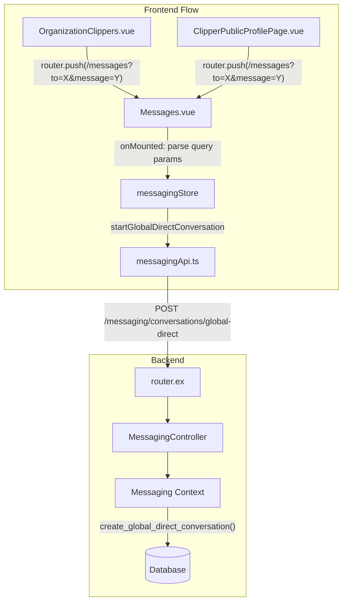

# Global Messaging System Implementation

## Architecture Overview




## Changes Required

### 1. Backend: Add Global Direct Conversation Support

**[`server/lib/clippster_server/messaging.ex`](server/lib/clippster_server/messaging.ex)**

- Add `create_global_direct_conversation(user1_id, user2_id)` function
- No organization membership verification required
- Set `organization_id: nil` for global conversations
- Reuse `find_existing_global_direct_conversation()` to prevent duplicates

**[`server/lib/clippster_server_web/router.ex`](server/lib/clippster_server_web/router.ex)**

- Add route: `POST /messaging/conversations/global-direct`

**[`server/lib/clippster_server_web/controllers/messaging_controller.ex`](server/lib/clippster_server_web/controllers/messaging_controller.ex)**

- Add `create_global_direct/2` action

### 2. Backend: Allow Nullable organization_id

**[`server/lib/clippster_server/messaging/conversation.ex`](server/lib/clippster_server/messaging/conversation.ex)**

- Modify changeset to allow `organization_id` to be optional for global conversations

### 3. Frontend: Add Global Conversation API

**[`client/src/services/messagingApi.ts`](client/src/services/messagingApi.ts)**

- Add `createGlobalDirectConversation(userId: number): Promise<Conversation>`

### 4. Frontend: Update Messaging Store

**[`client/src/stores/messaging.ts`](client/src/stores/messaging.ts)**

- Add `startGlobalDirectConversation(userId: number)` - doesn't require `currentOrgId`
- Update `initialize()` to work without requiring an org (for global conversations)
- Add `initializeForGlobalMessaging()` alternative initialization path

### 5. Frontend: Handle Deep Linking in Messages.vue

**[`client/src/pages/Messages.vue`](client/src/pages/Messages.vue)**

- Import and use `useRoute` from vue-router
- On mount, check for `to` and `message` query parameters
- If `to` param exists:

1. Call `startGlobalDirectConversation(toUserId)`
2. Auto-select the conversation
3. Pre-fill `messageInput` with the `message` query param
4. Clear URL params after processing (replace history)

- Handle loading states during conversation creation

### 6. Frontend: Update OrganizationClippers.vue

**[`client/src/components/organization/OrganizationClippers.vue`](client/src/components/organization/OrganizationClippers.vue)**

- Remove the message dialog (no longer needed since we redirect)
- Simplify `openMessageDialog()` to directly navigate to Messages page
- Keep the `sendMessage()` logic for the optional pre-compose dialog OR remove dialog entirely

## Key Implementation Details

### Backend: Global Conversation Creation

```elixir
# In messaging.ex
def create_global_direct_conversation(user1_id, user2_id) do
  # No org membership check - anyone can message anyone
  case find_existing_global_direct_conversation(user1_id, user2_id) do
    nil ->
      create_conversation_with_participants(
        %{
          type: "direct",
          organization_id: nil,  # Global conversation
          created_by_user_id: user1_id
        },
        [user1_id, user2_id]
      )
    conversation ->
      {:ok, conversation}
  end
end
```


### Frontend: Messages.vue Deep Link Handling

```typescript
// In Messages.vue setup
const route = useRoute();
const router = useRouter();

onMounted(async () => {
  // Handle deep link parameters
  const toUserId = route.query.to ? parseInt(route.query.to as string) : null;
  const prefilledMessage = route.query.message as string || '';
  
  if (toUserId) {
    // Create/find global conversation
    const conversation = await messagingStore.startGlobalDirectConversation(toUserId);
    await messagingStore.setActiveConversation(conversation.id);
    messageInput.value = prefilledMessage;
    
    // Clear URL params
    router.replace({ path: '/messages' });
  } else {
    // Normal initialization
    await loadOrganizationsAndMembers();
  }
});
```


## Migration Considerations

- Existing org-scoped conversations continue to work unchanged
- Global conversations have `organization_id = NULL` in database
- The `list_conversations_for_user()` function already works across all orgs (line 138-146 in messaging.ex)
- WebSocket connections work at conversation level, not org level

## Testing Scenarios

1. Click "Message" on clipper card -> redirects to Messages, creates conversation, pre-fills input
2. User not in any shared org with target -> global conversation created successfully
3. Existing global conversation with same user -> returns existing, doesn't create duplicate