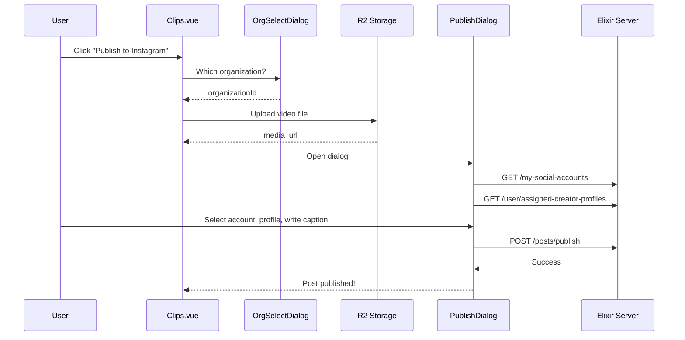

# Instagram Publishing Integration for Organization Members

## Problem Summary

The backend API and `PublishDialog.vue` component are fully implemented but **not wired into the UI**. Members have no way to access the "Publish to Instagram" functionality from the Clips page.**Current State:**

- Backend: Fully working (`POST /organizations/:org_id/posts/publish`)
- `PublishDialog.vue`: Complete with account + creator profile selection
- `PostSubmissionsList.vue`: Shows posts in admin dashboard
- **Missing**: No way to trigger publishing from the Clips page

## Implementation Plan

### 1. Add Client API for User's Assigned Creator Profiles

The server endpoint exists (`GET /user/assigned-creator-profiles`) but there's no client function.**File:** [client/src/services/socialAccountsApi.ts](client/src/services/socialAccountsApi.ts)Add function:

```typescript
export async function getMyAssignedCreatorProfiles(): Promise<{
  success: boolean;
  profiles: CreatorProfile[];
  error?: string;
}>
```


### 2. Add "Publish to Instagram" Button to BuildCard

**File:** [client/src/components/BuildCard.vue](client/src/components/BuildCard.vue)

- Add Instagram icon button in the hover overlay (alongside Play, Download, Delete)
- Emit `publish` event with build data when clicked

### 3. Integrate PublishDialog in Clips Page

**File:** [client/src/pages/Clips.vue](client/src/pages/Clips.vue)

- Import `PublishDialog` component
- Add state for organization selection and creator profiles
- Handle `publish` event from BuildCard:

1. Prompt user to select organization (if member of multiple)
2. Upload the clip video to R2 storage to get a public URL
3. Open PublishDialog with:

    - `mediaUrl` (R2 URL)
    - `thumbnailUrl` (from build)
    - `organizationId`
    - `creatorProfiles` (user's assigned profiles)
    - `isAdmin` (based on user's role in org)

### 4. Add Organization Selection Dialog

Since clips are stored locally without org context, users need to select which organization to publish under.**New Component:** `client/src/components/OrganizationSelectDialog.vue`

- Fetches user's organizations via auth store `getOrganizations()`
- Shows list for user to pick
- Returns selected organization ID

## Data Flow




## Files to Modify

| File | Changes ||------|---------|| [client/src/services/socialAccountsApi.ts](client/src/services/socialAccountsApi.ts) | Add `getMyAssignedCreatorProfiles()` || [client/src/components/BuildCard.vue](client/src/components/BuildCard.vue) | Add Instagram publish button || [client/src/pages/Clips.vue](client/src/pages/Clips.vue) | Integrate PublishDialog, handle organization selection, upload to R2 || [client/src/components/OrganizationSelectDialog.vue](client/src/components/OrganizationSelectDialog.vue) | New component for org selection |

## Key Implementation Details

1. **Video Upload**: Before publishing, the local video file must be uploaded to R2 storage to get a publicly accessible URL that Instagram can fetch. Use existing upload infrastructure.
2. **Organization Context**: Members may belong to multiple organizations. The UI must let them choose which org context to use for publishing.