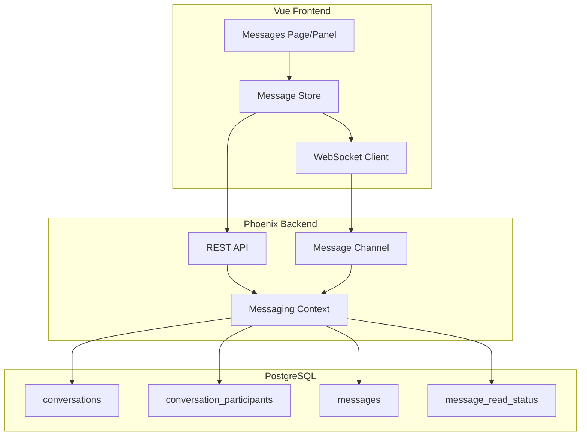

# Organization Messaging System Plan

## Architecture Overview

The messaging system will support three conversation types:

1. **Direct Messages (1:1)** - Private messages between two organization members
2. **Group Chats** - Multi-member conversations within an organization
3. **Org-Wide Announcements** - Broadcast messages to all organization members (admin/owner only)



---

## 1. Database Schema

Create four new tables in `server/priv/repo/migrations/`:

### conversations

- `id`, `organization_id`, `type` (direct/group/announcement), `name` (for groups), `created_by_user_id`, `timestamps`

### conversation_participants

- `id`, `conversation_id`, `user_id`, `role` (member/admin), `joined_at`, `left_at`, `timestamps`
- Unique constraint on [conversation_id, user_id]

### messages

- `id`, `conversation_id`, `sender_id`, `content` (text), `message_type` (text/system), `timestamps`
- Index on [conversation_id, inserted_at]

### message_read_status

- `id`, `message_id`, `user_id`, `read_at`
- For tracking unread counts

---

## 2. Backend Implementation

### Ecto Schemas (`server/lib/clippster_server/messaging/`)

- `conversation.ex` - Conversation schema with type validation
- `conversation_participant.ex` - Participant with role management
- `message.ex` - Message schema
- `message_read_status.ex` - Read tracking

### Context Module (`server/lib/clippster_server/messaging.ex`)

Key functions:

- `create_direct_conversation/3` - Start 1:1 chat (finds existing or creates)
- `create_group_conversation/4` - Create group with initial participants
- `create_announcement/3` - Org-wide broadcast (auto-includes all members)
- `send_message/3` - Send message to conversation
- `list_user_conversations/2` - Get user's conversations in an org
- `get_messages/3` - Paginated message history
- `mark_as_read/2` - Update read status
- `get_unread_counts/2` - Unread per conversation

### Phoenix Channel (`server/lib/clippster_server_web/messaging_channel.ex`)

- Join: `messaging:{organization_id}:{user_id}` - User's messaging channel
- Events:
  - `new_message` - Broadcast to conversation participants
  - `message_read` - Notify sender of read receipts
  - `typing` - Typing indicators
  - `conversation_created` - New conversation notification

### REST API Routes (`server/lib/clippster_server_web/router.ex`)

Add under `/api` with `:api_auth`:

```elixir
scope "/organizations/:organization_id/messaging" do
  get "/conversations", MessagingController, :list_conversations
  post "/conversations/direct", MessagingController, :create_direct
  post "/conversations/group", MessagingController, :create_group
  post "/conversations/announcement", MessagingController, :create_announcement
  get "/conversations/:id/messages", MessagingController, :get_messages
  post "/conversations/:id/messages", MessagingController, :send_message
  post "/conversations/:id/read", MessagingController, :mark_read
  get "/unread", MessagingController, :get_unread_counts
end
```

---

## 3. Frontend Implementation

### WebSocket Service (`client/src/services/messagingSocket.ts`)

- Connect to Phoenix channel with JWT auth
- Handle real-time events (new messages, typing, read receipts)
- Reconnection logic with exponential backoff

### API Service (`client/src/services/messagingApi.ts`)

- REST calls for conversations, messages, read status
- Types for Conversation, Message, Participant

### Pinia Store (`client/src/stores/messaging.ts`)

- State: conversations, messages (keyed by conversation_id), unread counts
- Actions: load conversations, send message, mark read
- Real-time sync with WebSocket

### Vue Components (`client/src/components/messaging/`)

- `MessagingPanel.vue` - Main panel (conversation list + chat view)
- `ConversationList.vue` - List of conversations with unread badges
- `ChatView.vue` - Message thread with input
- `MessageBubble.vue` - Individual message display
- `NewConversationDialog.vue` - Create direct/group chat
- `ParticipantSelector.vue` - Select org members for groups

### Page Integration

- Add `/organization/:id/messages` route
- Add messaging icon to organization dashboard sidebar
- Unread badge in navigation

---

## 4. Authorization Rules

| Action | owner | admin | member |

|--------|-------|-------|--------|

| Send DM | Yes | Yes | Yes |

| Create Group | Yes | Yes | Yes |

| Send Announcement | Yes | Yes | No |

| View Own Conversations | Yes | Yes | Yes |

---

## 5. Implementation Order

1. **Database**: Migrations and schemas
2. **Context**: Core messaging logic
3. **Channel**: Real-time infrastructure  
4. **API**: REST endpoints
5. **Frontend Services**: API client + WebSocket
6. **UI Components**: Messaging interface
7. **Integration**: Navigation and unread badges