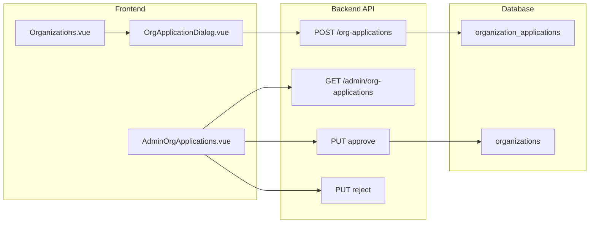

# Organization Application System

## Overview

Replace the self-service organization creation wizard with an application-based flow where users submit applications for admin review and approval.

## Architecture

## Frontend Changes

### 1. Remove Organization Creation Flow

- **[`AccountTypeDialog.vue`](client/src/components/AccountTypeDialog.vue)**: Remove organization option, always create personal accounts and redirect to `/projects`
- **[`OrganizationSelector.vue`](client/src/components/OrganizationSelector.vue)**: Remove "Create Organization" link from footer
- **[`router/index.ts`](client/src/router/index.ts)**: Remove `/organization/setup` route
- Delete [`OrganizationSetupWizard.vue`](client/src/components/OrganizationSetupWizard.vue)

### 2. Create Application Dialog

- New component `client/src/components/OrganizationApplicationDialog.vue`
- Fields: organization name, description, website/social links, team size, use case, contact email
- Style matching [`BugReportDialog.vue`](client/src/components/BugReportDialog.vue) pattern

### 3. Update Organizations Page

- **[`Organizations.vue`](client/src/pages/Organizations.vue)**: Replace "Create Organization" button with "Apply for Organization" button that opens the application dialog

### 4. Add Admin Page

- New page `client/src/pages/admin/AdminOrgApplications.vue`
- Table view with filters (status: pending/approved/rejected)
- Actions: Approve (creates org), Reject, Delete
- Style matching [`AdminBugReports.vue`](client/src/pages/admin/AdminBugReports.vue)
- Add route `/admin/org-applications` and nav item in [`AdminHub.vue`](client/src/pages/admin/AdminHub.vue)

## Backend Changes (Elixir/Phoenix)

### 5. Database Migration

- New table `organization_applications`:
- `id`, `user_id`, `name`, `description`, `website`, `team_size`, `use_case`, `contact_email`
- `status` (pending/approved/rejected), `admin_notes`, `reviewed_by_id`, `reviewed_at`
- `inserted_at`, `updated_at`

### 6. Schema and Context

- New schema `ClippsterServer.Organizations.OrganizationApplication`
- Functions: `create_application/2`, `list_applications/1`, `approve_application/2`, `reject_application/2`

### 7. API Endpoints

- `POST /api/organization-applications` - submit application (authenticated)
- `GET /api/admin/organization-applications` - list all (admin only)
- `PUT /api/admin/organization-applications/:id/approve` - creates organization from application
- `PUT /api/admin/organization-applications/:id/reject` - marks rejected with optional notes
- `DELETE /api/admin/organization-applications/:id` - removes application

## Application Flow

1. User clicks "Apply for Organization" on `/organizations`
2. Dialog collects detailed info, submits to API
3. Admin sees pending applications at `/admin/org-applications`