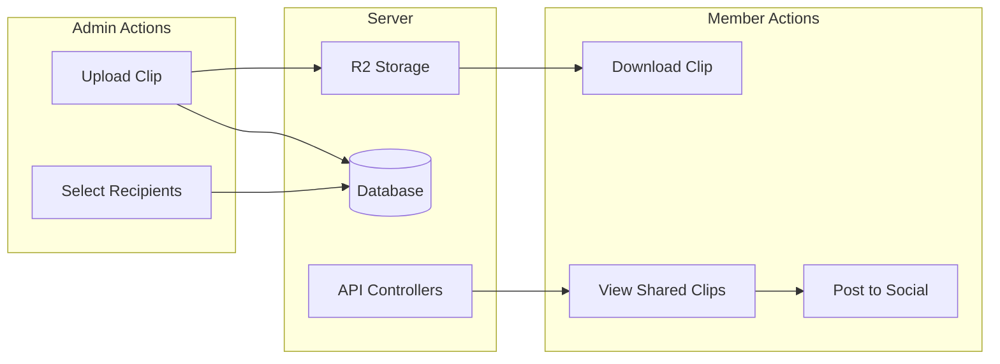

# Organization Shared Clips Feature

## Overview

This feature enables organizations to share viral clips with their members for distribution across social platforms. Admins upload clips to R2 storage, select recipients (all members or specific ones), and members can either download clips or post directly through connected social accounts.

## Architecture




## Database Schema

### New Table: `organization_shared_clips`

| Column | Type | Description ||--------|------|-------------|| id | bigint | Primary key || organization_id | bigint FK | Reference to organization || uploaded_by_user_id | bigint FK | Admin who uploaded || name | string | Display name || description | text | Optional context/caption || url | text | R2 storage URL || thumbnail_url | text | Video thumbnail || duration | decimal | Duration in seconds (max 180) || file_size | bigint | Size in bytes || share_with_all | boolean | True = all members, False = specific || expires_at | utc_datetime | Auto-set to inserted_at + 7 days || timestamps | | inserted_at, updated_at |

### New Table: `organization_shared_clip_recipients`

| Column | Type | Description ||--------|------|-------------|| id | bigint | Primary key || shared_clip_id | bigint FK | Reference to shared clip || user_id | bigint FK | Recipient member || viewed_at | utc_datetime | When member first viewed || downloaded_at | utc_datetime | When member downloaded || posted_at | utc_datetime | When member posted || timestamps | | inserted_at, updated_at |

## Key Files to Create/Modify

### Server (Elixir/Phoenix)

1. **New Schema**: [`server/lib/clippster_server/organizations/organization_shared_clip.ex`](server/lib/clippster_server/organizations/organization_shared_clip.ex)

- Ecto schema with validation (duration <= 180 seconds)

2. **New Schema**: [`server/lib/clippster_server/organizations/shared_clip_recipient.ex`](server/lib/clippster_server/organizations/shared_clip_recipient.ex)

- Tracks per-member receipt/action status

3. **New Migration**: `server/priv/repo/migrations/*_create_shared_clips.exs`

- Creates both tables with proper indexes

4. **Update Context**: [`server/lib/clippster_server/organizations.ex`](server/lib/clippster_server/organizations.ex)

- Add functions: `create_shared_clip`, `list_shared_clips`, `get_clips_for_member`, etc.

5. **New Controller**: [`server/lib/clippster_server_web/controllers/shared_clip_controller.ex`](server/lib/clippster_server_web/controllers/shared_clip_controller.ex)

- CRUD endpoints plus member-specific actions

6. **Update Router**: [`server/lib/clippster_server_web/router.ex`](server/lib/clippster_server_web/router.ex)

- Add routes under `/organizations/:org_id/shared-clips`

7. **New Worker**: [`server/lib/clippster_server/organizations/shared_clip_cleanup_worker.ex`](server/lib/clippster_server/organizations/shared_clip_cleanup_worker.ex)

- GenServer that runs daily to delete expired clips and their R2 files
- Started in application supervision tree

### Client (Vue/Tauri)

1. **New API Service**: [`client/src/services/sharedClipsApi.ts`](client/src/services/sharedClipsApi.ts)

- API wrapper for all shared clip operations

2. **New Component**: [`client/src/components/organization/SharedClipsList.vue`](client/src/components/organization/SharedClipsList.vue)

- Display shared clips with download/post actions

3. **New Component**: [`client/src/components/organization/ShareClipDialog.vue`](client/src/components/organization/ShareClipDialog.vue)

- Admin dialog to upload and share clips

4. **New Component**: [`client/src/components/organization/ClipRecipientSelector.vue`](client/src/components/organization/ClipRecipientSelector.vue)

- Select specific members or "all members"

5. **Update**: [`client/src/components/OrganizationDashboard.vue`](client/src/components/OrganizationDashboard.vue)

- Add "Shared Clips" tab/section

## API Endpoints

| Method | Endpoint | Description | Access ||--------|----------|-------------|--------|| POST | `/organizations/:id/shared-clips` | Upload and share clip | Admin || GET | `/organizations/:id/shared-clips` | List all shared clips | Admin || GET | `/user/shared-clips` | Get clips shared with current user | Member || GET | `/organizations/:id/shared-clips/:clip_id` | Get single clip | Member || DELETE | `/organizations/:id/shared-clips/:clip_id` | Delete shared clip | Admin || POST | `/shared-clips/:clip_id/mark-viewed` | Mark clip as viewed | Member || POST | `/shared-clips/:clip_id/mark-downloaded` | Record download action | Member || POST | `/shared-clips/:clip_id/post` | Post clip to social account | Member |

## Validation Rules

- Maximum clip duration: 180 seconds (3 minutes)
- Supported formats: mp4, mov, webm
- Maximum file size: 500MB (configurable)
- Only admins can upload/share clips
- Members can only see clips shared with them
- **Auto-expiration**: Clips automatically deleted 7 days after upload

## Auto-Expiration System

### How It Works

1. When a clip is uploaded, `expires_at` is automatically set to `inserted_at + 7 days`
2. A background worker (`SharedClipCleanupWorker`) runs once per day
3. The worker queries for clips where `expires_at < NOW()`
4. For each expired clip:

- Delete the video file from R2 storage
- Delete the thumbnail from R2 storage
- Delete the database record (cascades to recipients table)

### Worker Implementation

```elixir
# Runs daily at 3:00 AM UTC
defmodule ClippsterServer.Organizations.SharedClipCleanupWorker do
  use GenServer
  
  def cleanup_expired_clips do
    # Find all expired clips
    # Delete from R2, then from database
  end
end
```


## Member Experience

1. Member sees "Shared Clips" section in dashboard (or notification badge)
2. Clips display with thumbnail, name, description, and who shared it
3. **Expiration indicator**: Each clip shows "Expires in X days" countdown badge
4. Visual urgency: Badge changes color as expiration approaches (green > yellow > red)
5. Actions available:

- **Download**: Downloads clip to local storage
- **Post**: Opens publish dialog to select connected social account

## UI Expiration Indicators

### Countdown Badge Design

| Days Remaining | Badge Color | Text ||----------------|-------------|------|| 5-7 days | Green | "Expires in X days" || 2-4 days | Yellow/Amber | "Expires in X days" || 1 day | Red | "Expires tomorrow" || < 1 day | Red (pulsing) | "Expires today" |

### Admin View

- Shows upload date and exact expiration date/time
- Cannot extend expiration (must re-upload if needed)
- Warning banner when sharing: "This clip will be available for 7 days"

### Member View

- Prominent countdown badge on each clip card
- Toast notification for clips expiring within 24 hours