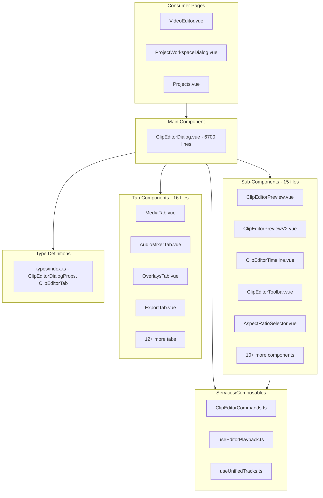

# ClipEditorDialog Complete Removal Plan

This plan removes the entire `clip-editor/` component ecosystem (30+ files, ~10,000+ lines total) to enable a fresh start. The approach prioritizes maintaining application stability throughout the process.

## Architecture Overview



---

## Phase 1: Create Placeholder Component

Create a minimal placeholder to prevent breaking the 3 consumer pages during removal.

### Step 1.1: Create placeholder component

Create [`client/src/components/clip-editor/ClipEditorDialogPlaceholder.vue`](client/src/components/clip-editor/ClipEditorDialogPlaceholder.vue):

```vue
<template>
  <Teleport to="body">
    <div v-if="modelValue" class="fixed inset-0 bg-black/80 flex items-center justify-center z-[9999]">
      <div class="bg-zinc-900 border border-white/10 rounded-xl p-8 max-w-md text-center">
        <h2 class="text-xl font-semibold text-white mb-2">Editor Removed</h2>
        <p class="text-zinc-400 mb-4">The clip editor is being rebuilt from scratch.</p>
        <button @click="close" class="px-4 py-2 bg-white/10 hover:bg-white/20 rounded-lg text-white">
          Close
        </button>
      </div>
    </div>
  </Teleport>
</template>

<script setup lang="ts">
defineProps<{
  modelValue: boolean;
  clipId?: string;
  videoSrc?: string | null;
  clipStartTime?: number;
  clipEndTime?: number;
  clipTitle?: string;
  clipSegments?: any[];
  creatorProfileWatermarkSettings?: any;
  editorMode?: boolean;
  editorProjectId?: string | null;
  editorProjectName?: string;
  creatorWatermarkId?: string | null;
  creatorWatermarkSettings?: string | null;
  creatorDefaultIntro?: any;
  creatorDefaultOutro?: any;
}>();

const emit = defineEmits<{
  (e: 'update:modelValue', value: boolean): void;
  (e: 'save', clipId: string): void;
  (e: 'editorSave', projectId: string): void;
}>();

function close() {
  emit('update:modelValue', false);
}
</script>
```

---

## Phase 2: Update Consumer Pages

Update all 3 pages that import ClipEditorDialog to use the placeholder.

### Step 2.1: Update VideoEditor.vue

In [`client/src/pages/VideoEditor.vue`](client/src/pages/VideoEditor.vue):**Change import** (line ~381):

```typescript
// FROM:
import ClipEditorDialog from '@/components/clip-editor/ClipEditorDialog.vue';
// TO:
import ClipEditorDialog from '@/components/clip-editor/ClipEditorDialogPlaceholder.vue';
```


### Step 2.2: Update Projects.vue

In [`client/src/pages/Projects.vue`](client/src/pages/Projects.vue):**Change import** (line ~1247):

```typescript
// FROM:
import ClipEditorDialog from '@/components/clip-editor/ClipEditorDialog.vue';
// TO:
import ClipEditorDialog from '@/components/clip-editor/ClipEditorDialogPlaceholder.vue';
```


### Step 2.3: Update ProjectWorkspaceDialog.vue

In [`client/src/components/ProjectWorkspaceDialog.vue`](client/src/components/ProjectWorkspaceDialog.vue):**Change import** (line ~234):

```typescript
// FROM:
import ClipEditorDialog from './clip-editor/ClipEditorDialog.vue';
// TO:
import ClipEditorDialog from './clip-editor/ClipEditorDialogPlaceholder.vue';
```

---

## Phase 3: Delete Tab Components

Delete all 16 tab components in `client/src/components/clip-editor/tabs/`:| File | Purpose ||------|---------|| `AspectTab.vue` | Aspect ratio configuration || `AudioMixerTab.vue` | Audio track mixing || `CaptionsTab.vue` | Caption/subtitle editor || `EffectsTab.vue` | Video effects || `ExportTab.vue` | Export settings || `FiltersTab.vue` | Video filters || `IntroOutroTab.vue` | Intro/outro management || `MediaTab.vue` | Media browser || `OverlaysTab.vue` | Text/sticker overlays || `SourcesTab.vue` | Source management || `StickersTab.vue` | Sticker overlays || `StyleTab.vue` | Styling options || `SubtitlesTab.vue` | Subtitle editor || `TextOverlayTab.vue` | Text overlay editor || `TranscriptTab.vue` | Transcript editor || `WatermarkTab.vue` | Watermark management |**Action**: Delete entire `client/src/components/clip-editor/tabs/` directory.---

## Phase 4: Delete Sub-Components

Delete all 15 utility components in `client/src/components/clip-editor/`:| File | Lines (est.) | Purpose ||------|--------------|---------|| `ClipEditorPreview.vue` | ~1500 | Legacy video preview || `ClipEditorPreviewV2.vue` | ~800 | New playback engine preview || `ClipEditorTimeline.vue` | ~2000 | Multi-track timeline || `ClipEditorToolbar.vue` | ~200 | Vertical tab toolbar || `AspectRatioSelector.vue` | ~150 | Aspect ratio buttons || `CollapsibleSection.vue` | ~50 | UI accordion || `HistoryPanel.vue` | ~100 | Undo/redo history || `KeyframeInspector.vue` | ~200 | Keyframe editing || `KeyframeMarker.vue` | ~80 | Timeline keyframe markers || `ManualPOIEditor.vue` | ~300 | Point of interest editor || `MediaItem.vue` | ~100 | Media browser item || `ProxySettings.vue` | ~150 | Proxy video settings || `SpeedCurveEditor.vue` | ~250 | Speed ramping curves || `TimelineTrack.vue` | ~400 | Individual timeline track || `TrackRenderer.vue` | ~350 | Track visual rendering || `TransformControls.vue` | ~300 | Overlay transform handles || `UnifiedInspector.vue` | ~200 | Property inspector || `VideoCompositor.vue` | ~400 | Video composition engine |**Action**: Delete each file listed above (keep only `ClipEditorDialogPlaceholder.vue` and `ExistingProjectDialog.vue`).---

## Phase 5: Delete Main Component

Delete the main dialog component:**Action**: Delete [`client/src/components/clip-editor/ClipEditorDialog.vue`](client/src/components/clip-editor/ClipEditorDialog.vue) (6,700 lines).---

## Phase 6: Clean Up Services and Composables

### Step 6.1: Delete ClipEditorCommands.ts

Delete [`client/src/services/commands/ClipEditorCommands.ts`](client/src/services/commands/ClipEditorCommands.ts) (~1,940 lines).This file contains undo/redo command implementations specific to ClipEditorDialog.

### Step 6.2: Evaluate useEditorPlayback.ts

Review [`client/src/composables/useEditorPlayback.ts`](client/src/composables/useEditorPlayback.ts) (~420 lines).**Decision needed**: This composable may be useful for a new editor. Consider:

- **Delete** if starting completely fresh
- **Keep** if the playback engine architecture is still valid

### Step 6.3: Evaluate useUnifiedTracks.ts

Review [`client/src/composables/useUnifiedTracks.ts`](client/src/composables/useUnifiedTracks.ts).**Decision needed**: Same as above - may be useful for timeline track management.---

## Phase 7: Clean Up Types

In [`client/src/types/index.ts`](client/src/types/index.ts), remove:

```typescript
// Lines ~1118-1125 - Remove ClipEditorDialogProps
export interface ClipEditorDialogProps {
  modelValue: boolean;
  clipId: string;
  videoSrc: string | null;
  clipStartTime: number;
  clipEndTime: number;
  clipTitle: string;
}

// Lines ~1127-1136 - Remove ClipEditorTab
export type ClipEditorTab =
  | 'media'
  | 'audio'
  | 'overlays'
  | 'watermark'
  | 'captions'
  | 'aspect'
  | 'effects'
  | 'export';

// Lines ~1138-1145+ - Remove EditorTimelineTrack and related types
export interface EditorTimelineTrack { ... }
export interface EditorTimelineItem { ... }
```

---

## Phase 8: Update Documentation

Update or archive documentation files that reference ClipEditorDialog:| File | Action ||------|--------|| `docs/PLAYBACK_ENGINE_REWRITE_PLAN.md` | Archive or update || `docs/SEAMLESS_SEGMENT_PREVIEW_PLAN.md` | Archive or update || `docs/IN_EDITOR_AND_DELETION_PLAN.md` | Archive or update || `docs/completed/Undo_Redo_Implementation_Plan.md` | Move to archived || `docs/completed/OVERLAY_EXPORT_STATUS.md` | Move to archived || `docs/completed/PER_SEGMENT_FRAMING_STATUS.md` | Move to archived |---

## Phase 9: Final Cleanup

### Step 9.1: Verify no broken imports

Run TypeScript check:

```bash
cd client && yarn type-check
```


### Step 9.2: Test application startup

Verify all 3 consumer pages load without errors:

1. `/video-editor` - VideoEditor.vue
2. `/projects` - Projects.vue  
3. ProjectWorkspaceDialog (within project workflow)

### Step 9.3: Rename placeholder

Once verified, optionally rename placeholder back to `ClipEditorDialog.vue` to serve as the starting point for the new implementation.---

## Summary of Deletions

| Category | Files | Est. Lines ||----------|-------|------------|| Main component | 1 | 6,700 || Tab components | 16 | ~4,000 || Sub-components | 17 | ~7,300 || Services | 1-3 | ~2,500 || Types | N/A | ~50 || **Total** | **35-37** | **~20,500** |

## Preserved Files

- `ExistingProjectDialog.vue` - Used independently for project selection