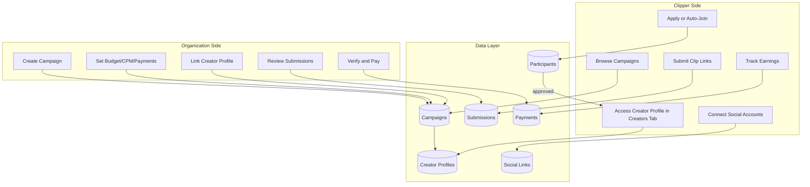

# Clipping Campaigns System Implementation

This plan adds a campaign marketplace to Clippster where organizations can create clipping campaigns, clippers can join and submit clips, and organizations can verify submissions and track payments.

## Architecture Overview

## Creator Profile Access Flow

When a clipper joins a campaign, they automatically gain access to the campaign's associated creator profile:

1. **Open campaigns (join_type: "open")**: User clicks "Join" → immediately becomes approved participant → creator profile appears in their Creators tab
2. **Application-required campaigns**: User applies → org approves → creator profile appears in their Creators tab
3. **Access revocation**: Profile access is removed when:
   - Participant is removed from the campaign
   - Campaign status changes to "completed" (all participants lose access)
   - (Exception: user retains access if they have it through another active campaign or direct org assignment)

The creator profile contains all the assets the clipper needs: intro/outro videos, watermarks, logos, platform links, etc.

## Database Schema

New tables to create in `server/priv/repo/migrations/`:

### 1. `clipping_campaigns`

- `id`, `organization_id`, `creator_profile_id`
- `title`, `description`, `cover_image_url`
- `budget` (decimal, total budget in USD dollars)
- `spent` (decimal, amount already spent in USD)
- `cpm` (decimal, cost per 1000 views in USD)
- `min_views_for_payment` (minimum views before clip qualifies)
- `join_type` (enum: "open", "application_required")
- `allowed_platforms` (array: ["tiktok", "instagram", "x"] - which platforms clips can be posted to)
- `payment_methods` (array: ["paypal", "crypto", "venmo", etc.])
- `status` (enum: "draft", "active", "paused", "completed")
- `starts_at`, `ends_at`
- timestamps

### 2. `campaign_participants`

- `id`, `campaign_id`, `user_id`
- `status` (enum: "pending", "approved", "rejected", "removed")
- `application_note` (optional message from clipper)
- `approved_at`, `approved_by_user_id`
- `profile_assignment_id` (FK to organization_profile_assignments - created when approved, deleted when removed)
- timestamps

**On approval:** Creates an `OrganizationProfileAssignment` linking user to campaign's creator profile

**On removal:** Deletes the profile assignment (revoking access)

**On campaign completion:** All profile assignments created through this campaign are deleted (bulk revocation)

### 3. `clipper_social_accounts`

- `id`, `user_id`
- `platform` (enum: "tiktok", "instagram", "x")
- `platform_user_id`, `username`, `display_name`
- `access_token`, `refresh_token`, `token_expires_at` (for API access)
- `profile_url`, `follower_count`
- `is_verified` (boolean)
- timestamps

### 4. `clipper_payment_methods`

- `id`, `user_id`
- `method_type` (enum: "paypal", "crypto", "venmo", etc.)
- `details` (encrypted JSON: email for PayPal, wallet address for crypto, etc.)
- `is_default` (boolean)
- timestamps

### 5. `campaign_submissions`

- `id`, `campaign_id`, `participant_id`, `user_id`
- `social_account_id` (which connected account)
- `clip_url` (unique constraint - same link cannot be submitted twice)
- `platform` (must match one of campaign's `allowed_platforms`)
- `platform_post_id`
- `view_count`, `views_last_updated_at`
- `status` (enum: "pending", "verified", "rejected", "paid")
- `rejection_reason`
- `verified_at`, `verified_by_user_id`
- timestamps

**Validation rules:**

- `clip_url` must be globally unique across all submissions
- `platform` must be in the campaign's `allowed_platforms` array
- Platform is auto-detected from URL (tiktok.com, instagram.com, x.com/twitter.com)

### 6. `campaign_payments`

- `id`, `campaign_id`, `submission_id`, `user_id`
- `amount` (decimal, payment amount in USD)
- `views_at_payment`
- `payment_method_id`
- `status` (enum: "pending", "processing", "completed", "failed")
- `external_transaction_id` (PayPal txn ID, blockchain hash, etc.)
- `paid_at`, `paid_by_user_id`
- timestamps

## Backend Implementation

### New Context: `ClippsterServer.Campaigns`

Location: `server/lib/clippster_server/campaigns.ex`

Functions to implement:

- Campaign CRUD (create, update, pause, complete)
  - On `complete_campaign/2`: Delete all `OrganizationProfileAssignment` records linked to this campaign's participants
- Participant management (apply, approve, reject)
- **Creator profile access on join:**
  - When user is approved (or auto-joins an "open" campaign), automatically grant access to the campaign's creator profile
  - Extend `Organizations.has_profile_access?/2` to also check campaign participation
  - Profile appears in clipper's "Creators" tab via existing `get_assigned_creator_profiles/1`
  - Access is revoked if participant is removed from campaign
- Submission handling (submit, verify, reject)
  - Validate platform matches campaign's `allowed_platforms`
  - Detect platform from URL (tiktok.com, instagram.com, x.com/twitter.com)
  - Enforce unique `clip_url` constraint (prevent duplicate submissions)
- Payment tracking (create payment record, mark as paid)
- View count updates (batch update from API)

### New Schemas in `server/lib/clippster_server/campaigns/`:

- `campaign.ex`
- `campaign_participant.ex`
- `campaign_submission.ex`
- `campaign_payment.ex`
- `clipper_social_account.ex`
- `clipper_payment_method.ex`

### New Controllers in `server/lib/clippster_server_web/controllers/`:

- `campaign_controller.ex` - Campaign CRUD, participant management
- `campaign_submission_controller.ex` - Clip submissions, verification
- `clipper_profile_controller.ex` - Social accounts, payment methods

### API Endpoints

**Public (logged-in users):**

- `GET /api/campaigns` - Browse active campaigns
- `GET /api/campaigns/:id` - Campaign details

**Clipper routes:**

- `POST /api/campaigns/:id/apply` - Apply to join campaign
- `GET /api/user/campaigns` - My joined campaigns
- `POST /api/campaigns/:id/submissions` - Submit a clip
- `GET /api/user/submissions` - My submissions
- `GET /api/user/earnings` - My earnings summary
- CRUD for `/api/user/social-accounts`
- CRUD for `/api/user/payment-methods`

**Organization routes:**

- `POST /api/organizations/:org_id/campaigns` - Create campaign
- `PUT /api/organizations/:org_id/campaigns/:id` - Update campaign
- `GET /api/organizations/:org_id/campaigns/:id/participants` - List applicants/participants
- `POST /api/organizations/:org_id/campaigns/:id/participants/:user_id/approve`
- `GET /api/organizations/:org_id/campaigns/:id/submissions` - All submissions
- `POST /api/organizations/:org_id/submissions/:id/verify` - Verify submission
- `POST /api/organizations/:org_id/submissions/:id/pay` - Mark as paid

## Frontend Implementation

### New Pages in `client/src/pages/`:

- `CampaignsPage.vue` - Browse/search campaigns marketplace
- `CampaignDetailPage.vue` - Single campaign view with join button
- `MyCampaignsPage.vue` - Clipper's joined campaigns and submissions
- `ClipperProfilePage.vue` - Manage social accounts and payment info

### Organization Dashboard (extend existing):

- Campaign management tab
- Submissions review interface
- Payment tracking dashboard

### New Components in `client/src/components/campaigns/`:

- `CampaignCard.vue` - Campaign preview card
- `CampaignForm.vue` - Create/edit campaign form
- `ParticipantsList.vue` - Manage applicants
- `SubmissionsList.vue` - Review submissions table
- `SocialAccountConnect.vue` - OAuth connect buttons
- `PaymentMethodForm.vue` - Add payment info

### New Services in `client/src/services/`:

- `campaignService.ts` - Campaign API calls
- `clipperProfileService.ts` - Social accounts, payment methods

## Social Media API Integration

For TikTok and Instagram view tracking:

1. OAuth flow for clippers to connect accounts
2. Store access/refresh tokens securely
3. Background job to periodically fetch view counts
4. Update `campaign_submissions.view_count` with latest data

Initial implementation will use manual view entry with API integration added when APIs are ready.

## Implementation Checklist

- [ ] Create database migrations for all 6 new tables
- [ ] Create Ecto schemas for campaigns, participants, submissions, payments
- [ ] Create schemas for social accounts and payment methods
- [ ] Implement Campaigns context with CRUD and business logic
- [ ] Create API controllers and add routes to router
- [ ] Create clipper profile API for social/payment management
- [ ] Create campaignService.ts and clipperProfileService.ts
- [ ] Build CampaignsPage.vue - campaign marketplace browser
- [ ] Build CampaignDetailPage.vue with join/apply functionality
- [ ] Build MyCampaignsPage.vue for clipper submissions tracking
- [ ] Build ClipperProfilePage.vue for social/payment management
- [ ] Add campaign management UI to organization dashboard
- [ ] Build submissions review and payment tracking UI for orgs

