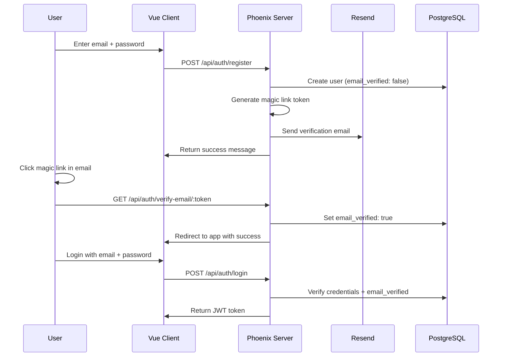

# Email/Password Authentication with Magic Link Verification

## Current State Analysis

The app currently supports two authentication methods:

- **Wallet auth**: Phantom wallet signature verification via Solana
- **Google OAuth**: Via Ueberauth with browser redirect flow

Key existing infrastructure:

- JWT-based auth via Joken ([`server/lib/clippster_server/auth/token_generator.ex`](server/lib/clippster_server/auth/token_generator.ex))
- Swoosh mailer already configured (Local adapter for dev)
- User schema supports `email` field (added for Google OAuth)

## Architecture



## Implementation Plan

### 1. Server: Add Dependencies and Configuration

**[`server/mix.exs`](server/mix.exs)** - Add password hashing:

```elixir
{:bcrypt_elixir, "~> 3.0"}
```

**[`server/config/runtime.exs`](server/config/runtime.exs)** - Configure Resend:

```elixir
resend_api_key = System.get_env("RESEND_API_KEY")
if resend_api_key do
  config :clippster_server, ClippsterServer.Mailer,
    adapter: Swoosh.Adapters.Resend,
    api_key: resend_api_key
end
```

### 2. Server: Database Migration

Create migration to add email auth fields to users table:

- `password_hash` (string, nullable) 
- `email_verified` (boolean, default: false)
- `email_verification_token` (string, nullable)
- `email_verification_sent_at` (datetime, nullable)
- `password_reset_token` (string, nullable)
- `password_reset_sent_at` (datetime, nullable)

### 3. Server: Update User Schema

**[`server/lib/clippster_server/accounts/user.ex`](server/lib/clippster_server/accounts/user.ex)**:

- Add new fields to schema
- Add `email_auth_changeset/2` for email/password registration
- Add `password_changeset/2` for password updates
- Add password hashing and validation (min 8 chars)

### 4. Server: Create Email Module

**New file: `server/lib/clippster_server/emails.ex`**:

- `verification_email/2` - Generate magic link verification email
- `password_reset_email/2` - Generate password reset email

**New file: `server/lib/clippster_server/mailer.ex`**:

- Swoosh Mailer module

### 5. Server: Update Accounts Context

**[`server/lib/clippster_server/accounts.ex`](server/lib/clippster_server/accounts.ex)**:

- `register_with_email/2` - Create user with email/password, generate verification token
- `verify_email/1` - Verify email via token
- `authenticate_with_email/2` - Login with email/password
- `send_password_reset/1` - Generate and send password reset token
- `reset_password/2` - Reset password via token
- Token generation with secure random bytes and expiry validation

### 6. Server: Create Email Auth Controller

**New file: `server/lib/clippster_server_web/controllers/email_auth_controller.ex`**:

- `register/2` - POST `/api/auth/email/register`
- `verify_email/2` - GET `/api/auth/email/verify/:token`
- `login/2` - POST `/api/auth/email/login`
- `resend_verification/2` - POST `/api/auth/email/resend-verification`
- `forgot_password/2` - POST `/api/auth/email/forgot-password`
- `reset_password/2` - POST `/api/auth/email/reset-password`

### 7. Server: Update Router

**[`server/lib/clippster_server_web/router.ex`](server/lib/clippster_server_web/router.ex)** - Add routes:

```elixir
# Email authentication routes
post "/auth/email/register", EmailAuthController, :register
get "/auth/email/verify/:token", EmailAuthController, :verify_email
post "/auth/email/login", EmailAuthController, :login
post "/auth/email/resend-verification", EmailAuthController, :resend_verification
post "/auth/email/forgot-password", EmailAuthController, :forgot_password
post "/auth/email/reset-password", EmailAuthController, :reset_password
```

### 8. Client: Update Auth Store

**[`client/src/stores/auth.js`](client/src/stores/auth.js)**:

- `registerWithEmail(email, password)` - Call register endpoint
- `loginWithEmail(email, password)` - Call login endpoint
- `resendVerificationEmail(email)` - Resend verification
- `forgotPassword(email)` - Request password reset
- `resetPassword(token, password)` - Complete password reset

### 9. Client: Update Auth Components

**[`client/src/components/Auth.vue`](client/src/components/Auth.vue)** and **[`client/src/components/AuthModal.vue`](client/src/components/AuthModal.vue)**:

- Add tabbed interface: "Sign In" / "Sign Up"
- Email/password input fields with validation
- Toggle between email auth and social auth options
- Show verification pending state after registration
- Error handling for unverified email login attempts

### 10. Client: Email Verification Callback Page

**New file: `client/src/pages/EmailVerification.vue`**:

- Handle `/email-verify/:token` route
- Call verification endpoint
- Show success/error state
- Redirect to login on success

### 11. Client: Password Reset Flow

**New file: `client/src/components/ForgotPasswordModal.vue`**:

- Email input to request reset
- Success message after sending

**New file: `client/src/pages/ResetPassword.vue`**:

- Handle `/reset-password/:token` route
- New password form with confirmation
- Submit to reset endpoint

### 12. Client: Update Router

**[`client/src/router/index.ts`](client/src/router/index.ts)**:

- Add `/email-verify/:token` route
- Add `/reset-password/:token` route

## Environment Variables Required

```env
RESEND_API_KEY=re_xxxxxxxxxxxxx
EMAIL_FROM=noreply@clippster.app
APP_URL=https://clippster.app  # For magic link URLs
```

## Security Considerations

- Password hashing with bcrypt (cost factor 12)
- Verification tokens: 32 bytes random, expire after 24 hours
- Reset tokens: 32 bytes random, expire after 1 hour
- Rate limiting on registration/login/forgot-password endpoints (future enhancement)
- Tokens stored hashed in DB, plain sent in email