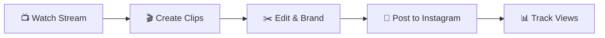
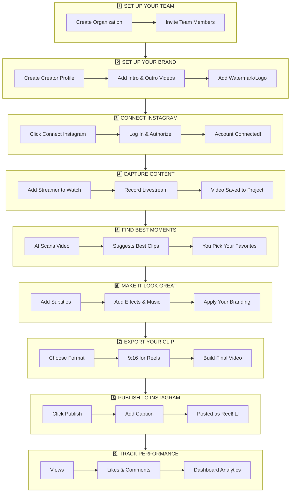
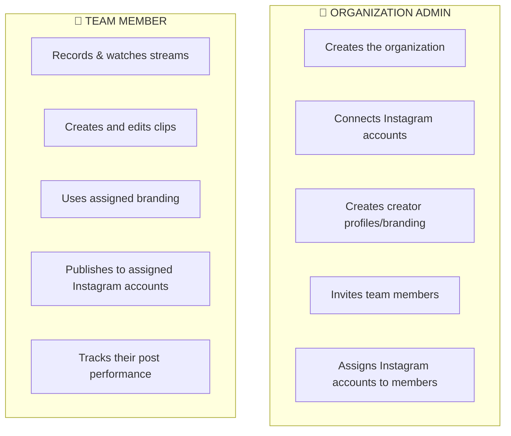
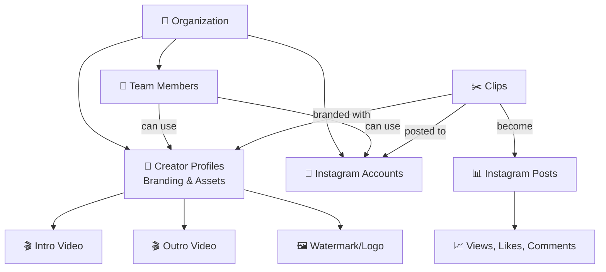
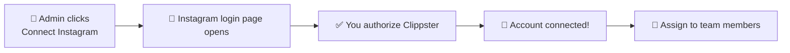
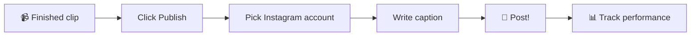

# Instagram Clip Flow - Simple Overview

## The Big Picture

---

## Complete Flow (Step by Step)

---

## Who Does What?

---

## How Everything Connects

---

## Instagram Connection Flow

---

## Clip Publishing Flow

---

## Summary Table

| Step | What Happens | Who Does It |
|------|-------------|-------------|
| 1 | Create organization & invite team | Admin |
| 2 | Set up branding (intro, outro, watermark) | Admin |
| 3 | Connect Instagram account | Admin |
| 4 | Assign Instagram to team members | Admin |
| 5 | Record or watch livestreams | Anyone |
| 6 | AI finds the best clip moments | Automatic |
| 7 | Edit clip with subtitles & effects | Anyone |
| 8 | Export with branding applied | Anyone |
| 9 | Publish to Instagram | Assigned Members |
| 10 | Track views & engagement | Anyone |

---

## Key Terms

| Term | What It Means |
|------|---------------|
| **Organization** | Your team/company in Clippster |
| **Creator Profile** | Your brand package (intro, outro, watermark, logo) |
| **Social Account** | A connected Instagram (or TikTok, etc.) account |
| **Assignment** | Giving a team member permission to use an Instagram account |
| **Post Submission** | A clip that was published to Instagram |
| **Analytics** | Views, likes, comments, and shares on your posts |
