# Complete Instagram Clip Flow - Clippster

This document covers the complete flow from content capture to Instagram posting, with clear separation between **Organizations** and **Clippers**.

---

## 🎯 The Two User Types

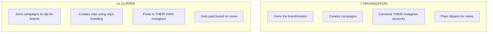

---

## 📋 Simple Overview: The Complete Journey

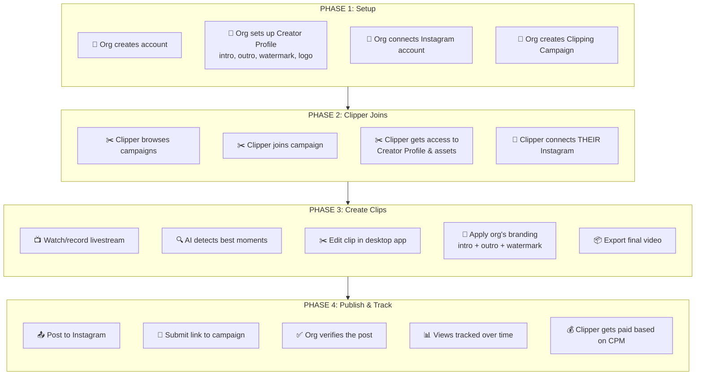

---

## 🏢 Organization Flow (Detailed)

### What Organizations Do

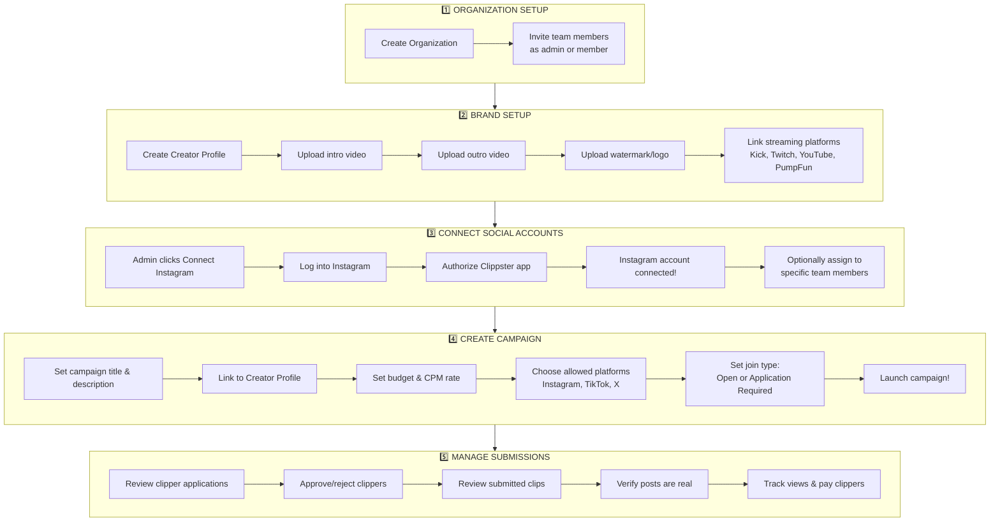

---

## ✂️ Clipper Flow (Detailed)

### What Clippers Do

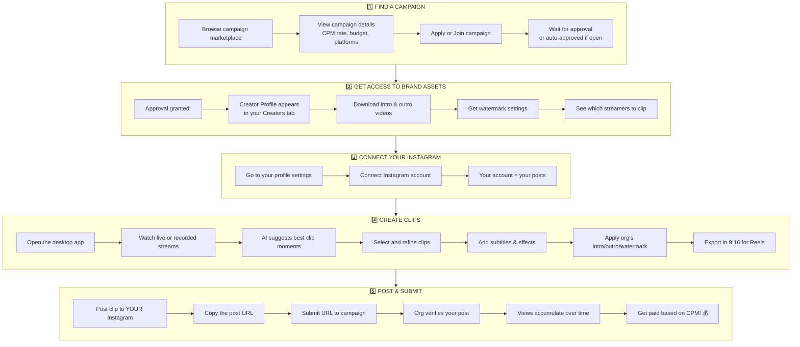

---

## 🎬 Clip Creation Flow (Desktop App)

### How clips are actually made

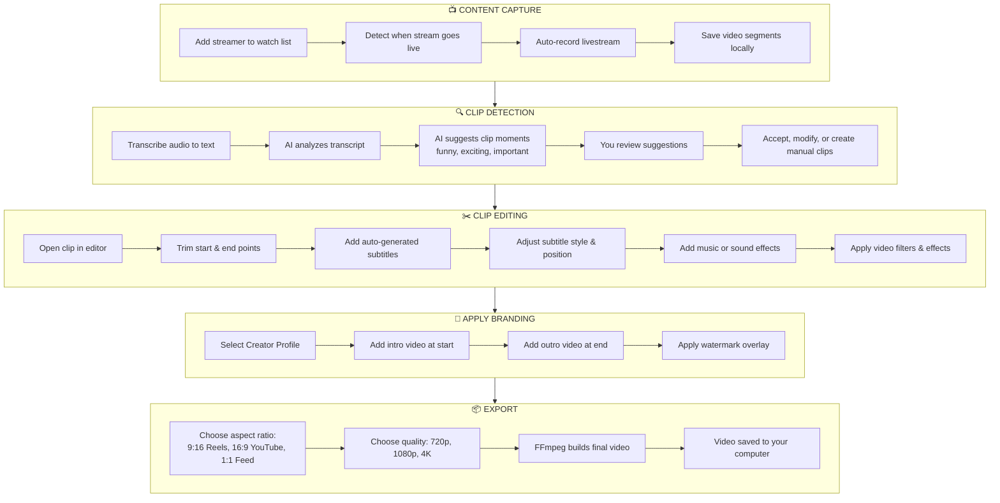

---

## 📱 Instagram Posting Flow

### How clips get to Instagram

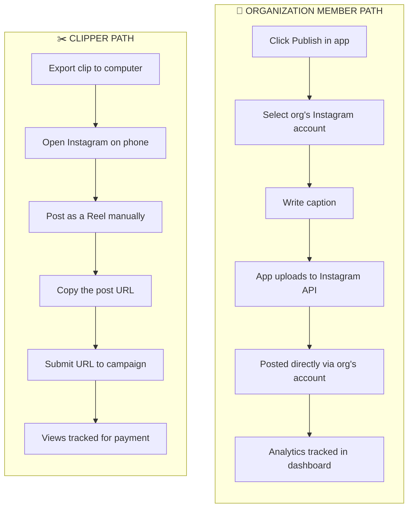

---

## 📊 Analytics & Payment Flow

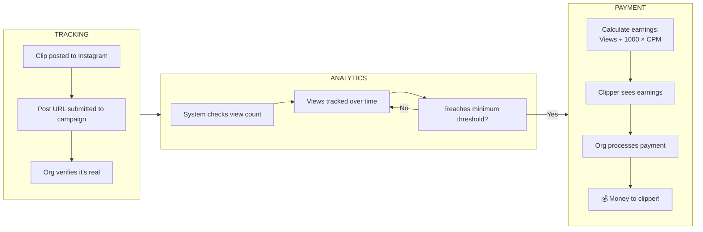

---

## 🔑 Key Differences: Org vs Clipper

| Aspect | 🏢 Organization | ✂️ Clipper |
|--------|-----------------|------------|
| **Instagram Account** | Org owns & connects it | Clipper uses their own |
| **Who Posts** | Org member posts via app | Clipper posts manually |
| **Branding Assets** | Org creates them | Clipper uses org's assets |
| **Payment** | Org pays clippers | Clipper receives payment |
| **Analytics** | Sees all posts in dashboard | Sees only their submissions |
| **Creator Profile** | Org creates & owns | Clipper gets temporary access |

---

## 🗂️ Data Summary

### What lives WHERE?

| Data | Location | Owner |
|------|----------|-------|
| Video files, clips | Desktop app (local SQLite) | User's computer |
| Organization info | Server (PostgreSQL) | Organization |
| Creator Profiles & assets | Server | Organization |
| Org's Instagram accounts | Server (encrypted) | Organization |
| Clipper's Instagram accounts | Server (encrypted) | Individual clipper |
| Campaigns | Server | Organization |
| Clip submissions | Server | Linked to clipper & campaign |
| Post analytics | Server | Tracked per post |
| Payments | Server | Linked to submissions |

---

---

# 🔧 Technical Details (For Engineers)

---

## Entity Relationship Diagram

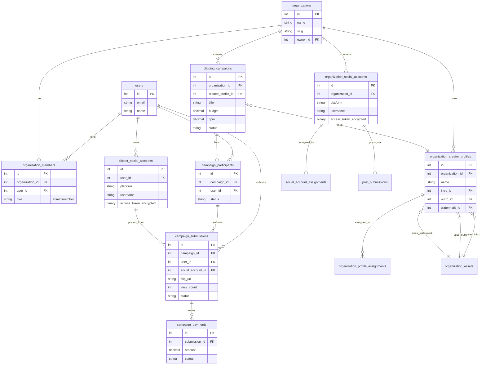

---

## Instagram OAuth Flow (Technical)

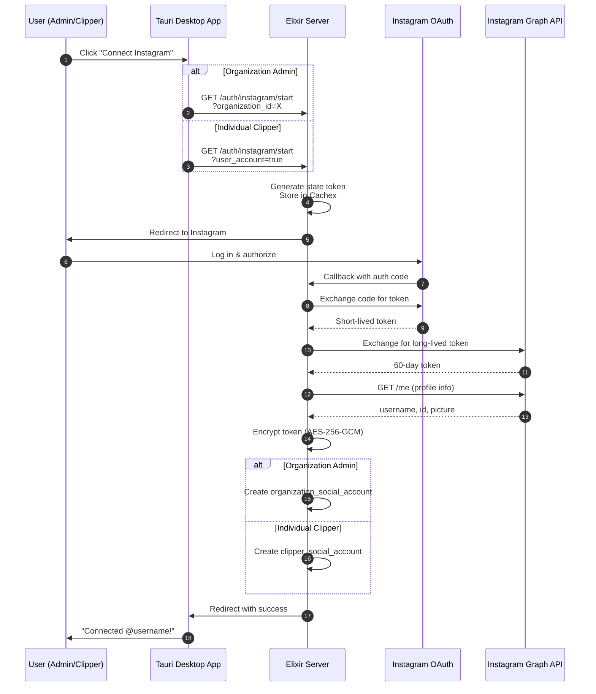

---

## Clip Build Pipeline (Technical)

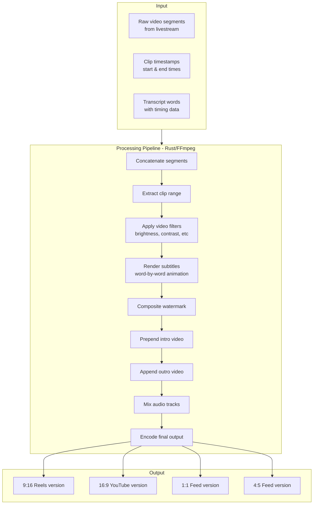

---

## System Architecture

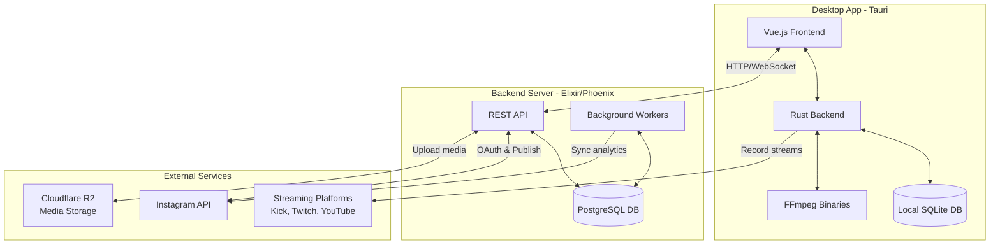

---

## Key API Routes

### Organization Routes
```
POST   /api/organizations                              Create org
GET    /api/organizations/:id/creator-profiles         List profiles
POST   /api/organizations/:id/creator-profiles         Create profile
GET    /api/organizations/:id/social-accounts          List connected accounts
POST   /api/organizations/:id/posts/publish            Publish to Instagram
GET    /api/organizations/:id/campaigns                List campaigns
POST   /api/organizations/:id/campaigns                Create campaign
```

### Clipper Routes
```
GET    /api/campaigns                                  Browse campaigns
POST   /api/campaigns/:id/apply                        Apply to campaign
GET    /api/user/campaigns                             My campaigns
POST   /api/campaigns/:id/submissions                  Submit clip URL
GET    /api/user/submissions                           My submissions
GET    /api/user/earnings                              My earnings
CRUD   /api/user/social-accounts                       My Instagram accounts
```

### Instagram Auth Routes
```
GET    /api/auth/instagram/start                       Start OAuth flow
GET    /api/auth/instagram/callback                    OAuth callback
POST   /api/auth/instagram/exchange                    Exchange code for token
```

---

## Key Files Reference

| Component | Path |
|-----------|------|
| **Server** | |
| Instagram OAuth | `server/lib/clippster_server_web/controllers/instagram_auth_controller.ex` |
| Instagram API client | `server/lib/clippster_server/social/platforms/instagram.ex` |
| Social accounts | `server/lib/clippster_server/social/social_account.ex` |
| Post submissions | `server/lib/clippster_server/social/post_submission.ex` |
| Organizations | `server/lib/clippster_server/organizations.ex` |
| Creator profiles | `server/lib/clippster_server/organizations/organization_creator_profile.ex` |
| **Client** | |
| Clip editor | `client/src/components/clip-editor/` |
| Export tab | `client/src/components/clip-editor/tabs/ExportTab.vue` |
| Publish dialog | `client/src/components/organization/PublishDialog.vue` |
| Social API service | `client/src/services/socialAccountsApi.ts` |
| Creator profiles DB | `client/src/services/database/creator-profiles.ts` |
| **Rust** | |
| Clip orchestrator | `client/src-tauri/src/clips/orchestrator.rs` |
| Livestream clips | `client/src-tauri/src/clips/livestream_clip.rs` |
| Video processor | `client/src-tauri/src/clips/video_processor.rs` |
| PumpFun recorder | `client/src-tauri/src/pumpfun.rs` |
