# Complete Instagram Clip Flow - Clippster

This document covers the complete flow from content capture to Instagram posting within **Organizations**.

---

## 🎯 How It Works (Simple Overview)

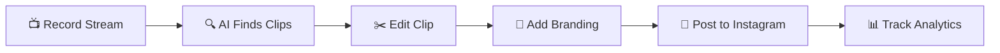

---

## 🏢 Organization Structure

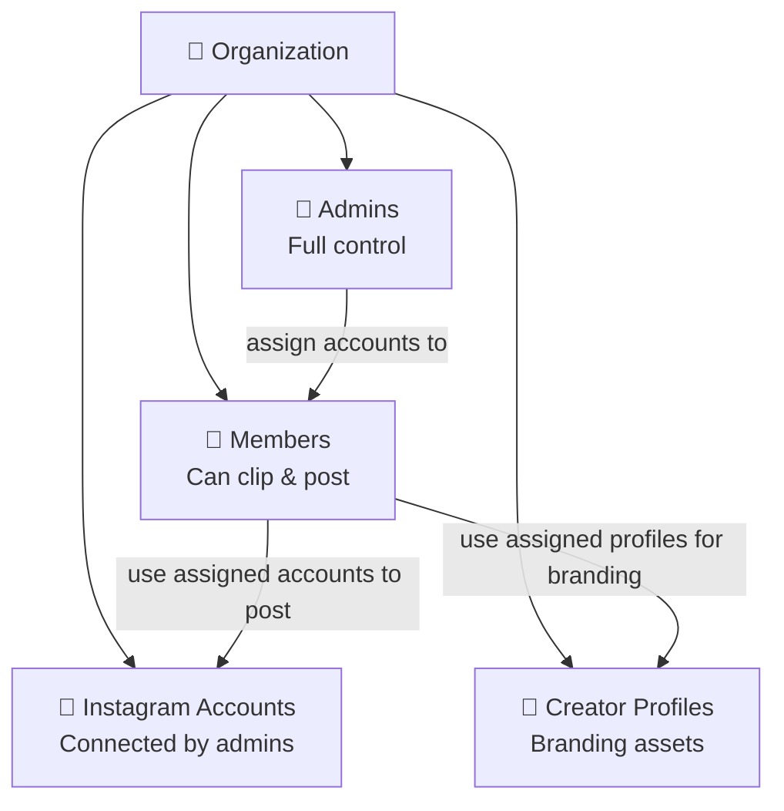

**Key point:** Team members do NOT need their own Instagram account. They post using the organization's connected Instagram accounts that are assigned to them.

---

## 📋 Complete Flow (Step by Step)

```mermaid
flowchart TB
    subgraph setup [" 1️⃣  ORGANIZATION SETUP "]
        direction TB
        A1[Admin creates organization] --> A2[Admin invites team members]
    end

    subgraph branding [" 2️⃣  BRAND SETUP "]
        direction TB
        B1[Create Creator Profile] --> B2[Upload intro & outro videos]
        B2 --> B3[Upload watermark/logo]
        B3 --> B4[Link streaming platforms]
    end

    subgraph instagram [" 3️⃣  CONNECT INSTAGRAM "]
        direction TB
        C1[Admin connects org's Instagram] --> C2[Instagram account saved to org]
        C2 --> C3[Admin assigns account to members]
    end

    subgraph content [" 4️⃣  CAPTURE CONTENT "]
        direction TB
        D1[Add streamer to watch list] --> D2[Record livestream]
        D2 --> D3[Video saved locally]
    end

    subgraph clips [" 5️⃣  CREATE CLIPS "]
        direction TB
        E1[AI detects best moments] --> E2[Edit clip in app]
        E2 --> E3[Add subtitles & effects]
        E3 --> E4[Apply Creator Profile branding]
        E4 --> E5[Export final video]
    end

    subgraph publish [" 6️⃣  PUBLISH TO INSTAGRAM "]
        direction TB
        F1[Click Publish in app] --> F2[Select assigned Instagram account]
        F2 --> F3[Write caption]
        F3 --> F4[App posts directly to Instagram]
    end

    subgraph track [" 7️⃣  TRACK PERFORMANCE "]
        direction TB
        G1[Post appears in dashboard] --> G2[Views, likes, comments tracked]
        G2 --> G3[Analytics sync automatically]
    end

    setup --> branding --> instagram --> content --> clips --> publish --> track
```

---

## 👑 What Admins Do

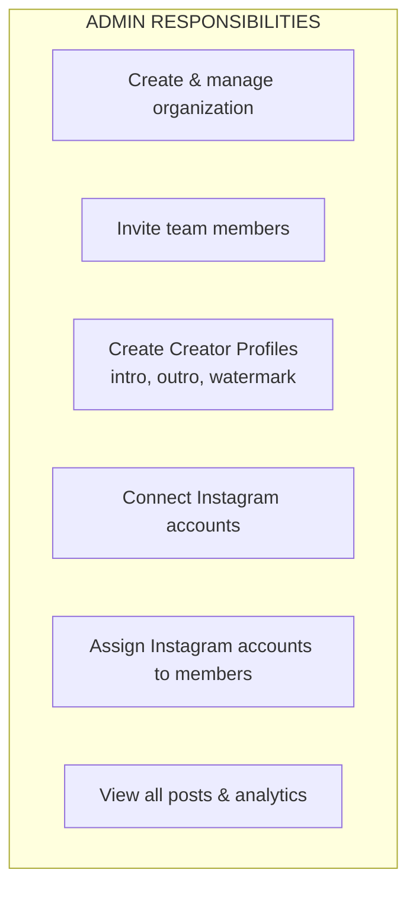

---

## 👤 What Members Do

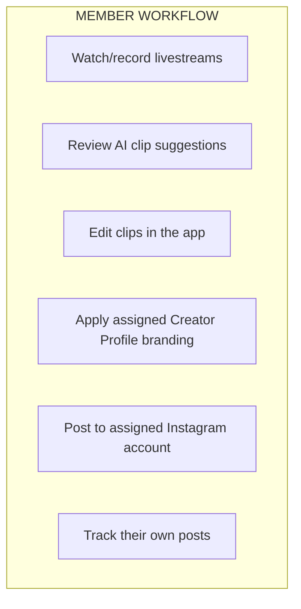

**Important:** Members use the organization's Instagram accounts (assigned by admin), NOT their personal accounts.

---

## 📱 Instagram Account Flow

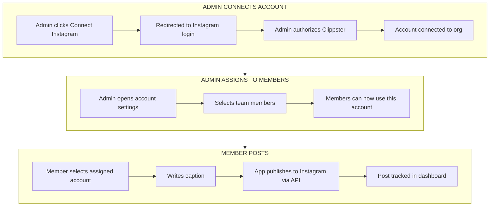

---

## 🎬 Clip Creation Flow

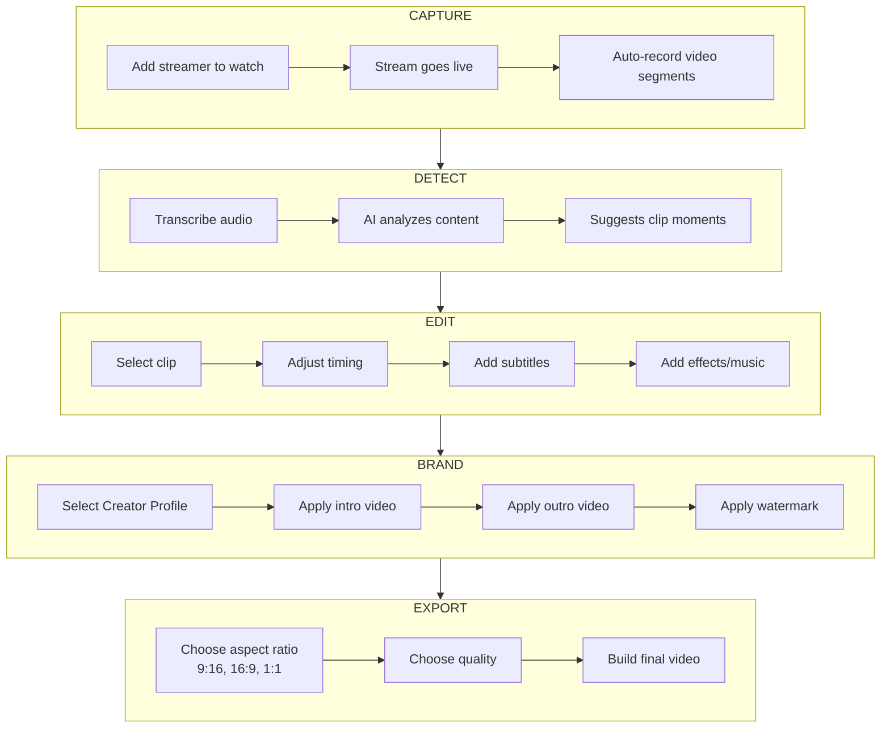

---

## 📊 Analytics Tracking

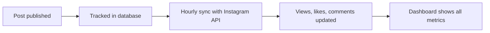

---

## 🔑 Who Can Do What

| Action | 👑 Admin | 👤 Member |
|--------|----------|-----------|
| Create organization | ✅ | ❌ |
| Invite members | ✅ | ❌ |
| Connect Instagram accounts | ✅ | ❌ |
| Assign accounts to members | ✅ | ❌ |
| Create Creator Profiles | ✅ | ❌ |
| Record streams | ✅ | ✅ |
| Create clips | ✅ | ✅ |
| Post to assigned Instagram | ✅ | ✅ |
| View all org analytics | ✅ | ❌ |
| View own posts | ✅ | ✅ |

---

## 🗂️ Key Concepts

| Concept | Description |
|---------|-------------|
| **Organization** | Your team/company that owns Creator Profiles and Instagram accounts |
| **Admin** | Can manage everything: accounts, profiles, members |
| **Member** | Can create clips and post to assigned Instagram accounts |
| **Creator Profile** | Brand package: intro, outro, watermark, platform links |
| **Social Account** | Connected Instagram account owned by the organization |
| **Assignment** | Permission for a member to use an org's Instagram account |
| **Post Submission** | A clip posted to Instagram, tracked with analytics |

---

---

# 🔧 Technical Details (For Engineers)

---

## Entity Relationship Diagram

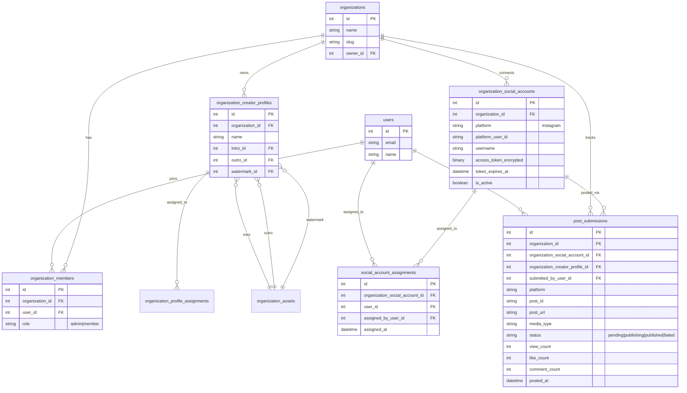

---

## Instagram OAuth Flow

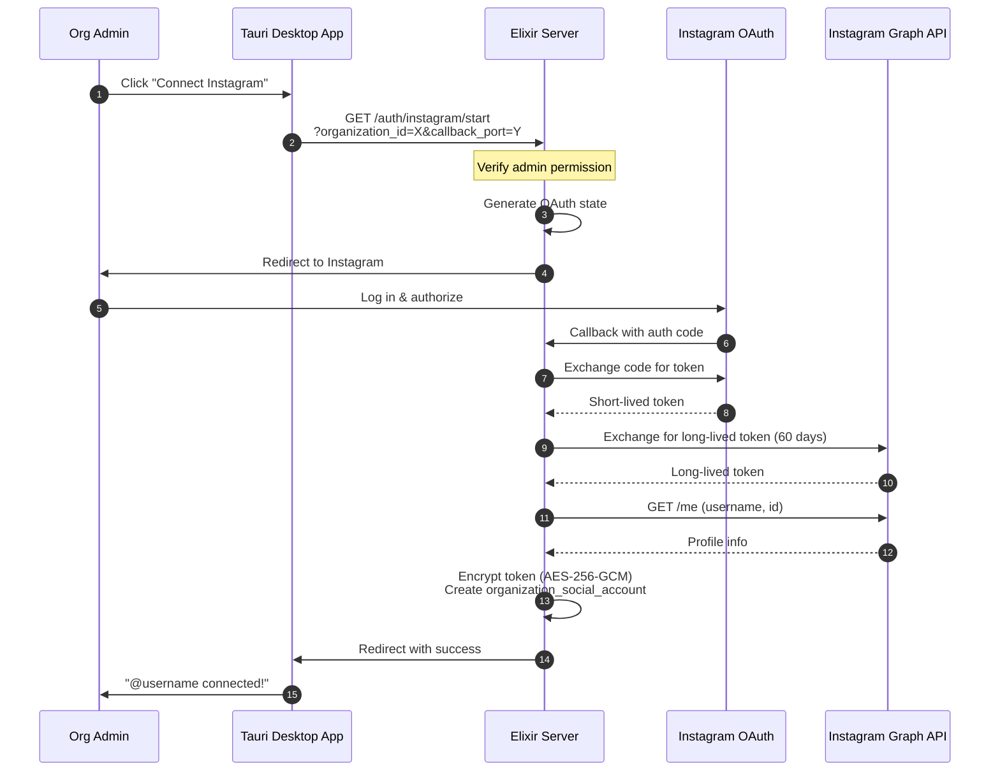

---

## Post Publishing Flow

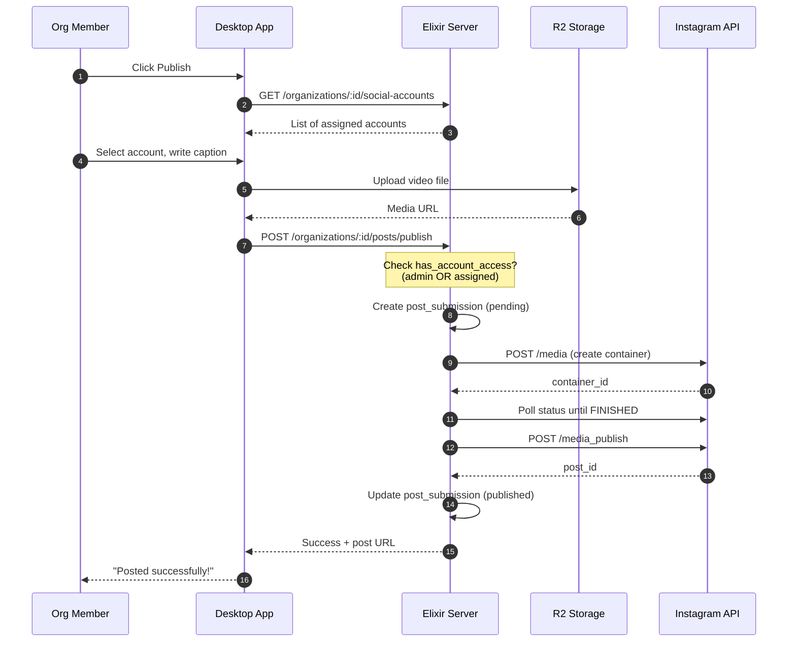

---

## Access Control Logic

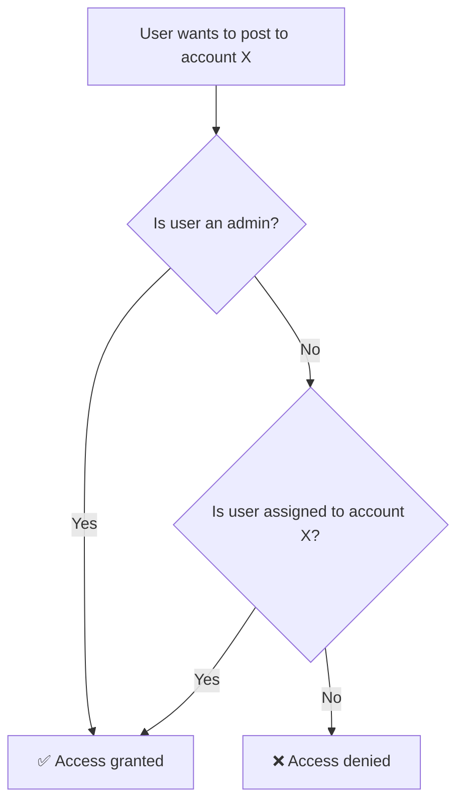

**Code reference:** `Social.has_account_access?/3`

```elixir
def has_account_access?(organization_id, account_id, user_id) do
  # Admins always have access
  if Organizations.is_admin?(organization_id, user_id) do
    true
  else
    # Check if assigned
    SocialAccountAssignment
    |> join(:inner, [a], s in SocialAccount, on: ...)
    |> where([a, s], s.id == ^account_id and a.user_id == ^user_id)
    |> Repo.exists?()
  end
end
```

---

## System Architecture

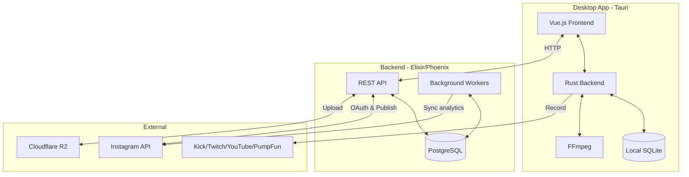

---

## Key API Routes

### Organization Social Accounts
```
GET    /api/organizations/:org_id/social-accounts              List connected accounts
POST   /api/organizations/:org_id/social-accounts              Connect new account (admin)
DELETE /api/organizations/:org_id/social-accounts/:id          Disconnect account (admin)
POST   /api/organizations/:org_id/social-accounts/:id/assign   Assign to members (admin)
DELETE /api/organizations/:org_id/social-accounts/:id/assign/:user_id  Unassign (admin)
```

### Publishing
```
POST   /api/organizations/:org_id/posts/publish                Publish clip to Instagram
GET    /api/organizations/:org_id/posts                        List all posts
GET    /api/organizations/:org_id/posts/:id                    Get single post
PUT    /api/organizations/:org_id/posts/:id                    Update analytics (admin)
GET    /api/organizations/:org_id/posts/analytics              Get analytics summary
```

### Instagram OAuth
```
GET    /api/auth/instagram/start                               Start OAuth flow
GET    /api/auth/instagram/callback                            OAuth callback
```

---

## Key Files

| Component | Path |
|-----------|------|
| **Server** | |
| Social context | `server/lib/clippster_server/social.ex` |
| Social account schema | `server/lib/clippster_server/social/social_account.ex` |
| Account assignment schema | `server/lib/clippster_server/social/social_account_assignment.ex` |
| Post submission schema | `server/lib/clippster_server/social/post_submission.ex` |
| Instagram API client | `server/lib/clippster_server/social/platforms/instagram.ex` |
| Instagram OAuth controller | `server/lib/clippster_server_web/controllers/instagram_auth_controller.ex` |
| Post controller | `server/lib/clippster_server_web/controllers/post_submission_controller.ex` |
| **Client** | |
| Social accounts manager | `client/src/components/organization/SocialAccountsManager.vue` |
| Publish dialog | `client/src/components/organization/PublishDialog.vue` |
| Social API service | `client/src/services/socialAccountsApi.ts` |
| Instagram auth helper | `client/src/lib/instagram-auth.ts` |
