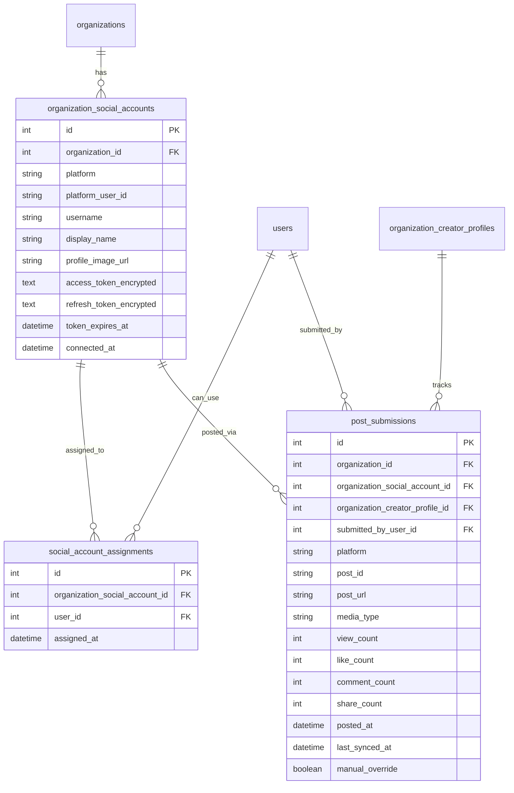

# Instagram Social Integration for Organizations

## Architecture Overview



## Phase 1: Database Schema

Create new migrations in [`server/priv/repo/migrations/`](server/priv/repo/migrations/):

**Migration 1: `create_organization_social_accounts.exs`**

- `organization_social_accounts` table with encrypted OAuth tokens
- `platform` field supports future expansion ("instagram", later "tiktok", "twitter", etc.)

**Migration 2: `create_social_account_assignments.exs`**

- Many-to-many relationship between social accounts and org members

**Migration 3: `create_post_submissions.exs`**

- Track published posts with analytics fields
- Links to social account, creator profile, and submitting user

## Phase 2: Client-Side Facebook SDK OAuth (UPDATED)

### Why Client-Side SDK?

The Instagram Graph API requires authentication through **Facebook Login** (not Instagram Basic Display API which is deprecated). Using the Facebook JavaScript SDK provides:

- Better UX with native popup flow
- Proper handling of Instagram Business/Creator account permissions  
- No server-side redirect complexity
- Direct token retrieval in browser

### OAuth Flow (Client-Side)

```
┌─────────────┐     ┌─────────────┐     ┌─────────────┐     ┌─────────────┐
│   Client    │     │ Facebook SDK│     │   Facebook  │     │   Server    │
│  (Vue App)  │     │  (Browser)  │     │   OAuth     │     │  (Elixir)   │
└──────┬──────┘     └──────┬──────┘     └──────┬──────┘     └──────┬──────┘
       │                   │                   │                   │
       │  FB.login()       │                   │                   │
       │──────────────────>│                   │                   │
       │                   │   OAuth Popup     │                   │
       │                   │──────────────────>│                   │
       │                   │                   │                   │
       │                   │   Access Token    │                   │
       │                   │<──────────────────│                   │
       │   authResponse    │                   │                   │
       │<──────────────────│                   │                   │
       │                   │                   │                   │
       │   POST /social-accounts (with token)  │                   │
       │───────────────────────────────────────────────────────────>│
       │                   │                   │                   │
       │                   │                   │   Get IG accounts │
       │                   │                   │   via Graph API   │
       │                   │                   │<──────────────────│
       │                   │                   │                   │
       │   Account created │                   │                   │
       │<───────────────────────────────────────────────────────────│
```

### Required Facebook Permissions

```javascript
FB.login(callback, {
  scope: [
    'instagram_basic',           // Basic Instagram account info
    'instagram_content_publish', // Publish to Instagram
    'instagram_manage_insights', // Read analytics
    'pages_show_list',           // List connected Facebook Pages
    'pages_read_engagement'      // Page engagement metrics
  ].join(','),
  return_scopes: true
});
```

### New/Updated Files

**Client:**
- `client/src/lib/facebook-sdk.ts` - Facebook SDK initialization and helpers
- `client/src/components/organization/SocialAccountsManager.vue` - Uses FB.login()

**Server:**
- `server/lib/clippster_server/social/platforms/instagram.ex` - Remove OAuth redirect, keep Graph API methods
- `server/lib/clippster_server_web/controllers/social_account_controller.ex` - Accept token from client

### Key Routes (Simplified)

```elixir
# No OAuth redirect routes needed - client handles OAuth via FB SDK

# Organization social accounts (protected)
get "/organizations/:org_id/social-accounts", SocialAccountController, :index
post "/organizations/:org_id/social-accounts", SocialAccountController, :create  # Receives token from client
get "/organizations/:org_id/social-accounts/:id", SocialAccountController, :show
put "/organizations/:org_id/social-accounts/:id", SocialAccountController, :update
delete "/organizations/:org_id/social-accounts/:id", SocialAccountController, :delete
post "/organizations/:org_id/social-accounts/:id/refresh", SocialAccountController, :refresh_token

# Account assignments
get "/organizations/:org_id/social-accounts/:id/assignments", SocialAccountController, :list_assignments
post "/organizations/:org_id/social-accounts/:id/assignments", SocialAccountController, :assign
delete "/organizations/:org_id/social-accounts/:id/assignments/:user_id", SocialAccountController, :unassign

# Post submissions
get "/organizations/:org_id/posts", PostSubmissionController, :index
post "/organizations/:org_id/posts/publish", PostSubmissionController, :publish
put "/organizations/:org_id/posts/:id", PostSubmissionController, :update
post "/organizations/:org_id/posts/:id/sync", PostSubmissionController, :sync_analytics
```

## Phase 3: Instagram API Integration

### Publishing Flow

1. Member selects connected IG account + creator profile
2. Upload media to Instagram via Content Publishing API
3. Create container, then publish
4. Store post_id and URL in `post_submissions`

### Analytics Sync

- GenServer worker runs hourly to sync analytics
- Uses Instagram Insights API for metrics
- Stores view_count, like_count, comment_count, share_count
- `manual_override` flag prevents auto-sync from overwriting manual entries

**New worker in [`server/lib/clippster_server/social/analytics_sync_worker.ex`](server/lib/clippster_server/social/analytics_sync_worker.ex)**

## Phase 4: Client - UI Components

### New Components in [`client/src/components/`](client/src/components/)

- `SocialAccountsManager.vue` - Connect/manage IG accounts
- `SocialAccountAssignments.vue` - Assign accounts to members  
- `PostSubmissionsList.vue` - View all posts with analytics
- `PublishDialog.vue` - Publish clip to Instagram

### Updates to Existing

- [`OrganizationDashboard.vue`](client/src/components/OrganizationDashboard.vue) - Add "Social Accounts" and "Posts" tabs
- New API service: `client/src/services/socialAccountsApi.ts`

### Dashboard Posts View

- Table showing all posts with columns: Thumbnail, Creator Profile, Account, Platform, Views, Likes, Comments, Posted At
- Filter by creator profile, account, date range
- Click to expand with full analytics and post details
- Manual edit option for analytics with override flag

## Phase 5: Platform Abstraction (Extensibility)

Design patterns for future platforms:

```elixir
# Platform behavior
defmodule ClippsterServer.Social.Platform do
  @callback authorize_url(opts) :: String.t()
  @callback exchange_code(code) :: {:ok, tokens} | {:error, reason}
  @callback refresh_tokens(refresh_token) :: {:ok, tokens} | {:error, reason}
  @callback publish_media(account, media_url, caption) :: {:ok, post} | {:error, reason}
  @callback get_insights(post_id) :: {:ok, metrics} | {:error, reason}
end

# Implementations
defmodule ClippsterServer.Social.Platforms.Instagram do
  @behaviour ClippsterServer.Social.Platform
  # ...
end
```

## Environment Variables Required

```bash
# Facebook App (for Instagram Graph API)
# Get these from https://developers.facebook.com/apps/
VITE_FACEBOOK_APP_ID=           # Client-side (public)
FACEBOOK_APP_SECRET=            # Server-side only (private)

# Token encryption key (generate with ClippsterServer.Social.TokenEncryption.generate_key())
SOCIAL_TOKEN_ENCRYPTION_KEY=
```

**Note:** The Facebook App must have:
1. Instagram Graph API product added
2. Instagram Basic Display product added (for backward compatibility)
3. Valid OAuth redirect URIs configured (though not used with SDK flow)

## Key Implementation Notes

1. **Token Security**: OAuth tokens must be encrypted at rest using AES-256-GCM
2. **Token Refresh**: Background job to refresh tokens before expiry (Instagram tokens last 60 days)
3. **Rate Limits**: Instagram API has strict rate limits - implement exponential backoff
4. **Permissions**: Only org admins can connect accounts; members can only use assigned accounts
5. **Analytics Sync**: Batch sync to minimize API calls, respect rate limits

## Files to Create/Update

| File | Purpose |
|------|---------|
| `server/lib/clippster_server/social.ex` | Social context module |
| `server/lib/clippster_server/social/social_account.ex` | Schema |
| `server/lib/clippster_server/social/social_account_assignment.ex` | Schema |
| `server/lib/clippster_server/social/post_submission.ex` | Schema |
| `server/lib/clippster_server/social/platforms/instagram.ex` | IG Graph API client (no OAuth redirect) |
| `server/lib/clippster_server/social/token_encryption.ex` | Token crypto |
| `server/lib/clippster_server/social/analytics_sync_worker.ex` | Sync worker |
| `server/lib/clippster_server/social/platform.ex` | Platform behavior |
| `server/lib/clippster_server_web/controllers/social_account_controller.ex` | Accounts CRUD |
| `server/lib/clippster_server_web/controllers/post_submission_controller.ex` | Posts controller |
| `client/src/lib/facebook-sdk.ts` | **NEW** - Facebook SDK initialization |
| `client/src/services/socialAccountsApi.ts` | API service |
| `client/src/components/organization/SocialAccountsManager.vue` | Account management UI (uses FB SDK) |
| `client/src/components/organization/SocialAccountAssignments.vue` | Assignment UI |
| `client/src/components/organization/PostSubmissionsList.vue` | Posts dashboard |
| `client/src/components/organization/PublishDialog.vue` | Publish modal |

**Removed:** `social_auth_controller.ex` - No longer needed with client-side SDK flow