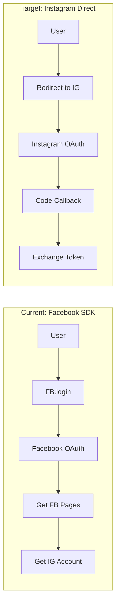

# Instagram Business Login Refactor

## Current State vs Target State




## OAuth Flow (per [Business Login docs](https://developers.facebook.com/docs/instagram-platform/instagram-api-with-instagram-login/business-login))

1. **Authorization**: Redirect to `https://www.instagram.com/oauth/authorize`
2. **Callback**: Receive `code` at your redirect URI  
3. **Token Exchange**: POST to `https://api.instagram.com/oauth/access_token`
4. **Long-lived Token**: GET `https://graph.instagram.com/access_token`

## Meta App Dashboard Setup

Before code changes, complete these in your Meta App Dashboard:

### Step 4: Click "Set up" for Instagram Business Login

Configure these settings:

- **OAuth Redirect URIs**: `http://localhost:5173/auth/instagram/callback`, `https://clippster.app/auth/instagram/callback`
- **Deauthorize Callback URL**: (optional) `https://clippster.app/api/instagram/deauthorize`
- **Delete Data Callback URL**: (optional) `https://clippster.app/api/instagram/delete`

### Step 2: Add Test Account

1. Go to **App roles** > **Roles**
2. Add your Instagram account as **Instagram Tester**
3. Accept the invite in Instagram app: Settings > Apps and Websites > Tester Invites

## Code Changes Required

### 1. Environment Variables

**Server `.env`**:

```bash
# Instagram API with Instagram Login
INSTAGRAM_APP_ID=25643553921997880
INSTAGRAM_APP_SECRET=<from dashboard>
INSTAGRAM_REDIRECT_URI=http://localhost:5173/auth/instagram/callback

# Keep for token encryption
SOCIAL_TOKEN_ENCRYPTION_KEY=<existing>
```

**Client `.env`**:

```bash
VITE_INSTAGRAM_APP_ID=25643553921997880
VITE_INSTAGRAM_REDIRECT_URI=http://localhost:5173/auth/instagram/callback
```


### 2. Client: Replace Facebook SDK with Redirect Flow

**Remove**: `client/src/lib/facebook-sdk.ts`**Create**: `client/src/lib/instagram-auth.ts`

- Build authorization URL with params:
- `client_id`: Instagram App ID
- `redirect_uri`: Your callback URL
- `scope`: `instagram_business_basic,instagram_business_content_publish`
- `response_type`: `code`
- Open popup/redirect to Instagram OAuth
- Handle callback route to capture code

**Update**: `client/src/services/socialAccountsApi.ts`

- Replace `connectAndSaveInstagramAccounts()` with redirect-based flow
- Add function to send auth code to server

**Add**: `client/src/pages/InstagramCallback.vue` (or add route handler)

- Capture `code` from URL params
- Send to server for token exchange

### 3. Server: Add Instagram OAuth Endpoints

**Update**: `server/lib/clippster_server_web/router.ex`

```elixir
# Public routes
get "/auth/instagram/callback", InstagramAuthController, :callback

# Protected routes (require auth)
post "/auth/instagram/exchange", InstagramAuthController, :exchange_code
```

**Create**: `server/lib/clippster_server_web/controllers/instagram_auth_controller.ex`

- `exchange_code/2`: Exchange authorization code for tokens
- POST to `https://api.instagram.com/oauth/access_token`
- Exchange short-lived for long-lived token
- Create/update social account

**Update**: `server/lib/clippster_server/social/platforms/instagram.ex`

- Update `exchange_code/2` to use Instagram OAuth endpoints
- Update `refresh_tokens/1` to use `https://graph.instagram.com/refresh_access_token`

### 4. Update Permissions (New Scope Names)

Per documentation, update permission names:

- `instagram_basic` → `instagram_business_basic`
- `instagram_content_publish` → `instagram_business_content_publish`
- `instagram_manage_comments` → `instagram_business_manage_comments`

### 5. Update Frontend Component

**Update**: `client/src/components/organization/SocialAccountsManager.vue`

- Remove Facebook SDK initialization
- Call new Instagram redirect-based auth function

## File Changes Summary

| Action | File ||--------|------|| Delete | `client/src/lib/facebook-sdk.ts` || Create | `client/src/lib/instagram-auth.ts` || Create | `client/src/pages/InstagramCallback.vue` || Create | `server/lib/clippster_server_web/controllers/instagram_auth_controller.ex` || Update | `server/lib/clippster_server/social/platforms/instagram.ex` || Update | `server/lib/clippster_server_web/router.ex` || Update | `client/src/services/socialAccountsApi.ts` |


Option 1: Use ngrok (Recommended for Development)
Install ngrok: https://ngrok.com/download
Run your Vite dev server: npm run dev (usually on port 5173)
In another terminal, run:
   ngrok http 5173
Copy the HTTPS URL ngrok gives you (e.g., https://abc123.ngrok.io)
Use that as your redirect URI:
Dashboard: https://abc123.ngrok.io/auth/instagram/callback
Client .env: VITE_INSTAGRAM_REDIRECT_URI=https://abc123.ngrok.io/auth/instagram/callback
Server .env: INSTAGRAM_REDIRECT_URI=https://abc123.ngrok.io/auth/instagram/callback
Note: The free ngrok URL changes each time you restart it. For consistent testing, consider ngrok's paid tier or use Option 2.