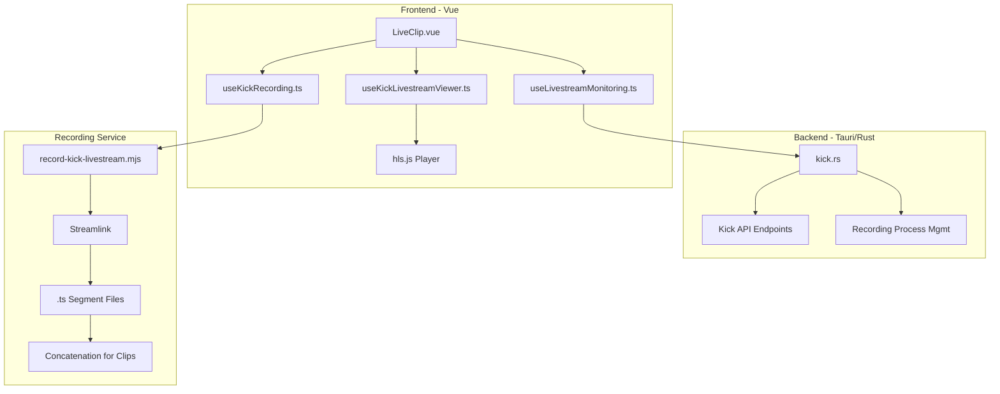

# Kick Livestream Integration Plan

> **Status**: Planning Complete - Ready for Implementation  
> **Created**: December 2024

## Overview

Implement live watching, recording, DVR playback, and auto-detection for Kick streams by leveraging Kick's HLS streaming infrastructure, which differs fundamentally from PumpFun's LiveKit-based approach.

## Implementation Checklist

- [ ] Create kick.rs backend with live status check and stream URL discovery
- [ ] Create kick-service recording with Streamlink + direct .ts concatenation (no sync issues)
- [ ] Create useKickLivestreamViewer.ts with hls.js integration
- [ ] Implement DVR seeking controls leveraging HLS native DVR
- [ ] Update useLivestreamMonitoring.ts to support Kick channels
- [ ] Update LiveClip.vue to handle Kick streams alongside PumpFun

---

## Why Kick Will NOT Have PumpFun's A/V Sync Issues

PumpFun uses **LiveKit/WebRTC** where audio and video arrive as **separate tracks** that must be reconstructed and synchronized by our recorder. This is why `record-livestream.mjs` has ~200 lines of complex PTS-based sync code with per-stream offset overrides.

Kick uses **HLS** where audio and video are **pre-muxed by the broadcaster's encoder** (OBS, etc.) before upload. The `.ts` segments we download are already perfectly synchronized - the same files viewers watch.

| Aspect | PumpFun (WebRTC) | Kick (HLS) |
|--------|------------------|------------|
| A/V Delivery | Separate tracks, reassembled client-side | Pre-muxed `.ts` segments |
| Sync Responsibility | Our recorder must sync tracks (error-prone) | Broadcaster's encoder syncs before upload |
| Container Format | Raw frames piped to FFmpeg | MPEG-TS containers already muxed |
| **Sync Issues?** | Yes - varies per stream/setup | **No - already synchronized** |

## Recording Approach (Streamlink + Direct Concatenation)

Based on discussion, we will use:

1. **Streamlink** - Robust HLS downloading, handles reconnection/edge cases
2. **Direct .ts concatenation** - No FFmpeg remuxing, preserves original A/V sync perfectly

This is dramatically simpler than PumpFun's pipeline:

```
PumpFun: WebRTC tracks → Complex PTS sync → FFmpeg encode → Segments
Kick:    HLS .ts files → Streamlink download → Concatenate → Done
```

## Architecture Overview



---

## Implementation Phases

### Phase 1: Kick API and Live Status Detection

**Goal**: Check if a Kick channel is live and get stream metadata

**Files to create/modify**:

- Create `client/src-tauri/src/kick.rs` - Kick API commands
- Modify `client/src-tauri/src/lib.rs` - Register new Kick commands
- Update `client/src/services/kick.ts` - Add live status functions

**Key tasks**:

1. Implement `check_kick_livestream` command to query Kick API for live status
2. Implement `get_kick_stream_url` to obtain the HLS m3u8 URL
3. Use the existing RapidAPI integration or Kick's public API endpoints

---

### Phase 2: HLS-Based Live Viewer

**Goal**: Watch Kick streams live with hls.js player

**Files to create/modify**:

- Create `client/src/composables/useKickLivestreamViewer.ts` - HLS-based viewer
- Update `client/src/pages/LiveClip.vue` - Add Kick stream viewer support
- Add hls.js dependency to `client/package.json`

**Key tasks**:

1. Initialize hls.js with the Kick m3u8 stream URL
2. Implement HLS quality level selection
3. Handle HLS events (manifest loaded, level switching, errors)
4. Leverage HLS's native DVR capabilities for seeking backwards

---

### Phase 3: Kick Stream Recording Service

**Goal**: Record Kick streams using Streamlink with direct .ts concatenation (no A/V sync issues)

**Files to create**:

- Create `client/src-tauri/kick-service/record-kick-livestream.mjs` - Recording orchestration
- Create `client/src-tauri/kick-service/package.json` - Dependencies

**Key tasks**:

1. Spawn Streamlink to download HLS stream to `.ts` file
2. Monitor output file and emit segment events at configurable intervals (e.g., every 5 minutes)
3. Use FFmpeg **only for splitting** the already-synchronized .ts into segments (stream copy, no re-encode)
4. Handle stream end detection and reconnection
5. Emit segment events to Tauri backend for auto-detection processing

**Why this avoids sync issues**:

- Streamlink downloads pre-synchronized .ts segments from Kick
- No audio/video track reconstruction needed (unlike PumpFun's WebRTC)
- FFmpeg only splits the file at keyframes using `-c copy` (no re-encoding)
- Original broadcaster sync is preserved end-to-end

**Streamlink command example**:

```bash
streamlink "https://kick.com/{channel}" best -o "{output_dir}/stream.ts"
```

**FFmpeg segment split (stream copy, preserves sync)**:

```bash
ffmpeg -i stream.ts -c copy -f segment -segment_time 300 -reset_timestamps 1 segment_%05d.ts
```

---

### Phase 4: DVR and Playback System

**Goal**: Enable rewind and seeking during live Kick streams

**Key approach** (simpler than PumpFun):

- Kick HLS streams already support DVR through their playlist structure
- hls.js can seek to any point in the DVR window natively
- No need for custom MediaRecorder-based DVR (HLS handles this)

**Files to modify**:

- Update `client/src/composables/useKickLivestreamViewer.ts` - Add DVR controls

**Key tasks**:

1. Query the HLS playlist for DVR window duration
2. Implement seek controls using hls.js's native seek capabilities
3. Track live edge vs. DVR playback position
4. Implement "go to live" functionality

---

### Phase 5: Monitoring and Auto-Detection

**Goal**: Monitor Kick channels and auto-detect clips during livestreams

**Files to modify**:

- Update `client/src/composables/useLivestreamMonitoring.ts` - Add Kick support
- Update `client/src/types/livestream.ts` - Platform type updates
- Update `client/src/services/database/creator-profiles.ts` - Kick profile support

**Key tasks**:

1. Add Kick-specific live status polling
2. Integrate Kick recording with the segment processing pipeline
3. Use existing auto-detection infrastructure for Kick segments

---

### Phase 6: Manual Clipping During Live

**Goal**: Allow users to create clips while watching live

**Key tasks**:

1. Track current playback position in HLS stream
2. Calculate clip boundaries based on DVR position
3. Extract segments from recorded HLS data for clip creation

---

## Technical Considerations

### HLS Stream URL Discovery

Kick streams are available at URLs like:

- Player embed: `https://player.kick.com/{username}`
- Potential HLS URL patterns to investigate:
  - `https://fa723fc1b171.us-west-2.playback.live-video.net/api/video/v1/us-west-2.{id}.channel.{id}.m3u8`
  - May require extracting from player page or using unofficial API

### Dependencies to Add

```json
{
  "hls.js": "^1.5.0"
}
```

### Database Updates

May need migration for Kick-specific creator profile fields if channel metadata structure differs significantly.

---

## Decisions Made

1. **Recording Method**: Use **Streamlink** (external binary) - most robust option
2. **Segment Handling**: **Direct .ts concatenation** - preserves original A/V sync, fastest approach

---

## Remaining Open Questions

1. **HLS URL Discovery**: Do you have knowledge of how to obtain the raw HLS m3u8 URL for a Kick channel? Streamlink may handle this automatically, but we need it for hls.js playback too.

2. **DVR Window**: Kick's DVR window may be limited (e.g., last 2-4 hours). Should we implement local recording for longer streams beyond Kick's DVR window?

3. **Streamlink Bundling**: Should Streamlink be bundled with the app, or require users to install it? (Similar to how FFmpeg is handled)

4. **API Rate Limits**: The existing RapidAPI integration may have rate limits. Should we investigate direct Kick API access for live status checks?

---

## Reference: Key Files in PumpFun Implementation

For reference when implementing Kick, these are the key PumpFun files to study:

| File | Purpose |
|------|---------|
| `client/src-tauri/pumpfun-service/record-livestream.mjs` | FFmpeg recording with complex A/V sync |
| `client/src-tauri/src/pumpfun.rs` | Tauri commands for PumpFun API |
| `client/src/composables/useLivestreamViewer.ts` | LiveKit-based viewer |
| `client/src/composables/useDvrRecording.ts` | Browser MediaRecorder DVR |
| `client/src/composables/useLivestreamMonitoring.ts` | Stream monitoring & auto-detection |
| `client/src/pages/LiveClip.vue` | Main live clipping UI |


