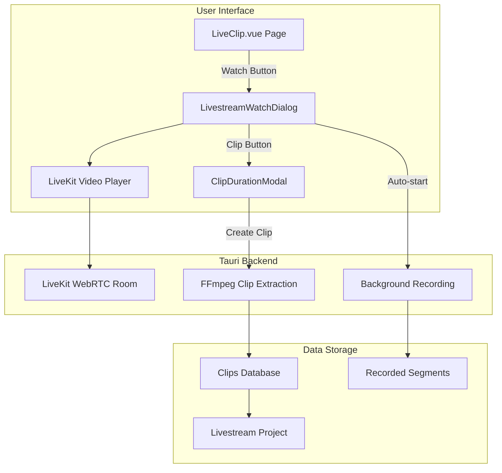

# Livestream Watch and Manual Clip Feature

This feature enables users to watch PumpFun livestreams in real-time within the app, with automatic watermark overlays for creator profiles, and the ability to create Kick-style clips (capturing the last N seconds) while watching.

## Architecture Overview



## Implementation Plan

### 1. Install LiveKit Client SDK

Add the LiveKit browser SDK to [`client/package.json`](client/package.json):

```json
"livekit-client": "^2.9.1"
```

### 2. Create Livestream Watch Dialog Component

Create a new component `LivestreamWatchDialog.vue` in [`client/src/components/`](client/src/components/) that:

- Connects to PumpFun LiveKit room as a viewer using the existing `joinLivestream` API
- Renders the video stream using LiveKit's video element attachment
- Overlays watermarks when creator profile is configured (leverage existing [`VideoPlayer.vue`](client/src/components/VideoPlayer.vue) watermark logic)
- Shows live viewer count, stream duration, and streamer info
- Auto-starts recording when dialog opens (using existing `useLivestreamMonitoring` composable)
- **DVR Timeline**: Seekable timeline with live edge indicator and "Go Live" button
- **Audio Controls**: Volume slider + mute button (persisted to localStorage)
- **Playback Speed**: 1x, 1.25x, 1.5x, 2x when rewound from live
- **Fullscreen Mode**: Fullscreen toggle with overlay controls on hover
- **Picture-in-Picture**: Mini-player mode for watching while navigating
- **Connection Status**: Visual indicator (green/yellow/red) + auto-reconnect logic
- **Quality Indicator**: Resolution badge and latency display
- **Buffering Indicator**: Spinner during loading/seeking
- **Keyboard Shortcuts**: Full keyboard control support
- **Clip Button**: Opens clip modal, or quick-clip with hotkey

### 3. Create Clip Duration Selector Modal

Create `ClipDurationModal.vue` for Kick-style clipping:

- Duration options: 10s, 20s, 30s, 60s, 90s (max)
- **Availability Check**: Disable durations exceeding recorded time with "Only X seconds available" tooltip
- **Optional Clip Name**: Text input with default "Clip - [timestamp]"
- **Progress Indicator**: Show extraction progress after confirmation
- Confirm/Cancel buttons
- Displays the target project folder where clip will be saved

### 4. Add Backend Clip Extraction Command

Add a new Tauri command in [`client/src-tauri/src/`](client/src-tauri/src/) to extract a clip from recorded segments:

```rust
#[tauri::command]
pub async fn extract_livestream_clip(
    app: tauri::AppHandle,
    session_id: String,
    clip_end_time: f64,      // Current stream time (seconds from start)
    clip_duration: f64,      // How many seconds to capture (10-90)
    output_path: String,
    watermark_settings: Option<WatermarkSettings>,  // Watermark to burn into clip
) -> Result<String, String>
```

This will:

- Find the relevant segment files for the time range
- Use FFmpeg to extract and concatenate the clip
- **Apply watermark to the clip using existing `apply_watermark_to_video` function** from [`video_processor.rs`](client/src-tauri/src/clips/video_processor.rs) (lines 743-751)
- Return the output file path with watermark baked in

### 5. Create useLivestreamViewer Composable

New composable [`client/src/composables/useLivestreamViewer.ts`](client/src/composables/) to manage:

- LiveKit room connection state (for live edge viewing)
- Video/audio track subscription
- **DVR Timeline State**:
  - `recordingStartTime`: When recording began
  - `liveEdgeTime`: Current live moment (updates in real-time)
  - `playbackPosition`: Where user is watching
  - `isAtLiveEdge`: Boolean - watching live vs rewound
  - `availableSegments`: List of recorded segment files with timestamps
- Stream time tracking (for clip timing based on playback position)
- Recording session synchronization
- Watermark settings lookup (from creator profile)
- **Playback Mode Switching**: Seamless transition between LiveKit (live) and segment playback (rewound)

### 6. Update LiveClip.vue Page

Modify [`client/src/pages/LiveClip.vue`](client/src/pages/LiveClip.vue) to:

- Add a "Watch" button for streamers that are currently LIVE
- Open the `LivestreamWatchDialog` when clicked
- Pass creator profile watermark settings if available

### 7. Database Updates

Add clip creation function that:

- Creates clip record in the livestream's project
- Links to the session for tracking
- Uses existing [`createClip`](client/src/services/database/clips.ts) with appropriate metadata

## Key Files to Create/Modify

| File | Action | Purpose |
|------|--------|---------|
| `client/src/components/LivestreamWatchDialog.vue` | Create | Main watch dialog with video, DVR timeline, audio controls |
| `client/src/components/LivestreamTimeline.vue` | Create | Seekable DVR timeline with live edge indicator, Go Live button |
| `client/src/components/ClipDurationModal.vue` | Create | Kick-style clip selector with availability check and naming |
| `client/src/composables/useLivestreamViewer.ts` | Create | LiveKit + segment playback, DVR state, mode switching |
| `client/src-tauri/src/clips/livestream_clip.rs` | Create | FFmpeg clip extraction with watermark support |
| `client/src/pages/LiveClip.vue` | Modify | Add Watch button for live streamers |
| `client/package.json` | Modify | Add livekit-client dependency |

## Watermark Integration

The watermark system serves two purposes:

### A. Live Preview Overlay (Visual Only)

1. When opening watch dialog, check if streamer has a linked creator profile via [`getCreatorProfileByPlatformId`](client/src/services/database/creator-profiles.ts)
2. If creator has `watermark_id` set, load watermark data using existing infrastructure
3. Overlay watermark on the video player using CSS positioning (similar to [`VideoPlayer.vue`](client/src/components/VideoPlayer.vue) lines 823-874)

### B. Baked Into Exported Clips (Permanent)

1. When creating a clip, pass the creator's watermark settings to the backend
2. FFmpeg applies the watermark using the existing `apply_watermark_to_video_with_ratio` function from [`video_processor.rs`](client/src-tauri/src/clips/video_processor.rs)
3. The exported clip file will have the watermark permanently burned in, just like clips from the regular clip editor

## Clip Workflow (Kick-style)

1. User clicks "Clip" button while watching (works whether at live edge or rewound)
2. Modal opens with duration options (10s, 20s, 30s, 60s, 90s)
   - **Durations longer than available recording before current playback position are disabled**
   - Tooltip shows "Only X seconds available before this point"
3. User optionally enters a custom clip name (defaults to "Clip - [timestamp]")
4. User selects duration and confirms
5. **Progress indicator appears** showing clip extraction status
6. Backend calculates: `clip_start = playback_position - duration` (NOT live edge)
   - If watching live: clips last X seconds from live
   - If rewound 20 minutes: clips X seconds ending at that 20-minute-ago point
7. FFmpeg extracts the clip from recorded segments
8. **FFmpeg applies watermark to the clip** (if creator profile has watermark configured)
9. Clip is saved to the livestream's project folder (with watermark baked in)
10. **Success toast notification** with "View Clip" button to navigate to Projects tab

## Live Viewer Features

### DVR Timeline (Kick-style Rewind)

The viewer includes a full timeline/progress bar enabling DVR-like functionality:

```
[========================================|====] ▶ LIVE
 ^                                       ^    ^
 Start of recording              Playback   Live Edge
                                 Position
```

**Features:**

- **Timeline Bar**: Shows entire recorded duration from stream start to live edge
- **Seekable**: User can click/drag anywhere on the timeline to jump to that point
- **Playback Position Indicator**: Shows where user is currently watching
- **Live Edge Indicator**: Pulsing red dot showing the current live moment
- **"Go Live" Button**: One-click return to the live edge when watching past content
- **Time Display**: Shows current position / total duration (e.g., "15:32 / 47:18")
- **Behind Live Indicator**: When not at live edge, show "X minutes behind live"

**Implementation:**

- When at live edge: Play via LiveKit WebRTC (real-time, lowest latency)
- When rewound: Play recorded segments via local video server (same as clip preview)
- Seamless transition between modes
- Timeline updates in real-time as new segments are recorded

### Clipping from Any Point

When user creates a clip while rewound:

- Clip captures X seconds **before the current playback position** (not live edge)
- Example: User is watching content from 20 minutes ago, clips 30 seconds → captures 30 seconds ending at that 20-minute-ago point
- Works identically whether watching live or rewound

### Audio Controls

- Volume slider (0-100%) with mute toggle button
- Volume preference persisted in localStorage

### Fullscreen Mode

- Fullscreen button to expand viewer to full screen
- Overlay controls (Timeline, Clip button, volume, exit fullscreen) appear on hover
- ESC key exits fullscreen

### Connection Health

- Status indicator: Connected (green) / Reconnecting (yellow) / Disconnected (red)
- Auto-reconnect with exponential backoff if connection drops
- "Stream Ended" message if streamer goes offline
- Graceful cleanup of recording session when stream ends

### Keyboard Shortcuts

| Key | Action |
|-----|--------|
| `Space` | Play/Pause |
| `←` | Seek backward 10 seconds |
| `→` | Seek forward 10 seconds |
| `J` | Seek backward 30 seconds |
| `L` | Seek forward 30 seconds |
| `M` | Toggle mute |
| `F` | Toggle fullscreen |
| `C` | Quick clip (instant 30s clip) or open clip modal |
| `Home` | Go to start of recording |
| `End` | Jump to live edge |
| `Esc` | Exit fullscreen / Close dialog |

### Playback Speed Control

- Speed options: 1x, 1.25x, 1.5x, 2x
- Only available when rewound (not at live edge)
- Speed selector in control bar
- Auto-resets to 1x when reaching live edge
- Keyboard: `<` to decrease, `>` to increase speed

### Buffering Indicator

- Spinner overlay when video is buffering
- "Loading..." state during seek operations
- Smooth transition indicator when switching between live and DVR modes
- Brief loading state when jumping to different timeline positions

### Quick Clip Hotkey

- Press `C` while watching to instantly create a 30-second clip
- Bypasses the duration selection modal for rapid clipping
- Shows brief toast: "Clip created! (30s)"
- Hold `Shift+C` to open full clip modal with options

### Picture-in-Picture Mode

- PiP button in control bar to launch floating mini-player
- Continues playing while navigating to other app pages
- Mini-player includes: Play/Pause, Clip button, Close
- Click mini-player to return to full viewer
- Respects system PiP support (falls back gracefully)

### Stream Quality & Latency Indicator

- Quality badge showing current resolution (720p, 1080p, etc.)
- When at live edge: Show latency indicator ("~2s delay")
- Click to see detailed stats (bitrate, dropped frames, connection quality)
- Helps users understand stream health

## Implementation Todos

1. Install livekit-client SDK in client/package.json
2. Create useLivestreamViewer.ts with LiveKit connection, DVR state, and playback mode switching
3. Create LivestreamWatchDialog.vue with video player, DVR timeline, audio controls, fullscreen
4. Create seekable timeline component with live edge indicator and Go Live button
5. Create ClipDurationModal.vue with availability check, optional naming, and progress indicator
6. Add Tauri command for FFmpeg clip extraction with watermark support
7. Add Watch button to LiveClip.vue for live streamers
8. Watermarks: visual overlay on live preview + baked into exported clips via FFmpeg
9. Add success toast with View Clip button and error handling for clip creation
10. Implement keyboard shortcuts (Space, arrows, M, F, C, Home, End) for video controls
11. Add playback speed control (1x, 1.25x, 1.5x, 2x) when rewound from live edge
12. Implement Picture-in-Picture mini-player mode with clip button
13. Add stream quality badge and latency indicator with detailed stats

