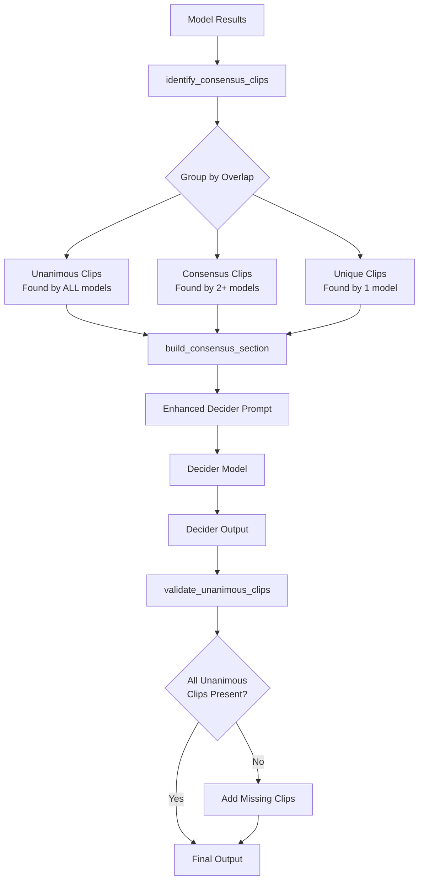

# Multimodel Consensus Clip Detection Fix

## Summary

Fixed issue #144 where the deciding model was skipping clips that were found by all detection models. The fix implements programmatic consensus analysis before the decider runs, ensuring unanimous clips are properly identified and preserved.

## Changes Made

### File: `server/lib/clippster_server/ai/multimodal_clip_detection.ex`

#### 1. New Function: `identify_consensus_clips/1`

Analyzes clips from all models and groups them by timestamp overlap:

- **Unanimous clips**: Found by ALL models (highest confidence)
- **Consensus clips**: Found by 2+ models (high priority)
- **Unique clips**: Found by only 1 model

Uses >50% timestamp overlap to determine if clips are the "same" clip across models.

#### 2. New Function: `build_consensus_section/1`

Formats the consensus analysis for inclusion in the decider prompt:

- Shows unanimous clips in detail with **MANDATORY** flag
- Lists consensus clips with model counts
- Provides summary statistics

#### 3. Updated Function: `build_decider_prompt/3`

Enhanced the decider prompt to include:

- Pre-computed consensus analysis section
- Explicit instructions that unanimous clips MUST NOT be skipped
- Clearer prioritization hierarchy (unanimous > consensus > unique)

#### 4. New Function: `validate_unanimous_clips/2`

Post-processing safeguard that:

- Checks if all unanimous clips appear in decider output
- Automatically adds back any missing unanimous clips
- Logs when restoration occurs for debugging

#### 5. Updated Function: `run_decider/3`

Orchestrates the new consensus workflow:

1. Analyzes model results to identify consensus clips
2. Logs consensus statistics
3. Builds prompt with consensus analysis
4. Validates decider output for unanimous clips

## How It Works



## Key Features

### 1. Programmatic Clip Correlation

Instead of relying on the AI to manually identify consensus clips, the system now:

- Programmatically compares timestamps across models
- Groups overlapping clips (>50% overlap)
- Counts model agreement for each clip group

### 2. Mandatory Unanimous Clips

Clips found by ALL models are:

- Explicitly flagged as MANDATORY in the prompt
- Included in full JSON format for reference
- Validated in post-processing and restored if missing

### 3. Transparent Logging

New logging provides visibility into:

- Number of unanimous vs consensus vs unique clips
- When unanimous clips are restored
- Model agreement patterns

## Testing

### Compilation Test

```bash
cd server
mix compile
```

✅ Compiles successfully with no errors

### Manual Testing

To test the fix:

1. Run a multimodel clip detection on a video
2. Check logs for consensus analysis messages:
   ```
   [MultimodalClipDetection] Consensus analysis: X unanimous, Y consensus clips
   ```
3. Verify unanimous clips appear in final output
4. Check for restoration warnings if decider skipped any

### Expected Log Output

```
[MultimodalClipDetection] Processing chunk 1/5 with 5 models
[MultimodalClipDetection] Running decider model: x-ai/grok-4.1-fast
[MultimodalClipDetection] Consensus analysis: 2 unanimous, 3 consensus clips
[MultimodalClipDetection] All unanimous clips validated successfully.
```

Or if restoration occurs:

```
[MultimodalClipDetection] Decider skipped 1 unanimous clip(s). Adding them back.
```

## Benefits

1. **Higher Accuracy**: Unanimous clips (highest confidence) are guaranteed to be included
2. **Transparency**: Clear visibility into which clips were found by multiple models
3. **Robustness**: Post-processing validation ensures no data loss
4. **Better AI Guidance**: Decider receives structured consensus data instead of raw results

## Technical Details

### Overlap Detection Algorithm

Two clips are considered overlapping if they share >50% of the shorter clip's duration:

```elixir
overlap_duration / shorter_clip_duration > 0.5
```

This threshold allows for some timestamp variation between models while still identifying the same clip.

### Best Version Selection

When multiple models find the same clip, the version with the highest virality score is selected as the representative.

### Post-Processing Safety

The `validate_unanimous_clips/2` function acts as a safety net:

- If the decider somehow misses unanimous clips (despite clear instructions)
- Those clips are automatically restored to the output
- Logged for debugging to identify prompt issues

## Related Files

- Primary: `server/lib/clippster_server/ai/multimodal_clip_detection.ex`
- Related: `server/lib/clippster_server/ai/openrouter_api.ex`
- Issue: https://github.com/snowdamiz/clippster-mono/issues/144

## Status

✅ Implementation complete
✅ Code compiles successfully
✅ Ready for production testing
