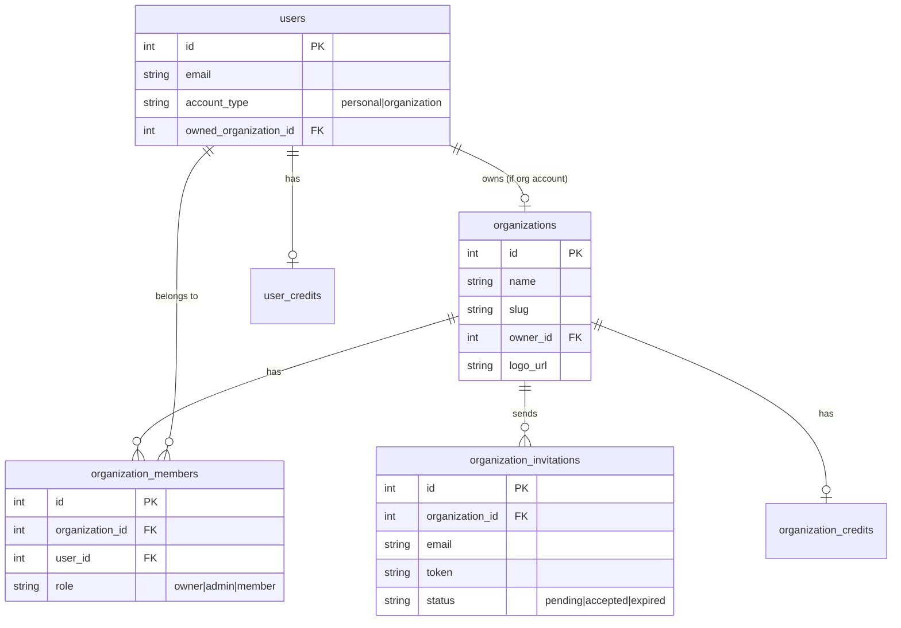

# Organization-Level Accounts Implementation Plan

## Overview

Add organization account support to Clippster where users can choose account type at registration, organizations can invite existing users or create member accounts, and credits are managed at both org and individual levels.

---

## Architecture



---

## Database Changes

### New Tables in [`server/priv/repo/migrations/`](server/priv/repo/migrations/)

**1. `organizations` table**

- `id`, `name`, `slug`, `description`, `logo_url`, `owner_id`, `settings` (JSON), timestamps

**2. `organization_members` table**

- `id`, `organization_id`, `user_id`, `role` (owner/admin/member), `joined_at`

**3. `organization_invitations` table**

- `id`, `organization_id`, `email`, `token` (hashed), `role`, `status`, `invited_by`, `expires_at`, timestamps

**4. `organization_credits` table**

- `id`, `organization_id`, `balance`, timestamps

### Modified Tables

**`users` table additions:**

- `account_type` (enum: personal/organization, default: null for pending selection)
- `owned_organization_id` (FK, nullable - for org account owners)

---

## Backend Implementation

### New Schemas in [`server/lib/clippster_server/`](server/lib/clippster_server/)

Create new context module `organizations.ex` with schemas:

- `Organization` - Core org entity
- `OrganizationMember` - Membership records
- `OrganizationInvitation` - Pending invites
- `OrganizationCredit` - Org credit pool

### Key Functions

```elixir
# Organizations context
- create_organization(owner_user, attrs)
- convert_to_organization(user, org_attrs)  # For existing users
- invite_member(org, email, role, invited_by)
- create_member_account(org, email, password, role)  # Org creates for user
- accept_invitation(token)
- get_user_organizations(user_id)
- allocate_credits_to_member(org, user, amount)
```

### New API Endpoints in [`server/lib/clippster_server_web/`](server/lib/clippster_server_web/)

Create `organization_controller.ex`:

- `POST /api/organizations` - Create org (convert account)
- `GET /api/organizations` - List user's organizations
- `POST /api/organizations/:id/invitations` - Send invite
- `POST /api/organizations/:id/members` - Create member account
- `GET /api/invitations/:token` - Get invitation details
- `POST /api/invitations/:token/accept` - Accept invitation

### Email Templates in [`server/lib/clippster_server/emails.ex`](server/lib/clippster_server/emails.ex)

Add invitation email template using existing Resend integration:

- `organization_invitation_email(email, org_name, inviter_name, invite_url)`

---

## Frontend Implementation

### New Components in [`client/src/components/`](client/src/components/)

**1. `AccountTypeDialog.vue`**

- Shows after first login/registration
- Two options: Personal Account / Organization Account
- Triggered when `user.account_type` is null

**2. `OrganizationSetupWizard.vue`**

- Multi-step setup for new org accounts
- Collects org name, description, logo
- Creates organization and converts account

**3. `OrganizationDashboard.vue`**

- Main org management interface
- Tabs: Members, Invitations, Credits, Settings

**4. `InviteMemberDialog.vue`**

- Email input for inviting existing users
- Option to create new account with email/password

**5. `AcceptInvitation.vue`**

- Page for accepting org invitations via email link

### Store Updates in [`client/src/stores/auth.js`](client/src/stores/auth.js)

Add to auth store:

- `accountType` state
- `pendingAccountTypeSelection` flag
- `selectAccountType(type)` action
- `organizations` state for org members

### Route Updates in [`client/src/router/index.ts`](client/src/router/index.ts)

- `/organization/setup` - Org setup wizard
- `/organization` - Org dashboard
- `/invite/:token` - Accept invitation page

---

## User Flows

### Flow 1: New Registration with Org Account

1. User registers (email/Google/wallet)
2. After verification, `AccountTypeDialog` appears
3. User selects "Organization Account"
4. `OrganizationSetupWizard` collects org details
5. Organization created, user becomes owner
6. Redirected to org dashboard

### Flow 2: Inviting Existing User

1. Org admin opens Invite dialog
2. Enters email of existing Clippster user
3. System sends invitation email via Resend
4. Invited user clicks link, sees org details
5. User accepts, becomes org member
6. User can now switch between personal/org context

### Flow 3: Creating Member Account

1. Org admin opens "Create Account" dialog
2. Enters email and temporary password
3. System creates verified account linked to org
4. Admin shares credentials with new member
5. New member logs in, is already org member

---

## Credit System

### Dual Credit Model

- **Organization Pool**: Shared credits owned by org
- **Individual Allocations**: Credits assigned to specific members from pool

### Credit Operations

```elixir
# Org admin allocates from pool to member
allocate_credits(org_id, user_id, amount)

# When member uses credits, deduct from their allocation first
# Fall back to org pool if allowed by settings
deduct_credits(user_id, org_id, amount)
```

---

## File Changes Summary

| File | Action |

|------|--------|

| `server/priv/repo/migrations/YYYYMMDD_create_organizations.exs` | Create |

| `server/lib/clippster_server/organizations/` | Create (schemas) |

| `server/lib/clippster_server/organizations.ex` | Create (context) |

| `server/lib/clippster_server_web/controllers/organization_controller.ex` | Create |

| `server/lib/clippster_server_web/router.ex` | Modify |

| `server/lib/clippster_server/emails.ex` | Modify |

| `server/lib/clippster_server/accounts/user.ex` | Modify |

| `client/src/components/AccountTypeDialog.vue` | Create |

| `client/src/components/OrganizationSetupWizard.vue` | Create |

| `client/src/components/OrganizationDashboard.vue` | Create |

| `client/src/components/InviteMemberDialog.vue` | Create |

| `client/src/stores/auth.js` | Modify |

| `client/src/router/index.ts` | Modify |

---

## Implementation Order

1. Database migrations and schemas
2. Organizations context with core functions
3. API endpoints and email templates
4. Account type selection dialog
5. Organization setup wizard
6. Member invitation flow
7. Member account creation
8. Organization dashboard
9. Credit allocation system