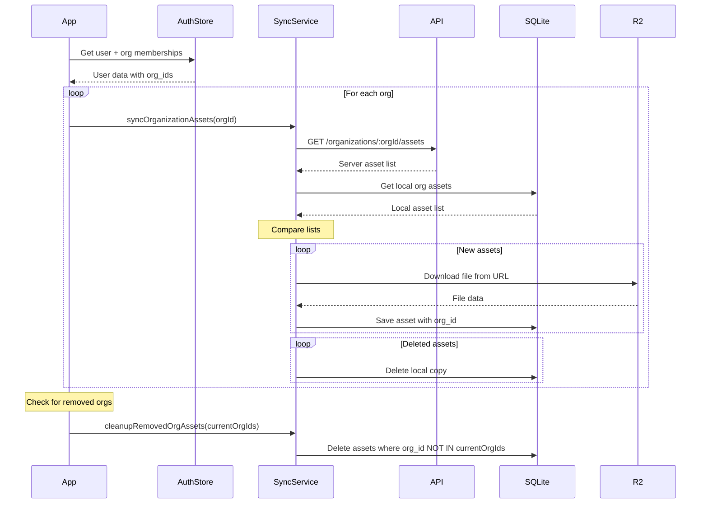

# Organization Assets with Local Sync

## Architecture Overview

```mermaid
flowchart TD
    subgraph startup [App Startup / Page Visit]
        A[Check User Org Membership] -->|API Call| B{User in Org?}
        B -->|Yes| C[Fetch Org Asset List from Server]
        B -->|No| D[Delete Local Org Assets]
        C --> E[Compare with Local Org Assets]
        E -->|New Assets| F[Download & Save Locally]
        E -->|Deleted on Server| G[Remove Local Copy]
        F -->|Show Badge| H[Downloading...]
    end
    
    subgraph usage [Asset Usage]
        I[Assets.vue / SourcesTab] --> J[Load from SQLite]
        J --> K[Display All Assets]
        K --> L{Asset Type}
        L -->|Local| M[Show Normal]
        L -->|Org Synced| N[Show with Org Badge]
    end
    
    subgraph server [Server Side]
        O[Org Admin] -->|Upload| P[R2 Storage]
        P --> Q[PostgreSQL Record]
        R[API: GET /orgs/:id/assets] --> Q
    end
```



## Key Changes from Original Plan

1. **Local Storage**: Org assets are downloaded and stored locally in SQLite with `organization_id` field
2. **Sync on Startup**: App fetches org asset list and syncs differences
3. **Downloading UI**: Show downloading badge on asset cards during sync
4. **Cleanup on Leave**: When user no longer in org, delete local copies

## Database Schema Changes

### Client SQLite - Add to existing tables

Add `organization_id` column to:

- `intro_outros` table
- `watermark_images` table  
- `audio_assets` table
- `image_assets` table

Assets with `organization_id = NULL` are local user assets.

Assets with `organization_id = <org_id>` are synced org assets.

### Server PostgreSQL - New table

```sql
CREATE TABLE organization_assets (
  id SERIAL PRIMARY KEY,
  organization_id INTEGER NOT NULL REFERENCES organizations(id) ON DELETE CASCADE,
  asset_type VARCHAR(20) NOT NULL, -- 'intro', 'outro', 'watermark', 'audio', 'image'
  name VARCHAR(255) NOT NULL,
  url TEXT NOT NULL,
  thumbnail_url TEXT,
  duration DECIMAL,
  width INTEGER,
  height INTEGER,
  file_size BIGINT,
  mime_type VARCHAR(100),
  uploaded_by_user_id INTEGER REFERENCES users(id),
  inserted_at TIMESTAMP DEFAULT NOW(),
  updated_at TIMESTAMP DEFAULT NOW()
);
```

## Key Files to Create/Modify

### Server-Side

1. **Migration** - `priv/repo/migrations/XXXXXX_create_organization_assets.exs`

2. **Schema** - [`server/lib/clippster_server/organizations/organization_asset.ex`](server/lib/clippster_server/organizations/organization_asset.ex)

3. **R2 Storage Module** - [`server/lib/clippster_server/storage.ex`](server/lib/clippster_server/storage.ex)

4. **API Controller** - [`server/lib/clippster_server_web/controllers/organization_asset_controller.ex`](server/lib/clippster_server_web/controllers/organization_asset_controller.ex)

   - `GET /organizations/:org_id/assets` - List assets (for sync)
   - `POST /organizations/:org_id/assets` - Upload asset (admin only)
   - `DELETE /organizations/:org_id/assets/:id` - Delete asset (admin only)

5. **Router** - Add routes to [`server/lib/clippster_server_web/router.ex`](server/lib/clippster_server_web/router.ex)

### Client-Side

1. **SQLite Migrations** - Add `organization_id` column to asset tables in [`client/src/services/database/core.ts`](client/src/services/database/core.ts)

2. **Org Asset Sync Service** - [`client/src/services/orgAssetSync.ts`](client/src/services/orgAssetSync.ts)
   ```typescript
   // Key functions:
   syncOrganizationAssets(orgId: string): Promise<SyncResult>
   cleanupRemovedOrgAssets(currentOrgIds: string[]): Promise<void>
   getLocalOrgAssets(orgId: string): Promise<Asset[]>
   downloadAndSaveAsset(asset: ServerAsset): Promise<void>
   ```

3. **API Service** - [`client/src/services/organizationAssetsApi.ts`](client/src/services/organizationAssetsApi.ts)

   - Fetch org assets list from server
   - Upload new asset (multipart)
   - Delete asset

4. **App Startup Hook** - Modify [`client/src/App.vue`](client/src/App.vue) or create composable

   - On authenticated user load, trigger sync
   - Check org membership, sync or cleanup

5. **Assets Page** - Modify [`client/src/pages/Assets.vue`](client/src/pages/Assets.vue)

   - Show org assets with organization badge/label
   - Show "Downloading..." badge on syncing assets
   - Group by: "My Assets" vs "Organization Assets (Org Name)"
   - Trigger sync on page mount

6. **SourcesTab** - Modify [`client/src/components/video-editor/SourcesTab.vue`](client/src/components/video-editor/SourcesTab.vue)

   - Include org assets in sources
   - Trigger sync on mount

7. **Organization Dashboard** - Modify [`client/src/components/OrganizationDashboard.vue`](client/src/components/OrganizationDashboard.vue)

   - Add "Assets" tab for admins to upload/manage
   - Upload UI similar to Assets page

8. **Database Types** - Update [`client/src/services/database/types.ts`](client/src/services/database/types.ts)

   - Add `organization_id?: string` to asset interfaces

## Sync Flow Detail



## UI States for Asset Cards

| State | Badge/Indicator |

|-------|-----------------|

| Local asset | None |

| Org asset (synced) | Small org icon + org name |

| Org asset (downloading) | Spinner + "Downloading..." overlay |

| Org asset (failed) | Error icon + retry option |

## Dependencies

**Server** (`mix.exs`):

- `{:ex_aws, "~> 2.5"}`
- `{:ex_aws_s3, "~> 2.5"}`
- `{:sweet_xml, "~> 0.7"}`

**Environment Variables**:

```
R2_ACCOUNT_ID=
R2_ACCESS_KEY_ID=
R2_SECRET_ACCESS_KEY=
R2_BUCKET_NAME=clippster-org-assets
R2_PUBLIC_URL=https://your-bucket.r2.dev
```