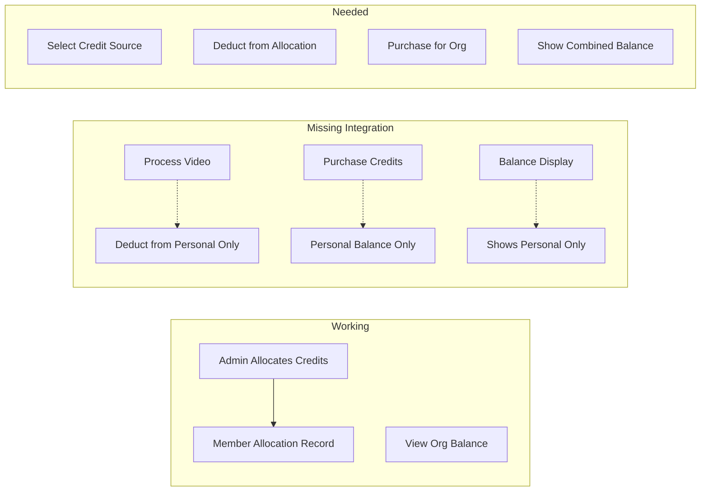
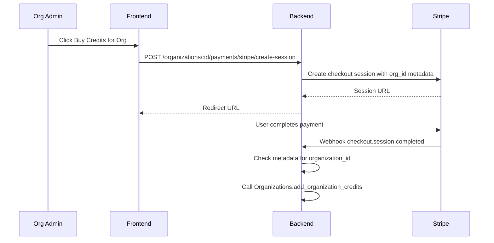
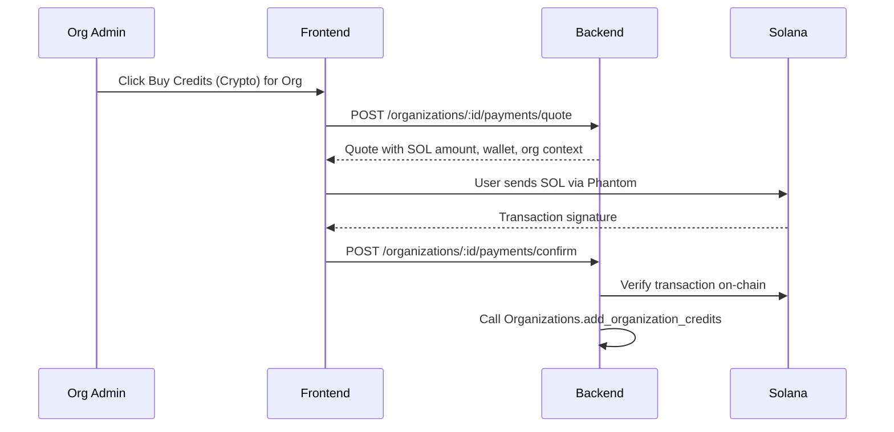

# Organization Credit System Completion

## Current State

The following is already implemented:

- Database tables: `organization_credits`, `member_credit_allocations`
- Models: `OrganizationCredit`, `MemberCreditAllocation` with changeset functions
- Backend context: `Organizations` with allocation/deduction functions
- API endpoints: Get org credits, allocate credits to member
- Frontend: `OrganizationDashboard.vue` Credits tab with allocation UI

## Gaps to Address

### 1. Credit Consumption Integration (Backend)

**Problem**: [`clips_controller.ex`](server/lib/clippster_server_web/controllers/clips_controller.ex) only checks personal credits via `Credits.get_user_balance(user_id)`. Organization allocations are never deducted.

**Solution**: Modify the credit deduction flow to:

1. Accept an optional `organization_id` parameter in processing requests
2. Check member allocation when org context is provided
3. Deduct from member allocation OR fall back to org pool based on settings

Files to modify:

- [`server/lib/clippster_server_web/controllers/clips_controller.ex`](server/lib/clippster_server_web/controllers/clips_controller.ex) - Add org-aware credit deduction
- [`server/lib/clippster_server/credits.ex`](server/lib/clippster_server/credits.ex) - Add unified `deduct_credits_with_org_context/3`

### 2. Organization Credit Purchase Flow (Backend + Frontend)

**Problem**: Both Stripe and crypto payment flows only create personal user credits. No way to purchase credits for an organization pool.

**Solution**: Add organization purchase support for both payment methods:

#### 2a. Stripe Flow for Organizations

**Implementation:**

1. New endpoint: `POST /api/organizations/:organization_id/payments/stripe/create-session`
2. Include `organization_id` in Stripe session metadata
3. Webhook handler checks for `organization_id` in metadata; if present, adds to org pool instead of user balance

Files to modify:

- [`server/lib/clippster_server_web/controllers/stripe_controller.ex`](server/lib/clippster_server_web/controllers/stripe_controller.ex) - Add `create_org_checkout_session/2`
- [`server/lib/clippster_server_web/router.ex`](server/lib/clippster_server_web/router.ex) - Add org stripe route

#### 2b. Crypto/Solana Flow for Organizations

**Implementation:**

1. New endpoint: `POST /api/organizations/:organization_id/payments/quote` - Generate quote tied to org
2. New endpoint: `POST /api/organizations/:organization_id/payments/confirm` - Verify and add to org pool
3. Reuse existing `verify_transaction` logic from `payment_controller.ex`

Files to modify:

- [`server/lib/clippster_server_web/controllers/payment_controller.ex`](server/lib/clippster_server_web/controllers/payment_controller.ex) - Add `get_org_quote/2` and `confirm_org_payment/2`
- [`server/lib/clippster_server_web/router.ex`](server/lib/clippster_server_web/router.ex) - Add org payment routes

#### 2c. Frontend UI

Add "Buy Credits" button to `OrganizationDashboard.vue` Credits tab that:

1. Opens payment method selector (Stripe or Crypto)
2. For Stripe: redirects to Stripe checkout with org context
3. For Crypto: shows wallet payment modal with org context

Files to modify:

- [`client/src/components/OrganizationDashboard.vue`](client/src/components/OrganizationDashboard.vue) - Add Buy Credits button and payment flow
- Consider reusing/adapting existing payment components from personal credit purchase flow

### 3. Balance Display Enhancement (Frontend)

**Problem**: [`useCreditBalance.ts`](client/src/composables/useCreditBalance.ts) only shows personal credits.

**Solution**: Enhance balance display to show:

- Personal credits
- Organization allocation (if member of org)
- Total available credits

Files to modify:

- [`client/src/composables/useCreditBalance.ts`](client/src/composables/useCreditBalance.ts) - Fetch org allocations
- [`server/lib/clippster_server_web/controllers/payment_controller.ex`](server/lib/clippster_server_web/controllers/payment_controller.ex) - Include org balance in response

### 4. Credit Source Selection (Frontend)

**Problem**: When user has both personal and org credits, no way to choose which to use.

**Solution**: Add credit source selector:

1. If user has org allocation, show selector before processing
2. Pass `organization_id` to processing endpoints when org credits selected

Files to modify:

- Create new composable: `client/src/composables/useCreditSource.ts`
- Modify [`client/src/components/ClipDetectionConfirmDialog.vue`](client/src/components/ClipDetectionConfirmDialog.vue) - Add credit source picker

### 5. Admin Credit Management (Optional)

**Problem**: No admin endpoint to manually add org credits (useful for manual adjustments).

**Solution**: Add admin endpoint to set/add org credits.

Files to modify:

- [`server/lib/clippster_server_web/controllers/admin_controller.ex`](server/lib/clippster_server_web/controllers/admin_controller.ex)
- [`server/lib/clippster_server_web/router.ex`](server/lib/clippster_server_web/router.ex)

## Implementation Priority

1. **Credit Consumption Integration** - Most critical; without this, allocated credits can't be used
2. **Balance Display Enhancement** - Users need to see their available org credits
3. **Credit Source Selection** - Required for users with both personal and org credits  
4. **Organization Credit Purchase (Stripe)** - Primary payment method for most users
5. **Organization Credit Purchase (Crypto)** - Alternative payment for crypto-native orgs
6. **Organization Purchase Frontend** - UI to trigger both payment flows
7. **Admin Credit Management** - Nice-to-have for support cases