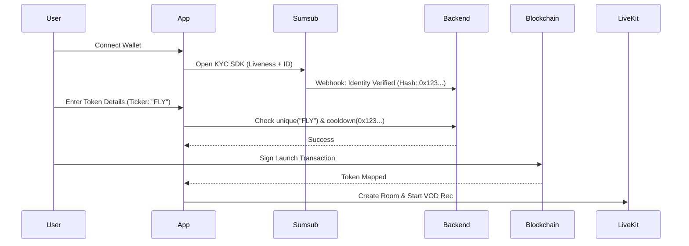
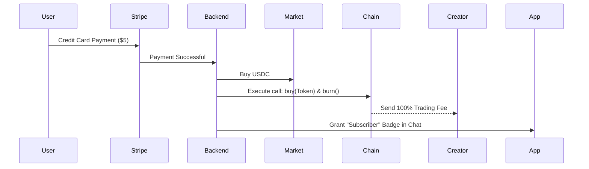

# Master Implementation Plan: Multi-Chain Crypto Launchpad

This document serves as the comprehensive technical blueprint for a next-generation streaming and token launch platform. It integrates high-fidelity streaming, automated crypto-economic incentives, and bank-grade identity verification.

## 1. Project Vision & Goals
A "PumpFun meets Kick" infrastructure built on a **React Native Monorepo**.
- **Prerequisite**: Streamers MUST launch a token to go live.
- **Compliance**: Enforce a strict **one-launch-per-45-days** rule per physical person.
- **Economics**: Bonding curve trading with integrated "Buy-and-Burn" subscriptions.
- **Experience**: Premium, unified UI across Web and Mobile with custom-built financial charts.

---

## 2. Architecture & Tech Stack

### Monorepo Structure (Turborepo)
- **Apps**:
    - `apps/web`: Next.js frontend for SEO, trading dashboards, and desktop streaming.
    - `apps/mobile`: Expo native app for high-performance streaming, KYC SDKs, and push notifications.
- **Shared Packages**:
    - `packages/app`: Core screens, business logic, and state management (Solito unified routing).
    - `packages/ui`: **Tamagui** design system for zero-runtime CSS on web and native primitives on mobile.
    - `packages/contracts`: Solana (Anchor) and EVM (Solidity) source code.
    - `packages/api`: Type-safe clients for the Elixir/Phoenix backend.

### Backend (Phoenix Elixir)
- **Real-Time**: Phoenix Channels for low-latency chat (100k+ concurrents) and price feeds.
- **Compliance Engine**: Integration with Sumsub for ID/Liveness checks.
- **Billing**: Stripe for Fiat-to-Stablecoin onramping.
- **Orchestration**: Managing LiveKit rooms, Egress recordings, and VOD archival.

---

## 3. Core Features & Technical Specification

### A. Professional KYC & Anti-Sybil
- **Provider**: **Sumsub Full KYC**.
- **Verification**: Document scanning (Passport/ID) + **3D Liveness Check**.
- **Enforcement**: 
    1. Backend stores a salted hash of the verified identity. 
    2. Check: `IF hash exists AND last_launch < 45 days THEN block_launch`.
    3. Prevents serial launchers from using fresh wallets or new social accounts.

### B. Multi-Chain Launchpad & Bonding Curves
- **Chains**: Solana (SPL) and EVM (Base/Ethereum/etc.).
- **Uniqueness Registry**: Centralized Postgres DB ensures `name` and `ticker` are unique across ALL chains before allowing deployment.
- **AMMs**: Linear/Exponential bonding curves ensure immediate liquidity without manual funding.
- **Graduation**: Automatic migration to Raydium (Solana) or Uniswap/Aura (EVM) once market cap targets are hit.

### C. Trading & Custom Charts
- **TradingView Alternative**: A fully custom **React Native Skia** financial chart.
    - 60fps interaction on mobile.
    - Real-time candle rendering via WebSocket streams.
    - Total control over aesthetic (Glow effects, specific color grading).
- **Fees**: 
    - Standard trading fee per swap.
    - **Subscription Special**: 100% of the trading fee from subscription-buys is routed directly to the creator's wallet.

### D. "Buy-and-Burn" Fiat Subscriptions
- **User Flow**: User clicks "Sub for $5.00" -> Pays via Credit Card (Stripe).
- **Automation**: 
    1. Backend receives Fiat.
    2. System acquires Stablecoin (USDC) via liquidity partner.
    3. System executes a `buy` on the project's bonding curve.
    4. Purchased tokens are immediately `burned` (removed from supply).
- **Impact**: Provides constant deflationary pressure and proof-of-support badges in chat.

### E. Integrated Streaming (Kick Experience)
- **Infrastructure**: **LiveKit SFU**.
- **Broadcast**: WHIP support for OBS (Web) and Native Camera SDK (Mobile).
- **Interactive**: "On-Stage" feature allowing broadcasters to invite viewers to join the video/audio stage in real-time.
- **VODs**: Every stream is recorded via LiveKit Egress, stored as HLS, and available for 24/7 playback on the token's profile page.

---

## 4. Technical Flows (Deep Dive)

### 1. Launch & KYC Flow

### 2. Subscription Flow

---

## 5. Verification & Compliance Plan

### Phase 1: Smart Contract Audit
- Formal verification of bonding curve math.
- Gas optimization for high-frequency trading.

### Phase 2: Stress Testing
- Benchmarking the **Skia Chart** with 500+ data points per second.
- Simulating 50k concurrent chat users on a single token page.

### Phase 3: Regulatory Review
- Registering as an MSB (US) or CASP (EU) to handle fiat-to-token onramping and identity storage.

---

## 6. Project Milestones
1.  **Monorepo Setup**: Solito + Expo + Tamagui scaffolding.
2.  **Core Contracts**: Bonding curves + Burn logic (Solana first).
3.  **The "Chart"**: Development of the custom Skia charting engine.
4.  **KYC Integration**: Sumsub SDK implementation.
5.  **Beta Launch**: First community stream & token launch.
