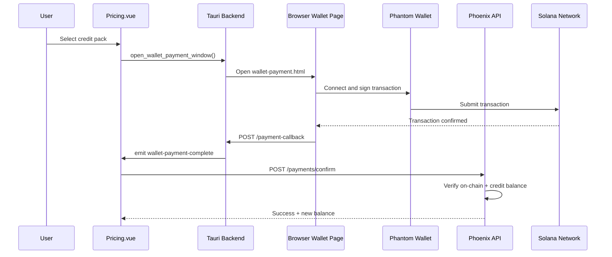
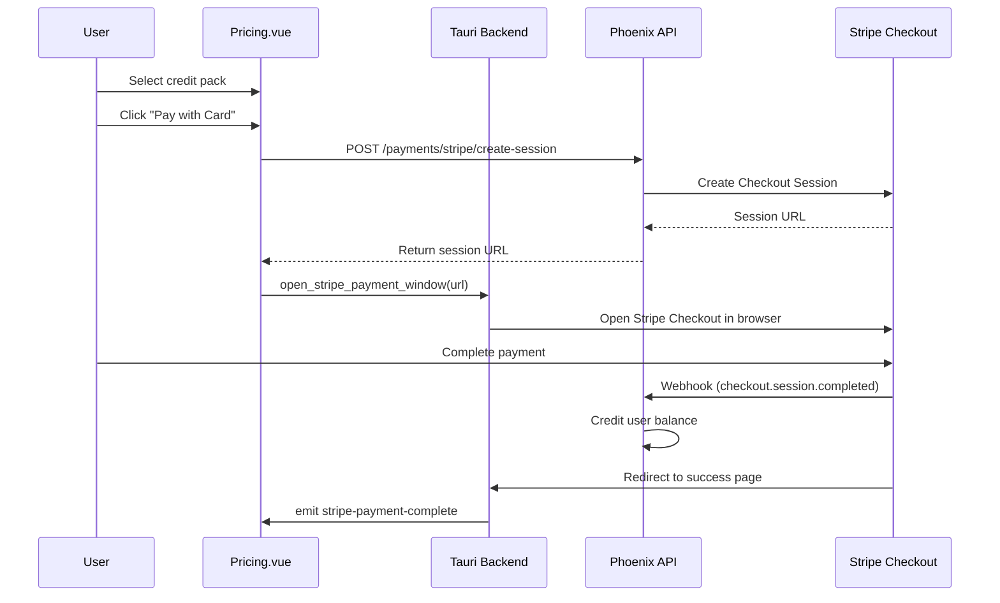

# Stripe FIAT Payment Integration Plan

## Current Payment Flow Summary

The existing crypto payment flow works as follows:



## Proposed Stripe Flow



## Implementation Tasks

### 1. Backend - Add Stripe Dependencies and Configuration

Add `stripity_stripe` to [server/mix.exs](server/mix.exs):

```elixir
{:stripity_stripe, "~> 3.2"}
```

Add configuration in `config/runtime.exs`:

- `STRIPE_SECRET_KEY` for API calls
- `STRIPE_WEBHOOK_SECRET` for webhook verification

### 2. Backend - Create Stripe Controller

Create new file `server/lib/clippster_server_web/controllers/stripe_controller.ex`:

- `create_checkout_session/2` - Creates Stripe Checkout session with pack pricing
- `webhook/2` - Handles `checkout.session.completed` event
- Success/cancel redirect handlers

Key implementation details:

- Use one-time payments (not subscriptions)
- Include `pack_type` and `user_id` in session metadata
- Set success/cancel URLs to local Tauri callback server

### 3. Backend - Update Router

Add routes to [server/lib/clippster_server_web/router.ex](server/lib/clippster_server_web/router.ex):

```elixir
# Public routes (webhook doesn't have auth)
post "/stripe/webhook", StripeController, :webhook

# Authenticated routes  
post "/payments/stripe/create-session", StripeController, :create_checkout_session
```

### 4. Database - Add Payment Method Tracking

Create migration to update `credit_transactions` table:

- Add `payment_method` field (enum: "solana", "stripe")
- Add `stripe_session_id` field (nullable)
- Add `stripe_payment_intent_id` field (nullable)

Update [server/lib/clippster_server/credits/credit_transaction.ex](server/lib/clippster_server/credits/credit_transaction.ex) schema.

### 5. Client - Update Tauri Commands

Add to [client/src-tauri/src/auth.rs](client/src-tauri/src/auth.rs):

- `open_stripe_payment_window` command to open browser
- `start_stripe_callback_server` for success/cancel redirects
- `StripePaymentResult` struct

### 6. Client - Add Stripe Payment Page

Create `client/public/stripe-success.html` and `stripe-cancel.html`:

- Success page sends callback to Tauri and closes
- Cancel page allows retry or close

### 7. Client - Update Pricing.vue

Modify [client/src/pages/Pricing.vue](client/src/pages/Pricing.vue):

- Enable the "Pay with Card" button (currently disabled with "Coming Soon")
- Add `initiateStripePayment()` function
- Listen for `stripe-payment-complete` event
- Handle success/cancel states

## Environment Variables Required

```env
# Server
STRIPE_SECRET_KEY=sk_live_xxx
STRIPE_WEBHOOK_SECRET=whsec_xxx
STRIPE_SUCCESS_URL=http://localhost:48276/stripe-success
STRIPE_CANCEL_URL=http://localhost:48276/stripe-cancel
```

## Files to Create/Modify

| File | Action |

|------|--------|

| `server/mix.exs` | Add stripity_stripe dependency |

| `server/config/runtime.exs` | Add Stripe config |

| `server/lib/clippster_server_web/controllers/stripe_controller.ex` | Create |

| `server/lib/clippster_server_web/router.ex` | Add Stripe routes |

| `server/priv/repo/migrations/*_add_payment_method.exs` | Create migration |

| `server/lib/clippster_server/credits/credit_transaction.ex` | Add fields |

| `client/src-tauri/src/auth.rs` | Add Stripe commands |

| `client/public/stripe-success.html` | Create |

| `client/public/stripe-cancel.html` | Create |

| `client/src/pages/Pricing.vue` | Enable Stripe button |