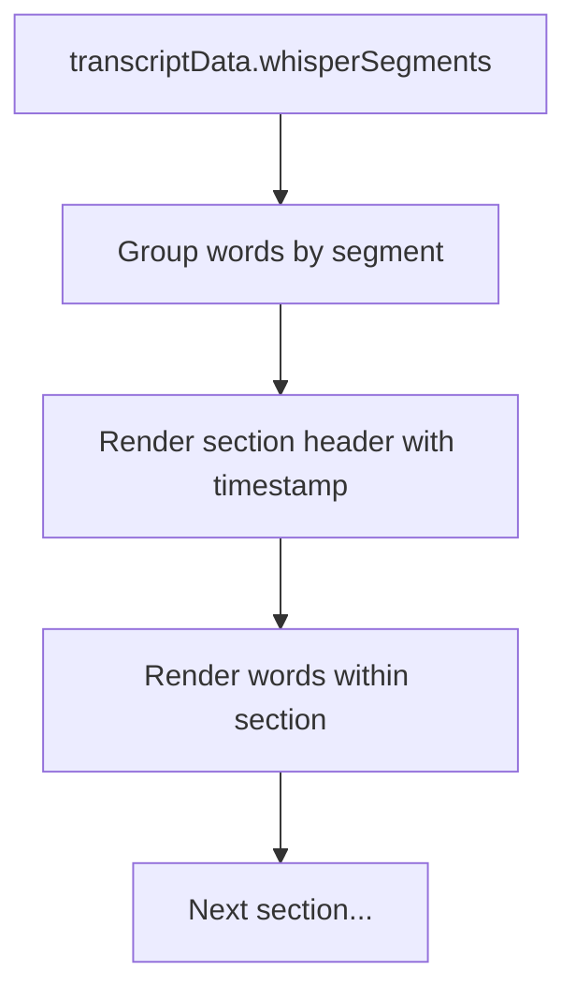

# Transcript Navigation Features

## Overview

Enhance the transcript viewing experience with three key features:

1. **Time-based section headers** - Display natural speech segments from Whisper with timestamp headers
2. **Find navigation** - Add up/down arrows to cycle through search matches (like Microsoft Word)
3. **Click-to-seek** - Already implemented, just needs verification

## Current State

- [TranscriptPanel.vue](client/src/components/TranscriptPanel.vue) and [TranscriptTab.vue](client/src/components/clip-editor/tabs/TranscriptTab.vue) already have:
  - Search highlighting (`matchedPhraseIndices`)
  - Click-to-seek functionality (`onWordClick` -> `seekVideo`)
  - Word-level timestamp data (`start`, `end`)
- [useTranscriptData.ts](client/src/composables/useTranscriptData.ts) already parses `WhisperSegment` data with segment boundaries

## Implementation

### 1. Time-Based Section Headers

Group words by their natural Whisper segments and display timestamp headers:



**Changes to both components:**

- Create computed property `segmentedWords` that groups words by their containing WhisperSegment
- Render each segment with a header showing `startTime - endTime` (e.g., "0:00 - 0:15")
- Clickable section headers also seek to that segment's start time

### 2. Find Navigation (Up/Down Arrows)

Add a search results toolbar showing match count and navigation:

```
[Search input] [2 of 5] [↑] [↓]
```

**Changes to both components:**

- Add `currentMatchIndex` state to track which match is focused
- Compute `matchGroups` - distinct phrase match positions (not individual word indices)
- Add "X of Y" display and up/down arrow buttons
- Scroll to and highlight the focused match differently from other matches
- Up arrow: go to previous match, wrap to last if at first
- Down arrow: go to next match, wrap to first if at last

### 3. Styling

- **Section headers**: Subtle divider with timestamp in muted text
- **Current search match**: Brighter highlight + ring (e.g., `bg-yellow-500/40 ring-2 ring-yellow-400`)
- **Other search matches**: Keep current style (`bg-yellow-500/20`)

## Files to Modify

| File | Changes |
|------|---------|
| [TranscriptPanel.vue](client/src/components/TranscriptPanel.vue) | Add section headers, find navigation UI, match tracking state |
| [TranscriptTab.vue](client/src/components/clip-editor/tabs/TranscriptTab.vue) | Same changes as TranscriptPanel |

