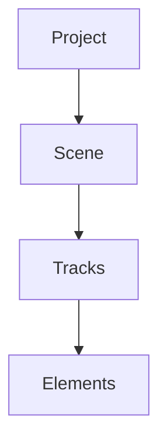
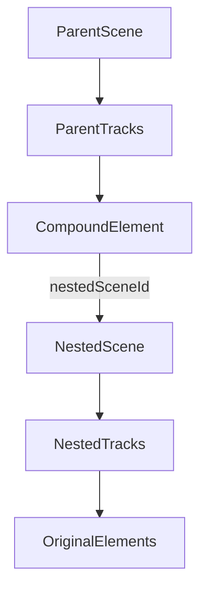

# Compound Clip (CapCut-style) Plan

## Goal

Implement **Create Compound Clip** and **Ungroup Compound Clip** in Clippster so multiple timeline elements behave as one item on the parent timeline, while remaining fully editable inside a nested timeline on double-click.

## Current State

The editor is flat today:

- Data model: [`client/src/editor/types/timeline.ts`](client/src/editor/types/timeline.ts), [`client/src/editor/types/project.ts`](client/src/editor/types/project.ts)
- Active scene editing: [`client/src/editor/core/managers/scenes-manager.ts`](client/src/editor/core/managers/scenes-manager.ts)
- Timeline mutations: [`client/src/editor/lib/commands/timeline/element/*`](client/src/editor/lib/commands/timeline/element)
- Preview/render tree: [`client/src/editor/renderer/scene-builder.ts`](client/src/editor/renderer/scene-builder.ts), [`client/src/editor/core/managers/renderer-manager.ts`](client/src/editor/core/managers/renderer-manager.ts)
- Closest existing precedent: `linkedElementId` pairing in extract-audio, plus sibling `TScene` support

There is **no** compound element type, group command, or nested render path yet.

## Target Architecture

Use the selected approach: **compound element references a nested scene**.

Behavior:
- Parent timeline shows one compound clip block
- Move/trim/duplicate/delete on parent affects the compound as one unit
- Double-click compound opens nested scene in timeline editor
- Breadcrumb/back action returns to parent scene
- Preview/export recursively render nested scene content at remapped time

## Phase 1: Data Model + Persistence

### 1. Add compound element type

In [`client/src/editor/types/timeline.ts`](client/src/editor/types/timeline.ts):
- Add `CompoundElement` extending `BaseTimelineElement`
- Fields:
  - `type: 'compound'`
  - `nestedSceneId: string`
  - `name?: string`
  - `transform`, `opacity`, `speed` as needed for parent-level behavior
- Extend `TimelineElement` union and any type guards/helpers

### 2. Extend scene metadata for nesting

In [`client/src/editor/types/timeline.ts`](client/src/editor/types/timeline.ts) and [`client/src/editor/types/project.ts`](client/src/editor/types/project.ts):
- Add optional scene fields such as:
  - `parentSceneId?: string`
  - `parentCompoundElementId?: string`
  - `isCompoundInternal?: boolean`
- Keep nested scenes in `project.scenes[]`; do not rely on active-scene-only lookup

### 3. Persist + migrate

In [`client/src/editor/storage/tauri-storage-adapter.ts`](client/src/editor/storage/tauri-storage-adapter.ts) and storage types:
- Serialize/deserialize compound elements and nested scene refs
- Add migration/default handling for older projects without compound support

## Phase 2: Core Commands

Create new commands under [`client/src/editor/lib/commands/timeline/element/`](client/src/editor/lib/commands/timeline/element):

### `CreateCompoundClipCommand`
Input: selected `{ trackId, elementId }[]` from active scene

Steps:
1. Validate selection is non-empty and contiguous enough for v1
2. Create new nested scene with copied/moved selected elements
3. Compute compound bounds:
   - `startTime = min(selected.startTime)`
   - `duration = max(selected.endTime) - startTime`
4. Normalize nested element times to local zero-based timeline inside nested scene
5. Insert one `CompoundElement` on parent timeline at compound bounds
6. Remove original selected elements from parent scene
7. Wrap in [`macro-command.ts`](client/src/editor/lib/commands/macro-command.ts) so create is one undo step

### `UngroupCompoundClipCommand`
Input: one compound element

Steps:
1. Resolve nested scene by `nestedSceneId`
2. Reinsert nested elements back onto parent scene with absolute times restored
3. Remove compound element
4. Optionally delete or archive nested scene if no longer referenced

### Update existing commands to respect compounds

Likely touch points:
- [`delete-elements.ts`](client/src/editor/lib/commands/timeline/element/delete-elements.ts)
- [`duplicate-elements.ts`](client/src/editor/lib/commands/timeline/element/duplicate-elements.ts)
- [`move-element.ts`](client/src/editor/lib/commands/timeline/element/move-element.ts)
- [`split-elements.ts`](client/src/editor/lib/commands/timeline/element/split-elements.ts)

Rules for v1:
- Parent-level operations affect compound container only
- Split on parent timeline is disabled for compound clips unless explicitly supported later
- Delete compound deletes nested scene too

## Phase 3: Scene Navigation (Double-click Drill-in)

### 1. Navigation state

Extend [`client/src/editor/core/managers/scenes-manager.ts`](client/src/editor/core/managers/scenes-manager.ts):
- `openCompoundScene(compoundElementId)`
- `exitCompoundScene()`
- Track breadcrumb stack: `parentSceneId -> nestedSceneId`

### 2. UI entry points

Add actions in:
- [`client/src/editor/composables/timeline/element/useElementInteraction.ts`](client/src/editor/composables/timeline/element/useElementInteraction.ts): double-click compound opens nested scene
- Timeline context menu / toolbar actions via editor actions composable
- Scene header/breadcrumb UI near existing scenes view/components

Expected UX:
- Right-click selection -> **Create Compound Clip**
- Double-click compound block -> open nested timeline
- Breadcrumb/back -> return to parent scene with same playhead preserved where possible

## Phase 4: Timeline UI

Update timeline rendering/interaction:
- [`client/src/editor/components/timeline/*`](client/src/editor/components/timeline) or equivalent element component
- Distinct compound clip styling (container bar, icon/name)
- Selection treats compound as one element on parent scene
- Disable direct editing of internal tracks until drill-in

Add menu/shortcut wiring:
- Context menu: Create Compound Clip / Ungroup Compound Clip
- Optional keyboard shortcut in editor shortcuts composable

Selection constraints for v1:
- Require multi-select on parent scene
- Disallow creating compound from existing compound internals without first exiting nested scene

## Phase 5: Preview + Export Rendering

This is the main technical lift beyond commands.

### 1. Recursive scene build

In [`client/src/editor/renderer/scene-builder.ts`](client/src/editor/renderer/scene-builder.ts):
- Add compound branch
- Resolve nested scene by ID
- Recursively build child scene tree
- Remap time:
  - `localTime = (parentTime - compound.startTime) * compound.speed + compound.trimStart`
- Apply parent transform/opacity around child subtree

### 2. Composite render node

Add [`client/src/editor/renderer/nodes/composite-node.ts`](client/src/editor/renderer/nodes/composite-node.ts):
- Wrap recursive child `RootNode`
- Render child tree at remapped local time
- Optionally precomp to offscreen canvas for transform/opacity correctness

Use [`TransitionNode`](client/src/editor/renderer/nodes/transition-node.ts) as the closest existing composite pattern.

### 3. Cache invalidation

Update [`client/src/editor/lib/scene-input-fingerprint.ts`](client/src/editor/lib/scene-input-fingerprint.ts):
- Include nested scene content referenced by compound elements
- Invalidate preview tree when nested scene tracks change, even if parent scene is active

### 4. Preview hit-testing

Update [`client/src/editor/composables/preview/usePreviewInteraction.ts`](client/src/editor/composables/preview/usePreviewInteraction.ts):
- Parent scene: compound behaves as one selectable bounds box
- Nested scene editing uses existing per-element hit-testing

### 5. Export parity

Verify [`client/src/editor/renderer/scene-frame-export.ts`](client/src/editor/renderer/scene-frame-export.ts) and [`renderer-manager.ts`](client/src/editor/core/managers/renderer-manager.ts):
- Nested compounds render correctly in WYSIWYG export
- Audio collection/export path also remaps nested audio timing if nested scenes contain audio tracks

## Phase 6: Helpers + Edge Cases

Add helpers in [`client/src/editor/lib/timeline/element-utils.ts`](client/src/editor/lib/timeline/element-utils.ts):
- `buildCompoundElement(...)`
- `isCompoundElement(...)`
- `getCompoundBounds(...)`

Handle v1 edge cases explicitly:
- Transitions touching selected range: exclude from compound or block action with clear toast/error
- Linked extracted-audio pairs: keep pair together when compounding
- Empty nested scene after ungroup/delete: cleanup orphaned nested scene
- Undo/redo across create, drill-in navigation, and ungroup

## Suggested Implementation Order

1. Types + scene registry lookup beyond active scene
2. Create/Ungroup commands with undo/redo
3. Parent timeline UI + context menu
4. Drill-in navigation + breadcrumb
5. Recursive preview rendering
6. Export/audio parity + migration/tests

## Verification Plan

Manual UI checks:
1. Select video + extracted audio on parent timeline -> Create Compound Clip
2. Confirm they collapse into one compound block
3. Move/trim/duplicate/delete compound on parent timeline as one unit
4. Double-click compound -> nested timeline opens with original individual tracks
5. Edit inside nested scene -> preview updates correctly
6. Exit nested scene -> parent timeline shows compound still intact
7. Ungroup compound -> original tracks restored to parent timeline
8. Undo/redo each of the above

Automated checks:
- Unit tests for compound bounds/time remapping helpers
- Fingerprint test coverage in [`client/src/editor/lib/scene-input-fingerprint.test.ts`](client/src/editor/lib/scene-input-fingerprint.test.ts)
- Type-check: `cd client && yarn vue-tsc --noEmit`

## Out of Scope for v1

- Splitting a compound clip on the parent timeline
- Nesting compounds inside compounds
- Replacing nested content with a referenced external project clip
- CapCut-style pre-render/flatten to a single media file

These can be follow-ups once basic create/open/ungroup works reliably.
