# Clipper Profiles Implementation Plan

## Overview

Clipper Profiles allow users to build a public portfolio showcasing their work, clip channel links, specialties, and availability. Organizations can browse the directory, filter by various criteria, watch portfolio clips, message clippers, and leave endorsements.

## Architecture

```mermaid
flowchart TD
    subgraph clipper_side [Clipper Side]
        EditProfile[Edit Profile & Bio]
        SetTags[Set Specialty & Style Tags]
        SetPlatforms[Set Preferred Platforms]
        AddChannelLinks[Add Clip Channel Links]
        SelectClips[Select from My Clips]
        UploadClips[Upload Manual Clips]
        SetAvailability[Toggle Looking for Work]
        SetTimezone[Set Timezone]
    end
    
    subgraph org_side [Organization Side]
        BrowseClippers[Browse Clipper Directory]
        FilterClippers[Filter by Tags/Platforms/Availability]
        ViewProfile[View Clipper Profile]
        WatchClips[Watch Portfolio Clips]
        ViewLeaderboard[View Leaderboards]
        ClickChannels[Click Channel Links → Browser]
        MessageClipper[Message Clipper]
        LeaveEndorsement[Leave Endorsement]
    end
    
    subgraph storage [Storage]
        R2[(Cloudflare R2)]
        ClipperProfiles[(clipper_profiles)]
        ChannelLinks[(clipper_channel_links)]
        PortfolioClips[(clipper_portfolio_clips)]
        Endorsements[(clipper_endorsements)]
    end
    
    SelectClips --> R2
    UploadClips --> R2
    WatchClips --> R2
```



## Database Schema

### 1. `clipper_profiles`

| Column | Type | Notes |
|--------|------|-------|
| `id` | bigint | PK |
| `user_id` | references(:users) | Unique, one per user |
| `display_name` | string | Public name |
| `bio` | text | Short bio (max 500 chars) |
| `avatar_url` | string | Profile picture (R2) |
| `slug` | string | Unique URL slug |
| `is_public` | boolean | Default false |
| `looking_for_work` | boolean | Default false - availability toggle |
| `experience_level` | string | "beginner", "intermediate", "experienced", "professional" |
| `specialty_tags` | array | ["gaming", "irl", "just-chatting", "esports", "music", "sports", "news", "crypto"] |
| `content_style_tags` | array | ["meme", "clean", "effects", "subtitles", "storytelling", "highlights", "reactions"] |
| `preferred_platforms` | array | ["tiktok", "instagram", "youtube", "x", "facebook"] |
| `languages` | array | ["en", "es", "pt", "fr", "de", "ja", "ko", "zh", etc.] |
| `timezone` | string | IANA timezone (e.g., "America/New_York") |
| `response_time_hours` | integer | Auto-calculated avg response time |
| `is_verified` | boolean | Default false - earned badge |
| `total_campaigns_completed` | integer | Default 0 |
| `total_clips_delivered` | integer | Default 0 |
| `total_endorsements` | integer | Default 0 - cached count |
| timestamps | | |

### 2. `clipper_channel_links`

Links to clipper's clip channels (TikTok, YouTube, Instagram where they post clips).

| Column | Type | Notes |
|--------|------|-------|
| `id` | bigint | PK |
| `clipper_profile_id` | references | FK |
| `platform` | string | "tiktok", "youtube", "instagram", "x", "kick", "twitch" |
| `url` | string | Full URL to clip channel |
| `username` | string | Display username/handle |
| `display_order` | integer | Order to show |
| timestamps | | |

### 3. `clipper_portfolio_clips`

| Column | Type | Notes |
|--------|------|-------|
| `id` | bigint | PK |
| `clipper_profile_id` | references | FK |
| `title` | string | Clip title |
| `video_url` | string | R2 URL |
| `thumbnail_url` | string | R2 thumbnail URL |
| `duration` | decimal | Seconds |
| `file_size` | bigint | Bytes |
| `display_order` | integer | 1-3 |
| timestamps | | |

**Constraints:** Max **3** clips per profile

### 4. `clipper_endorsements`

| Column | Type | Notes |
|--------|------|-------|
| `id` | bigint | PK |
| `clipper_profile_id` | references | FK to clipper receiving endorsement |
| `organization_id` | references | FK to org giving endorsement |
| `endorsed_by_user_id` | references | FK to org member who wrote it |
| `campaign_id` | references | Optional FK to related campaign |
| `content` | text | Endorsement text (max 300 chars) |
| `rating` | integer | 1-5 stars (optional) |
| timestamps | | |

**Constraints:** One endorsement per org per clipper (can update)

### 5. `clipper_badges`

| Column | Type | Notes |
|--------|------|-------|
| `id` | bigint | PK |
| `clipper_profile_id` | references | FK |
| `badge_type` | string | "verified", "top_clipper", "rising_star" |
| `earned_at` | utc_datetime | When badge was earned |
| `expires_at` | utc_datetime | Optional expiration |
| timestamps | | |

### 6. `clipper_leaderboard_entries`

Weekly/monthly leaderboard snapshots.

| Column | Type | Notes |
|--------|------|-------|
| `id` | bigint | PK |
| `clipper_profile_id` | references | FK |
| `period_type` | string | "weekly", "monthly" |
| `period_start` | date | Start of period |
| `period_end` | date | End of period |
| `rank` | integer | Position on leaderboard |
| `clips_delivered` | integer | Clips delivered in period |
| `campaigns_active` | integer | Campaigns participated in |
| `endorsements_received` | integer | New endorsements in period |
| `score` | integer | Calculated ranking score |
| timestamps | | |

## Leaderboard System

**Ranking Score Calculation:**
```
score = (clips_delivered * 10) + (endorsements_received * 50) + (campaigns_active * 25)
```

**Leaderboard Types:**
- **Weekly** - Resets every Monday
- **Monthly** - Resets 1st of each month
- **All-Time** - Cumulative (derived from profile stats)

**Display:**
- Top 50 clippers shown
- Clipper sees their own rank even if not in top 50
- Filter by specialty tags

## Badge System

**Verified Clipper Badge** - Earned when:
- Completed 3+ campaigns with positive endorsements, OR
- Manually verified by admin

**Top Clipper Badge** - Earned when:
- Ranked in top 10 on monthly leaderboard

**Rising Star Badge** - Earned when:
- New clipper (< 3 months) with 5+ campaigns completed

## Backend Implementation

### Context: `ClippsterServer.ClipperProfiles`

Location: `server/lib/clippster_server/clipper_profiles.ex`

**Profile Functions:**
- `get_or_create_profile/1`
- `update_profile/2`
- `get_profile_by_slug/1`
- `list_public_profiles/1` - With filters for tags, platforms, languages, looking_for_work, timezone
- `update_response_time/1` - Auto-calculate from message history
- `increment_stats/2` - Update clips_delivered, campaigns_completed

**Channel Links:**
- `add_channel_link/2`
- `update_channel_link/2`
- `delete_channel_link/1`
- `reorder_channel_links/2`

**Portfolio Clips:**
- `add_portfolio_clip/2` - Upload to R2
- `replace_portfolio_clip/2`
- `remove_portfolio_clip/1`
- `reorder_portfolio_clips/2`

**Endorsements:**
- `create_endorsement/3` - Org endorses clipper
- `update_endorsement/2`
- `list_endorsements/1`
- `can_endorse?/2` - Check if org worked with clipper

**Badges:**
- `check_and_award_badges/1` - Run after campaign completion
- `award_badge/2`
- `revoke_badge/2`

**Leaderboards:**
- `get_leaderboard/2` - Get weekly/monthly/all-time
- `calculate_weekly_leaderboard/0` - Background job
- `calculate_monthly_leaderboard/0` - Background job
- `get_clipper_rank/2` - Get specific clipper's rank

### Schemas

Location: `server/lib/clippster_server/clipper_profiles/`
- `clipper_profile.ex`
- `clipper_channel_link.ex`
- `clipper_portfolio_clip.ex`
- `clipper_endorsement.ex`
- `clipper_badge.ex`
- `clipper_leaderboard_entry.ex`

### Controller & Routes

`clipper_profile_controller.ex`

**Own profile:**
- `GET /api/user/clipper-profile`
- `PUT /api/user/clipper-profile`
- `POST /api/user/clipper-profile/channel-links`
- `PUT /api/user/clipper-profile/channel-links/:id`
- `DELETE /api/user/clipper-profile/channel-links/:id`
- `POST /api/user/clipper-profile/portfolio-clips`
- `PUT /api/user/clipper-profile/portfolio-clips/:id`
- `DELETE /api/user/clipper-profile/portfolio-clips/:id`

**Public:**
- `GET /api/clippers` - Directory with filters:
  - `?looking_for_work=true`
  - `?specialty_tags[]=gaming`
  - `?content_style_tags[]=meme`
  - `?preferred_platforms[]=tiktok`
  - `?languages[]=en`
  - `?experience_level=experienced`
  - `?timezone=America/New_York`
  - `?verified_only=true`
- `GET /api/clippers/:slug` - Public profile with clips & endorsements
- `GET /api/clippers/leaderboard?period=weekly` - Leaderboard

**Organization:**
- `POST /api/clippers/:slug/message` - Start DM
- `POST /api/clippers/:slug/endorsements` - Create endorsement
- `PUT /api/clippers/:slug/endorsements/:id` - Update endorsement

## Frontend Implementation

### Pages

1. **`ClipperProfilePage.vue`** - Edit own profile
   - Profile form (name, bio, avatar)
   - Experience level dropdown
   - Specialty tags multi-select
   - Content style tags multi-select
   - Preferred platforms multi-select
   - Languages multi-select
   - Timezone selector
   - "Looking for work" toggle
   - Clip channel links editor
   - Portfolio clips picker

2. **`ClipperDirectoryPage.vue`** - Browse clippers
   - Filter sidebar:
     - Looking for work toggle
     - Specialty tags
     - Content style tags
     - Preferred platforms
     - Languages
     - Experience level
     - Timezone
     - Verified only
   - Grid of clipper cards
   - Pagination

3. **`ClipperPublicProfilePage.vue`** - View profile
   - Header: avatar, name, bio, badges
   - Stats: campaigns completed, clips delivered
   - Tags: specialties, styles, platforms, languages, experience
   - Timezone display
   - "Looking for work" indicator
   - Response time indicator
   - Clip channel links (click → browser)
   - Portfolio clips with video player
   - Endorsements section
   - "Message" button (for orgs)
   - "Leave Endorsement" button (for orgs who've worked with clipper)

4. **`ClipperLeaderboardPage.vue`** - Leaderboards
   - Weekly / Monthly / All-Time tabs
   - Top 50 clippers ranked
   - Filter by specialty
   - Current user's rank highlighted

### Components

Location: `client/src/components/clipper-profile/`
- `ClipperProfileForm.vue`
- `TagSelector.vue` - Multi-select for tags/platforms/languages
- `TimezoneSelector.vue`
- `ChannelLinksEditor.vue`
- `PortfolioClipPicker.vue`
- `PortfolioClipsDisplay.vue`
- `ClipperCard.vue` - Directory card with badges & stats
- `ClipperBadge.vue`
- `ClipperStats.vue` - Campaigns, clips delivered display
- `EndorsementCard.vue`
- `EndorsementForm.vue`
- `ClipperFilters.vue` - Directory filter sidebar
- `LeaderboardTable.vue`

### Services

- `clipperProfileApi.ts`

### Routes

- `/clipper/profile` - Edit own
- `/clippers` - Directory
- `/clippers/leaderboard` - Leaderboards
- `/clipper/:slug` - Public view

## Predefined Options

### Specialty Tags
```typescript
const SPECIALTY_TAGS = [
  "gaming",
  "irl", 
  "just-chatting",
  "esports",
  "music",
  "sports",
  "news",
  "crypto",
  "comedy",
  "educational",
  "asmr",
  "creative",
  "podcasts"
]
```

### Content Style Tags
```typescript
const CONTENT_STYLE_TAGS = [
  "meme",
  "clean",
  "effects",
  "subtitles",
  "storytelling",
  "highlights",
  "reactions",
  "compilations",
  "dramatic"
]
```

### Preferred Platforms
```typescript
const PLATFORMS = [
  "tiktok",
  "instagram",
  "youtube",
  "x",
  "facebook",
  "snapchat"
]
```

### Channel Link Platforms
```typescript
const CHANNEL_PLATFORMS = [
  "tiktok",
  "youtube",
  "instagram",
  "x",
  "kick",
  "twitch"
]
```

### Languages (ISO 639-1)
```typescript
const LANGUAGES = [
  { code: "en", name: "English" },
  { code: "es", name: "Spanish" },
  { code: "pt", name: "Portuguese" },
  { code: "fr", name: "French" },
  { code: "de", name: "German" },
  { code: "ja", name: "Japanese" },
  { code: "ko", name: "Korean" },
  { code: "zh", name: "Chinese" },
  { code: "ru", name: "Russian" },
  { code: "ar", name: "Arabic" },
  { code: "hi", name: "Hindi" },
  { code: "it", name: "Italian" },
  { code: "pl", name: "Polish" },
  { code: "tr", name: "Turkish" },
  { code: "vi", name: "Vietnamese" },
  { code: "th", name: "Thai" },
  { code: "id", name: "Indonesian" }
]
```

### Experience Levels
```typescript
const EXPERIENCE_LEVELS = [
  { value: "beginner", label: "Beginner" },
  { value: "intermediate", label: "Intermediate" },
  { value: "experienced", label: "Experienced" },
  { value: "professional", label: "Professional" }
]
```

## Background Jobs

### Response Time Calculation
- Runs daily
- Calculates rolling average from last 20 conversations
- Updates `response_time_hours` field

### Leaderboard Calculation
- **Weekly**: Runs every Monday at 00:00 UTC
- **Monthly**: Runs 1st of each month at 00:00 UTC
- Calculates scores and ranks for all active clippers
- Stores snapshot in `clipper_leaderboard_entries`

### Badge Check
- Runs after each campaign completion
- Checks if clipper qualifies for new badges
- Awards/revokes badges as needed

## Implementation Phases

### Phase 1: Core Profile & Channel Links
- [ ] Migration: `clipper_profiles` with all fields
- [ ] Migration: `clipper_channel_links`
- [ ] Schemas and context functions
- [ ] Controller and routes
- [ ] `ClipperProfilePage.vue` with full form
- [ ] `TagSelector.vue`, `TimezoneSelector.vue`
- [ ] `ChannelLinksEditor.vue`

### Phase 2: Portfolio Clips
- [ ] Migration: `clipper_portfolio_clips`
- [ ] R2 upload integration
- [ ] `PortfolioClipPicker.vue`
- [ ] Replace/remove clip functionality

### Phase 3: Directory & Public Profiles
- [ ] `ClipperDirectoryPage.vue` with filters
- [ ] `ClipperFilters.vue`
- [ ] `ClipperCard.vue` with stats
- [ ] `ClipperPublicProfilePage.vue`
- [ ] Video player for clips
- [ ] Channel links open in browser

### Phase 4: Endorsements & Badges
- [ ] Migration: `clipper_endorsements`, `clipper_badges`
- [ ] Endorsement context functions
- [ ] `EndorsementCard.vue`, `EndorsementForm.vue`
- [ ] Badge award logic
- [ ] `ClipperBadge.vue`

### Phase 5: Leaderboards & Stats
- [ ] Migration: `clipper_leaderboard_entries`
- [ ] Leaderboard calculation jobs
- [ ] `ClipperLeaderboardPage.vue`
- [ ] `LeaderboardTable.vue`
- [ ] Stats tracking (campaigns, clips delivered)

### Phase 6: Messaging & Response Time
- [ ] "Message Clipper" integration
- [ ] Response time calculation job
- [ ] Display response time on profile

---

## Summary

**Clippers can:**
- Edit profile with bio, avatar, timezone, experience level
- Select specialty tags and content style tags
- Set preferred posting platforms
- Add languages they work in
- Toggle "looking for work"
- Add clip channel links (their TikTok, YouTube, etc. where they post clips)
- Add up to 3 portfolio clips (from My Clips or upload)
- Swap clips anytime
- Earn badges and collect endorsements
- Track their leaderboard ranking
- See their campaign stats (completed, clips delivered)

**Organizations can:**
- Browse clipper directory with filters
- Filter by: availability, specialty, style, platforms, languages, experience, timezone, verified
- View public profiles and watch portfolio clips
- Click clip channel links (opens browser)
- View leaderboards to find top performers
- Message clippers
- Leave endorsements after working together

**System:**
- Auto-calculates response time from message history
- Calculates weekly/monthly leaderboards
- Awards badges based on performance
- Tracks campaign stats automatically
- Stores portfolio clips in R2
