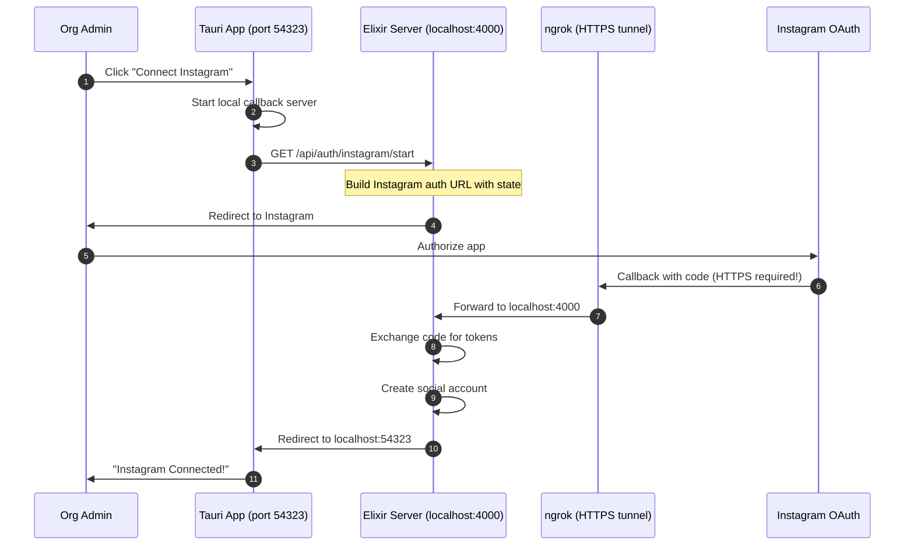

# Instagram Business Login Setup Guide

## Current Implementation Status ✅

The Instagram integration is **fully implemented**. This document covers Meta portal configuration and development setup.

## Architecture Overview



**Key insight**: Instagram requires HTTPS for callbacks. In development, we use ngrok to tunnel HTTPS to our local server.

---

## Meta App Dashboard Setup

### Prerequisites

1. A **Meta Developer Account**: https://developers.facebook.com/
2. An **Instagram Business or Creator Account** (not personal)
3. A **Facebook Page** connected to that Instagram account

### Step 1: Create or Configure Your Meta App

1. Go to https://developers.facebook.com/apps/
2. Select your app (from screenshot: `clippster.app-IG`, ID: `25643553921997880`)
3. Or create a new app: Click **Create App** → **Consumer** → Fill details

### Step 2: Add Instagram API Product

1. In your app dashboard, go to **Add Products**
2. Find **Instagram** and click **Set up**
3. Choose **Instagram API with Instagram Login** (NOT "Instagram Basic Display" which is deprecated)

### Step 3: Configure Instagram Business Login

From the screenshot, you're on step 4 "Set up Instagram Business login". Configure:

**Callback URL** (OAuth Redirect URIs):
```
https://YOUR-NGROK-URL.ngrok-free.app/api/auth/instagram/callback
https://api.clippster.app/api/auth/instagram/callback
```

**Verify Token** (optional, for webhooks):
```
your-custom-verify-token
```

> ⚠️ **Important**: The ngrok URL changes each time you restart (unless you have a paid plan). Update it in the dashboard before each dev session.

### Step 4: Add Required Permissions

Go to **App Review** → **Permissions and Features** and request:

| Permission | Purpose | Required |
|------------|---------|----------|
| `instagram_business_basic` | Read profile info | ✅ Yes |
| `instagram_business_content_publish` | Post content | ✅ Yes |
| `instagram_business_manage_comments` | Read/reply comments | Optional |
| `instagram_business_manage_messages` | DMs | Optional |

For testing, these work immediately with test users. For production, submit for **App Review**.

### Step 5: Add Test Users

1. Go to **App Roles** → **Roles**
2. Click **Add People**
3. Add your Instagram account as **Instagram Tester**
4. Accept the invite in Instagram app:
   - Settings → Website Permissions → Apps and Websites → Tester Invites

---

## Development Environment Setup

### 1. Install ngrok

Download from https://ngrok.com/download or:

```bash
# Windows (with chocolatey)
choco install ngrok

# macOS
brew install ngrok

# Or download directly and add to PATH
```

Sign up for free account and authenticate:
```bash
ngrok config add-authtoken YOUR_AUTH_TOKEN
```

### 2. Start ngrok Tunnel

Terminal 1 - Start your Elixir server:
```bash
cd server
mix phx.server
# Server runs on localhost:4000
```

Terminal 2 - Start ngrok tunnel:
```bash
ngrok http 4000
```

You'll see output like:
```
Forwarding    https://abc123.ngrok-free.app -> http://localhost:4000
```

Copy the `https://...ngrok-free.app` URL.

### 3. Update Meta App Dashboard

1. Go to your Meta app → Instagram → Instagram Business Login
2. Update **OAuth Redirect URIs** to:
   ```
   https://abc123.ngrok-free.app/api/auth/instagram/callback
   ```
3. Click **Save**

### 4. Configure Server Environment

Create/update `server/.env`:

```bash
# Instagram API with Instagram Login
INSTAGRAM_APP_ID=25643553921997880
INSTAGRAM_APP_SECRET=your_app_secret_from_dashboard
INSTAGRAM_REDIRECT_URI=https://abc123.ngrok-free.app/api/auth/instagram/callback

# Token encryption (generate once, keep secure)
# Generate with: mix run -e "IO.puts(Base.encode64(:crypto.strong_rand_bytes(32)))"
SOCIAL_TOKEN_ENCRYPTION_KEY=your_generated_key_here
```

> 💡 Get `INSTAGRAM_APP_SECRET` from Meta Dashboard → App Settings → Basic → App Secret (click Show)

### 5. Configure Client Environment

Update `client/.env`:

```bash
# API URL - point to ngrok for OAuth to work
VITE_API_URL=https://abc123.ngrok-free.app
```

Or, if you want local API calls but ngrok for OAuth only, keep:
```bash
VITE_API_URL=http://localhost:4000
```

The OAuth flow goes through the server anyway, so this mainly affects other API calls.

### 6. Run the Tauri App

```bash
cd client
npm run tauri:dev
```

---

## Testing the OAuth Flow

1. Open the Tauri app
2. Navigate to Organization Dashboard → Social Accounts
3. Click **Connect Instagram**
4. Browser opens to your server → redirects to Instagram
5. Log in with your Instagram Tester account
6. Authorize the app
7. You'll see "Instagram Connected!" page
8. App shows the connected account

### Troubleshooting

**"Invalid redirect_uri"**
- The URI in Meta dashboard must EXACTLY match what the server sends
- Check ngrok is running and URL is updated in dashboard
- Include the full path: `/api/auth/instagram/callback`

**"App not approved"**
- Make sure you added yourself as Instagram Tester
- Accept the invite in Instagram app settings

**"Token expired"**
- Long-lived tokens last 60 days
- The `TokenRefreshWorker` handles automatic refresh
- For testing, just reconnect the account

**"Connection timed out"**
- Check ngrok is running
- Check the Elixir server is running
- Check server logs for errors

---

## Current OAuth Scopes

The server requests these scopes (defined in `instagram_auth_controller.ex`):

```elixir
@instagram_scopes "instagram_business_basic,instagram_business_content_publish,instagram_business_manage_messages,instagram_business_manage_comments"
```

These map to:
- Profile info (username, profile picture)
- Content publishing (reels, posts)
- Message management (optional)
- Comment management (optional)

---

## File Reference

| Component | File |
|-----------|------|
| **Server** | |
| OAuth Controller | `server/lib/clippster_server_web/controllers/instagram_auth_controller.ex` |
| Instagram API | `server/lib/clippster_server/social/platforms/instagram.ex` |
| Config | `server/config/runtime.exs` (lines 78-95) |
| Router | `server/lib/clippster_server_web/router.ex` (Instagram routes) |
| **Client** | |
| Auth Helper | `client/src/lib/instagram-auth.ts` |
| API Service | `client/src/services/socialAccountsApi.ts` |
| UI Component | `client/src/components/organization/SocialAccountsManager.vue` |
| **Tauri** | |
| Rust Auth | `client/src-tauri/src/auth.rs` (Instagram functions) |

---

## Production Configuration

For production deployment, set these environment variables:

```bash
# Fly.io secrets or similar
INSTAGRAM_APP_ID=25643553921997880
INSTAGRAM_APP_SECRET=your_secret
INSTAGRAM_REDIRECT_URI=https://api.clippster.app/api/auth/instagram/callback
SOCIAL_TOKEN_ENCRYPTION_KEY=your_key

# Optional: for webhook verification
INSTAGRAM_WEBHOOK_VERIFY_TOKEN=your_token
```

The server automatically uses `https://api.clippster.app/api/auth/instagram/callback` in production if `INSTAGRAM_REDIRECT_URI` is not set.

---

## Ngrok Tips for Development

### Consistent URL (Paid Feature)

With ngrok paid plan, you can reserve a subdomain:
```bash
ngrok http 4000 --subdomain=clippster-dev
# Always: https://clippster-dev.ngrok.io
```

### Quick Restart Script

Create `start-dev.ps1`:
```powershell
# Start ngrok and copy URL to clipboard
$ngrok = Start-Process ngrok -ArgumentList "http 4000" -PassThru -NoNewWindow
Start-Sleep 2
$url = (Invoke-RestMethod http://localhost:4040/api/tunnels).tunnels[0].public_url
Write-Host "ngrok URL: $url"
Write-Host "Update Meta Dashboard with: $url/api/auth/instagram/callback"
Set-Clipboard "$url/api/auth/instagram/callback"
Write-Host "Callback URL copied to clipboard!"
```

### Using ngrok Dashboard

While ngrok is running, visit http://localhost:4040 to:
- See all requests/responses
- Replay requests for debugging
- View the current public URL
