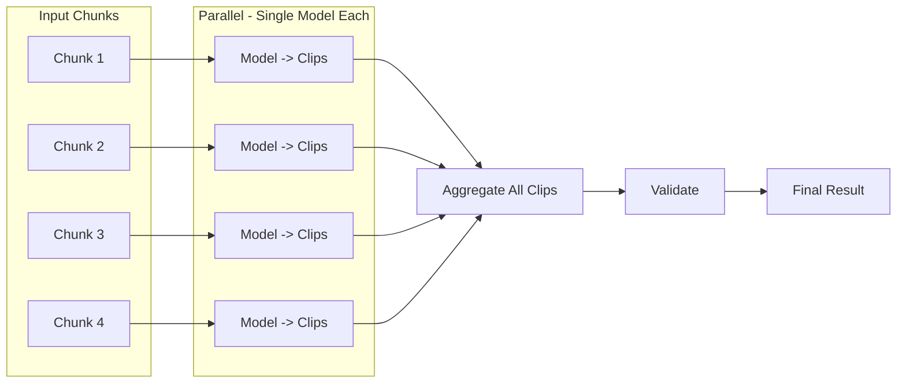
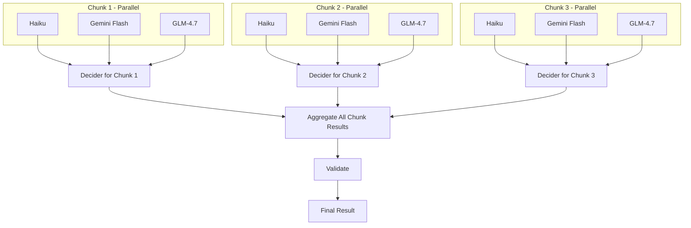

# Multimodal Clip Detection Implementation

## Architecture Overview

### Normal Mode (Parallel Chunks)

All chunks are processed in parallel by a single model, then results are aggregated.



**Steps:**

1. User has N chunks of transcript
2. All N chunks sent to the same single model simultaneously (in parallel)
3. Each chunk returns its own list of clips
4. All clip lists are aggregated together
5. Validation runs on combined clips
6. Final result sent to user

### Multimodal Mode (Parallel Chunks, Each with 3 Models + Decider)

Each chunk is processed by 3 models in parallel, then a decider synthesizes that chunk's results. All chunks are also processed in parallel.



**Steps:**

1. For each chunk (all chunks processed in parallel):

- Run 3 models in parallel: Claude Haiku, Gemini Flash, GLM-4.7
- Each model returns its own list of clips for that chunk
- Decider (Gemini Pro) synthesizes the 3 results into final clips for that chunk

2. All chunk results (from their respective deciders) are aggregated
3. Validation runs on combined clips
4. Final result sent to user

**Key Point:** The decider runs ONCE PER CHUNK, not once at the end. This keeps context manageable and allows better synthesis of overlapping/conflicting clips within each chunk's time range.

## Implementation Details

### 1. Server-Side: Parallelize Chunk Processing (Both Modes)

Refactor [`server/lib/clippster_server_web/controllers/clips_controller.ex`](server/lib/clippster_server_web/controllers/clips_controller.ex) `execute_chunked_clip_detection/5`:**Current State (Sequential):**

```elixir
# Chunks processed one at a time with Enum.reduce
sorted_chunks
|> Enum.with_index()
|> Enum.reduce({[], 0}, fn {chunk, index}, {acc_clips, acc_tokens} ->
   # Process each chunk sequentially...
end)
```

**New State (Parallel):**

```elixir
# Process all chunks in parallel using Task.async_stream
sorted_chunks
|> Enum.with_index()
|> Task.async_stream(fn {chunk, index} ->
   process_chunk_with_ai(chunk, index, system_prompt, user_prompt, project_id, user_id, multimodal)
end, max_concurrency: 4, timeout: 180_000)
|> Enum.reduce({[], 0}, fn {:ok, result}, {acc_clips, acc_tokens} ->
   # Aggregate results...
end)
```

**Key Changes:**

- Use `Task.async_stream/3` with configurable `max_concurrency` (default 4)
- Set appropriate timeout per chunk (3 minutes for normal, 5 minutes for multimodal)
- Handle partial failures gracefully (continue if some chunks fail)
- Aggregate clips and usage tokens after all parallel tasks complete
- Progress updates show "Processing chunks X-Y of Z..." instead of sequential updates

### 2. Server-Side: New Multimodal Processing Module

Create [`server/lib/clippster_server/ai/multimodal_clip_detection.ex`](server/lib/clippster_server/ai/multimodal_clip_detection.ex) to orchestrate the multimodal flow:**Function: `process_chunk_multimodal/4`** (called once per chunk)

```elixir
def process_chunk_multimodal(chunk_transcript, system_prompt, user_prompt, project_id) do
  models = [
    "anthropic/claude-haiku-4.5",
    "google/gemini-3-flash-preview",
    "z-ai/glm-4.7"
  ]
  
  # Step 1: Run all 3 models in parallel for this chunk
  model_results = models
  |> Task.async_stream(fn model ->
    OpenRouterAPI.generate_clips_with_model(chunk_transcript, system_prompt, user_prompt, model)
  end, max_concurrency: 3, timeout: 120_000)
  |> Enum.map(fn {:ok, result} -> result end)
  
  # Step 2: Run decider to synthesize the 3 results for this chunk
  OpenRouterAPI.decide_final_clips(model_results, chunk_transcript, "google/gemini-3-pro-preview")
end
```

**Decider responsibilities (per chunk):**

- Analyze clips detected by each of the 3 models
- Identify consensus clips (detected by 2+ models)
- Resolve conflicts (overlapping timestamps, different boundaries)
- Select best clip version based on virality scores and reasoning
- Return single unified clip list for that chunk

### 3. Server-Side: Modify OpenRouterAPI

Update [`server/lib/clippster_server/ai/openrouter_api.ex`](server/lib/clippster_server/ai/openrouter_api.ex):

- Add `generate_clips_with_model/5` function that accepts an explicit model parameter
- Add `decide_final_clips/3` function for the decider model with a specialized prompt

### 4. Server-Side: Update Clips Controller

Modify [`server/lib/clippster_server_web/controllers/clips_controller.ex`](server/lib/clippster_server_web/controllers/clips_controller.ex):

- Accept new `multimodal` boolean parameter in `detect/2` and `detect_chunked/2`
- Apply 2x credit multiplier when `multimodal=true`
- Route to multimodal processing flow when enabled
- Update progress broadcasts to reflect multimodal stages

### 5. Client-Side: Add Multimodal Toggle to Dialog

Update [`client/src/components/ClipDetectionConfirmDialog.vue`](client/src/components/ClipDetectionConfirmDialog.vue):

- Add toggle switch for "Enhanced Multimodal Detection"
- Show explanatory tooltip about the feature
- Update credit calculation to show 2x cost when enabled
- Emit `multimodal` flag in the confirm event

### 6. Client-Side: Pass Multimodal Flag Through Detection Flow

Update [`client/src/composables/useChunkedClipDetection.ts`](client/src/composables/useChunkedClipDetection.ts):

- Add `multimodal?: boolean` to `ChunkedDetectionOptions`
- Include the flag in API requests to `/clips/detect` and `/clips/detect-chunked`
- Update progress messages to reflect multimodal processing stages

### 7. Update Detection Trigger Points

Update [`client/src/components/ProjectWorkspaceDialog.vue`](client/src/components/ProjectWorkspaceDialog.vue):

- Handle multimodal flag from the confirm dialog
- Pass it through to `detectClipsWithChunking`

## Credit Calculation

When multimodal is enabled:

- Base rate: 1 credit per minute of video (or 0.75 if pre-transcribed)
- Multimodal multiplier: 2x
- Total: 2 credits per minute (or 1.5 if pre-transcribed)

## Progress Stages

**Normal Mode:**

1. "Initializing clip detection..."
2. "Processing chunks 1-4 of 10..." (batch progress)
3. "Aggregating results..."
4. "Validating and correcting clip timestamps..."
5. "Completed!"

**Multimodal Mode:**

1. "Initializing multimodal detection..."
2. "Processing chunk 1/10 with 3 models..." (per-chunk progress)
3. "Decider synthesizing chunk 1/10..."
4. (Repeat 2-3 for each chunk, shown as batch when parallel)
5. "Aggregating all chunk results..."
6. "Validating and correcting clip timestamps..."
7. "Completed!"

## Performance Benefits

**Normal Mode (Parallel Chunks):**

- Current: 10 chunks x 2 min each = ~20 min total (sequential)
- New: 10 chunks processed 4 at a time = ~5 min total (4x faster)

**Multimodal Mode (Per-Chunk Decider):**

- Per chunk: 3 models run in parallel (~2 min) + Decider (~30-60 sec) = ~2.5-3 min per chunk
- With 4 chunks processing in parallel: 10 chunks = ~7-8 min total
- Only ~40-60% slower than normal mode despite 4x more AI calls per chunk (3 models + 1 decider)

**Why Per-Chunk Decider is Better:**

- Decider has focused context (only clips from one time range)
- Better at resolving overlapping timestamps within a chunk
- More manageable input size for the decider model