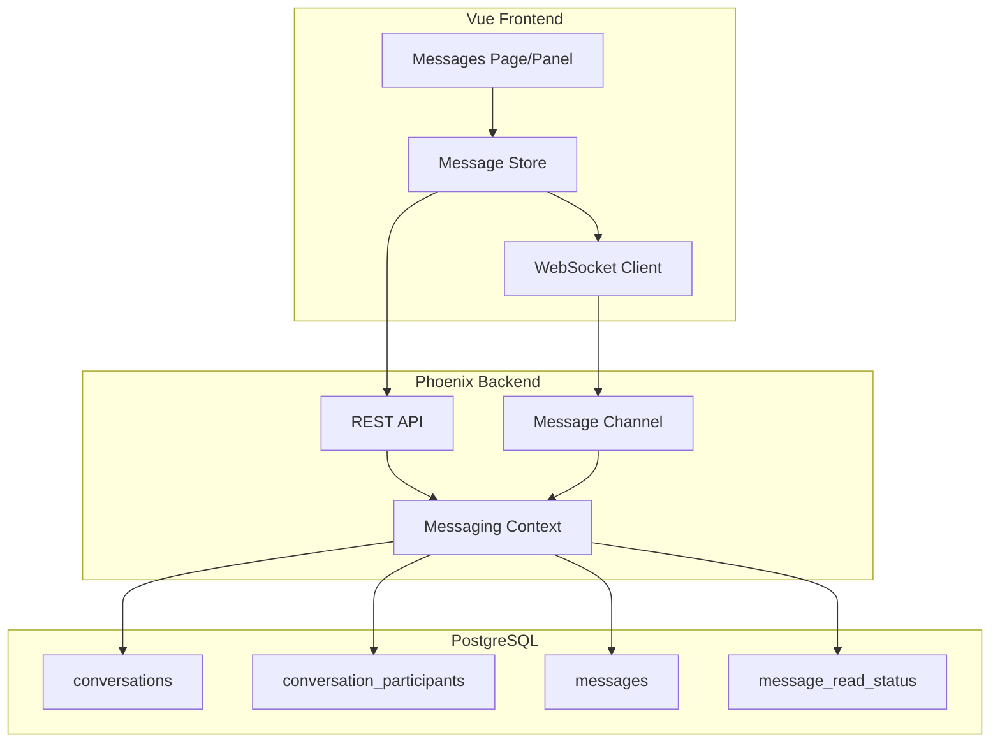

<!-- d0862a25-7c3d-4a67-a200-3370c5edfb6f afde4c02-a4ad-43c8-a008-026c2c60f842 -->
# Organization Messaging System Plan

## Architecture Overview

The messaging system will support three conversation types:

1. **Direct Messages (1:1)** - Private messages between two organization members
2. **Group Chats** - Multi-member conversations within an organization
3. **Org-Wide Announcements** - Broadcast messages to all organization members (admin/owner only)

**Note:** Users can only message other users within the same organization. Cross-org messaging is not supported.



---

## 1. Database Schema

Create four new tables in `server/priv/repo/migrations/`:

### conversations

```elixir
schema "conversations" do
  field :type, :string                   # "direct", "group", "announcement"
  field :name, :string                   # For group chats (null for direct)
  field :last_message_at, :utc_datetime
  field :last_message_preview, :string   # First ~100 chars of last message
  
  belongs_to :organization, Organization
  belongs_to :created_by, User, foreign_key: :created_by_user_id
  
  # Future: link to campaign for campaign-specific chats
  # belongs_to :campaign, Campaign  # nullable
  
  has_many :participants, ConversationParticipant
  has_many :messages, Message
  
  timestamps(type: :utc_datetime)
end
```

### conversation_participants

```elixir
schema "conversation_participants" do
  field :role, :string, default: "member"  # "admin", "member"
  field :joined_at, :utc_datetime
  field :left_at, :utc_datetime            # Soft delete for leaving groups
  field :last_read_at, :utc_datetime       # For quick unread count (per-conversation)
  field :muted, :boolean, default: false   # Mute toast notifications
  
  belongs_to :conversation, Conversation
  belongs_to :user, User
  
  timestamps(type: :utc_datetime)
end
```

- Unique constraint on [conversation_id, user_id]

### messages

```elixir
schema "messages" do
  field :content, :text, null: false
  field :message_type, :string, default: "text"  # "text", "system"
  field :edited_at, :utc_datetime                # Track edits
  field :deleted_at, :utc_datetime               # Soft delete
  
  belongs_to :conversation, Conversation
  belongs_to :sender, User
  
  has_many :read_statuses, MessageReadStatus
  
  timestamps(type: :utc_datetime)
end
```

- Index on [conversation_id, inserted_at]

### message_read_status

```elixir
schema "message_read_status" do
  field :read_at, :utc_datetime
  
  belongs_to :message, Message
  belongs_to :user, User
  
  timestamps(type: :utc_datetime)
end
```

- Unique constraint on [message_id, user_id]
- For detailed per-message read tracking and read receipts

---

## 2. Migration

```elixir
defmodule ClippsterServer.Repo.Migrations.CreateMessagingTables do
  use Ecto.Migration

  def change do
    create table(:conversations) do
      add :type, :string, null: false  # "direct", "group", "announcement"
      add :name, :string               # For group chats
      add :last_message_at, :utc_datetime
      add :last_message_preview, :string
      
      add :organization_id, references(:organizations, on_delete: :delete_all), null: false
      add :created_by_user_id, references(:users, on_delete: :nilify_all)
      # Future: add :campaign_id, references(:clipping_campaigns, on_delete: :delete_all)
      
      timestamps(type: :utc_datetime)
    end

    create index(:conversations, [:organization_id])
    create index(:conversations, [:last_message_at])
    create index(:conversations, [:type])

    create table(:conversation_participants) do
      add :role, :string, default: "member", null: false
      add :joined_at, :utc_datetime
      add :left_at, :utc_datetime
      add :last_read_at, :utc_datetime
      add :muted, :boolean, default: false, null: false
      
      add :conversation_id, references(:conversations, on_delete: :delete_all), null: false
      add :user_id, references(:users, on_delete: :delete_all), null: false
      
      timestamps(type: :utc_datetime)
    end

    create unique_index(:conversation_participants, [:conversation_id, :user_id])
    create index(:conversation_participants, [:user_id])

    create table(:messages) do
      add :content, :text, null: false
      add :message_type, :string, default: "text", null: false
      add :edited_at, :utc_datetime
      add :deleted_at, :utc_datetime
      
      add :conversation_id, references(:conversations, on_delete: :delete_all), null: false
      add :sender_id, references(:users, on_delete: :nilify_all)
      
      timestamps(type: :utc_datetime)
    end

    create index(:messages, [:conversation_id, :inserted_at])
    create index(:messages, [:sender_id])

    create table(:message_read_status) do
      add :read_at, :utc_datetime, null: false
      
      add :message_id, references(:messages, on_delete: :delete_all), null: false
      add :user_id, references(:users, on_delete: :delete_all), null: false
      
      timestamps(type: :utc_datetime)
    end

    create unique_index(:message_read_status, [:message_id, :user_id])
    create index(:message_read_status, [:user_id])
  end
end
```

---

## 3. Backend Implementation

### Ecto Schemas (`server/lib/clippster_server/messaging/`)

- `conversation.ex` - Conversation schema with type validation
- `conversation_participant.ex` - Participant with role, mute, soft-delete
- `message.ex` - Message schema with edit/delete support
- `message_read_status.ex` - Per-message read tracking

### Context Module (`server/lib/clippster_server/messaging.ex`)

Key functions:

```elixir
defmodule ClippsterServer.Messaging do
  # Conversations
  def create_direct_conversation(organization_id, user1_id, user2_id)
  def create_group_conversation(organization_id, name, creator_id, member_ids)
  def create_announcement(organization_id, creator_id, content)  # Auto-includes all members
  def get_conversation(id)
  def list_user_conversations(organization_id, user_id)
  def list_conversations_for_user(user_id)  # Across all orgs
  
  # Messages
  def send_message(conversation_id, sender_id, content)
  def edit_message(message_id, user_id, new_content)
  def delete_message(message_id, user_id)  # Soft delete
  def get_messages(conversation_id, opts \\ [])  # Paginated
  
  # Read status
  def mark_as_read(conversation_id, user_id)
  def mark_message_read(message_id, user_id)
  def get_unread_counts(organization_id, user_id)
  def get_unread_count_for_conversation(conversation_id, user_id)
  
  # Participants
  def add_participant(conversation_id, user_id, adder_id)
  def remove_participant(conversation_id, user_id, remover_id)
  def leave_conversation(conversation_id, user_id)
  def toggle_mute(conversation_id, user_id)
  
  # Access control
  def is_participant?(conversation_id, user_id)
  def can_send_announcement?(organization_id, user_id)
  def can_message_user?(organization_id, from_user_id, to_user_id)  # Both must be org members
end
```

### Phoenix Channel (`server/lib/clippster_server_web/channels/messaging_channel.ex`)

```elixir
defmodule ClippsterServerWeb.MessagingChannel do
  use ClippsterServerWeb, :channel
  
  # Join user's personal channel for notifications
  def join("messaging:user:" <> user_id, _params, socket)
  
  # Join specific conversation
  def join("messaging:conversation:" <> conversation_id, _params, socket)
  
  # Events
  def handle_in("new_message", %{"content" => content}, socket)
  def handle_in("edit_message", %{"message_id" => id, "content" => content}, socket)
  def handle_in("delete_message", %{"message_id" => id}, socket)
  def handle_in("typing", _payload, socket)
  def handle_in("mark_read", _payload, socket)
  
  # Broadcasts
  # - "new_message" - New message in conversation
  # - "message_edited" - Message was edited
  # - "message_deleted" - Message was deleted
  # - "user_typing" - Typing indicator
  # - "message_read" - Read receipt
  # - "conversation_created" - New conversation notification
end
```

### REST API Routes (`server/lib/clippster_server_web/router.ex`)

```elixir
scope "/api" do
  pipe_through [:api, :api_auth]
  
  # Organization-scoped messaging
  scope "/organizations/:organization_id/messaging" do
    get "/conversations", MessagingController, :list_conversations
    post "/conversations/direct", MessagingController, :create_direct
    post "/conversations/group", MessagingController, :create_group
    post "/conversations/announcement", MessagingController, :create_announcement
    get "/unread", MessagingController, :get_unread_counts
  end
  
  # Conversation-specific (not org-scoped for cross-org access)
  scope "/conversations/:id" do
    get "/", MessagingController, :get_conversation
    get "/messages", MessagingController, :get_messages
    post "/messages", MessagingController, :send_message
    put "/messages/:message_id", MessagingController, :edit_message
    delete "/messages/:message_id", MessagingController, :delete_message
    post "/read", MessagingController, :mark_read
    put "/mute", MessagingController, :toggle_mute
    post "/participants", MessagingController, :add_participant
    delete "/participants/:user_id", MessagingController, :remove_participant
    post "/leave", MessagingController, :leave_conversation
  end
  
  # User-level endpoints
  get "/me/conversations", MessagingController, :list_all_conversations
  get "/me/unread-count", MessagingController, :get_total_unread
end
```

---

## 4. Frontend Implementation

### WebSocket Service (`client/src/services/messagingSocket.ts`)

```typescript
import { Socket, Channel } from 'phoenix';

class MessagingSocket {
  private socket: Socket | null = null;
  private userChannel: Channel | null = null;
  private conversationChannels: Map<string, Channel> = new Map();
  
  connect(token: string, userId: string) {
    this.socket = new Socket('/socket', { params: { token } });
    this.socket.connect();
    
    // Join user's notification channel
    this.userChannel = this.socket.channel(`messaging:user:${userId}`);
    this.userChannel.join();
    
    // Listen for new message notifications
    this.userChannel.on('new_message_notification', (payload) => {
      // Update unread count, show toast if not muted
    });
    
    this.userChannel.on('conversation_created', (payload) => {
      // Add new conversation to list
    });
  }
  
  joinConversation(conversationId: string) {
    if (!this.socket) return;
    
    const channel = this.socket.channel(`messaging:conversation:${conversationId}`);
    channel.join();
    
    channel.on('new_message', (message) => { /* Add to conversation */ });
    channel.on('message_edited', (message) => { /* Update message */ });
    channel.on('message_deleted', ({ message_id }) => { /* Mark deleted */ });
    channel.on('user_typing', ({ user_id }) => { /* Show indicator */ });
    channel.on('message_read', ({ user_id, message_id }) => { /* Update receipt */ });
    
    this.conversationChannels.set(conversationId, channel);
  }
  
  sendMessage(conversationId: string, content: string) { /* ... */ }
  editMessage(conversationId: string, messageId: string, content: string) { /* ... */ }
  deleteMessage(conversationId: string, messageId: string) { /* ... */ }
  sendTyping(conversationId: string) { /* ... */ }
  markRead(conversationId: string) { /* ... */ }
  
  leaveConversation(conversationId: string) {
    const channel = this.conversationChannels.get(conversationId);
    if (channel) {
      channel.leave();
      this.conversationChannels.delete(conversationId);
    }
  }
  
  disconnect() {
    this.conversationChannels.forEach(ch => ch.leave());
    this.userChannel?.leave();
    this.socket?.disconnect();
  }
}

export const messagingSocket = new MessagingSocket();
```

### API Service (`client/src/services/messagingApi.ts`)

```typescript
// Types
interface Conversation {
  id: string;
  type: 'direct' | 'group' | 'announcement';
  name: string | null;
  organizationId: string;
  lastMessageAt: string | null;
  lastMessagePreview: string | null;
  participants: Participant[];
  unreadCount: number;
  muted: boolean;
}

interface Participant {
  id: string;
  userId: string;
  displayName: string;
  avatarUrl: string | null;
  role: 'admin' | 'member';
  joinedAt: string;
}

interface Message {
  id: string;
  conversationId: string;
  senderId: string;
  senderName: string;
  senderAvatarUrl: string | null;
  content: string;
  messageType: 'text' | 'system';
  editedAt: string | null;
  deletedAt: string | null;
  insertedAt: string;
  readBy: string[];  // User IDs who have read
}

// API calls
export const messagingApi = {
  listConversations(orgId: string): Promise<Conversation[]>,
  listAllConversations(): Promise<Conversation[]>,
  createDirectConversation(orgId: string, userId: string): Promise<Conversation>,
  createGroupConversation(orgId: string, name: string, memberIds: string[]): Promise<Conversation>,
  createAnnouncement(orgId: string, content: string): Promise<Conversation>,
  getConversation(id: string): Promise<Conversation>,
  getMessages(conversationId: string, opts?: { before?: string; limit?: number }): Promise<Message[]>,
  sendMessage(conversationId: string, content: string): Promise<Message>,
  editMessage(conversationId: string, messageId: string, content: string): Promise<Message>,
  deleteMessage(conversationId: string, messageId: string): Promise<void>,
  markAsRead(conversationId: string): Promise<void>,
  toggleMute(conversationId: string): Promise<{ muted: boolean }>,
  addParticipant(conversationId: string, userId: string): Promise<Participant>,
  removeParticipant(conversationId: string, userId: string): Promise<void>,
  leaveConversation(conversationId: string): Promise<void>,
  getUnreadCounts(orgId: string): Promise<Record<string, number>>,
  getTotalUnread(): Promise<number>,
};
```

### Pinia Store (`client/src/stores/messaging.ts`)

```typescript
interface MessagingState {
  conversations: Map<string, Conversation>;
  messages: Map<string, Message[]>;  // conversationId -> messages
  unreadCounts: Map<string, number>;
  totalUnread: number;
  activeConversationId: string | null;
  typingUsers: Map<string, Set<string>>;  // conversationId -> userIds
}

// Actions
// - loadConversations(orgId?)
// - loadMessages(conversationId, opts?)
// - sendMessage(conversationId, content)
// - editMessage(conversationId, messageId, content)
// - deleteMessage(conversationId, messageId)
// - markAsRead(conversationId)
// - toggleMute(conversationId)
// - setActiveConversation(conversationId)
// - handleNewMessage(message)
// - handleMessageEdited(message)
// - handleMessageDeleted(messageId)
// - handleTyping(conversationId, userId)
```

### Vue Components (`client/src/components/messaging/`)

- `MessagingPanel.vue` - Main panel (conversation list + chat view)
- `ConversationList.vue` - List of conversations with unread badges, last message preview
- `ChatView.vue` - Message thread with input
- `MessageBubble.vue` - Individual message with edit/delete options, read receipts
- `NewConversationDialog.vue` - Create direct/group chat
- `ParticipantSelector.vue` - Select org members for groups
- `AnnouncementDialog.vue` - Create org-wide announcement
- `TypingIndicator.vue` - Show who is typing
- `ChatHeader.vue` - Conversation name, participants, mute toggle

### User Settings

```typescript
interface MessagingSettings {
  showToastNotifications: boolean;  // Can be disabled in settings
  // Unread count badge is always visible regardless of this setting
}
```

### Page Integration

- Add `/organization/:id/messages` route
- Add `/organization/:id/messages/:conversationId` route
- Add messaging icon to organization dashboard sidebar
- Unread badge in navigation (always visible)
- Toast notifications (respects user preference + per-conversation mute)

---

## 5. Authorization Rules

| Action | owner | admin | member |
|--------|-------|-------|--------|
| Send DM (same org only) | Yes | Yes | Yes |
| Create Group (same org only) | Yes | Yes | Yes |
| Send Announcement | Yes | Yes | No |
| Edit Own Message | Yes | Yes | Yes |
| Delete Own Message | Yes | Yes | Yes |
| Delete Any Message | Yes | Yes | No |
| Add/Remove Participants (same org) | Yes | Yes | No |
| Mute Conversation | Yes | Yes | Yes |
| Leave Group | Yes | Yes | Yes |
| View Own Conversations | Yes | Yes | Yes |

**Constraint:** All messaging is organization-scoped. Users can only message other members of the same organization.

---

## 6. Implementation Order

1. **Database**: Migration with all tables
2. **Schemas**: Ecto schemas with associations
3. **Context**: Core messaging logic with all CRUD operations
4. **Channel**: Real-time infrastructure with all events
5. **API**: REST endpoints for all operations
6. **Frontend Services**: API client + WebSocket
7. **Store**: Pinia store with real-time sync
8. **UI Components**: Full messaging interface
9. **Integration**: Navigation, unread badges, notifications

---

## 7. Future Considerations

### Campaign Messaging (After Campaigns Implementation)
- Add `campaign_id` foreign key to `conversations`
- Allow campaign applicants to message designated campaign admins
- Campaign-specific group chats for approved participants

### Attachments (v2)
- Add `attachment_url`, `attachment_type`, `attachment_metadata` fields to `messages`
- Support image uploads to R2
- File sharing with presigned URLs

### Message Search
- Full-text search on message content
- Search within conversation or across all conversations

---

## To-dos

- [ ] Create database migration for conversations, participants, messages, read_status tables
- [ ] Create Ecto schemas for Conversation, ConversationParticipant, Message, MessageReadStatus
- [ ] Implement Messaging context with CRUD, edit/delete, mute, and query functions
- [ ] Create MessagingChannel for real-time events (new, edit, delete, typing, read)
- [ ] Add MessagingController with REST endpoints for all operations
- [ ] Create messagingApi.ts and messagingSocket.ts services
- [ ] Create messaging Pinia store for state management
- [ ] Build Vue messaging components (panel, chat view, message bubbles with edit/delete)
- [ ] Add messages route, sidebar navigation, and unread badge indicators
- [ ] Add user notification settings (toast toggle)
- [ ] Add per-conversation mute functionality