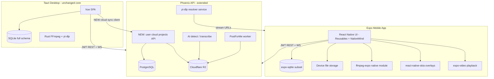
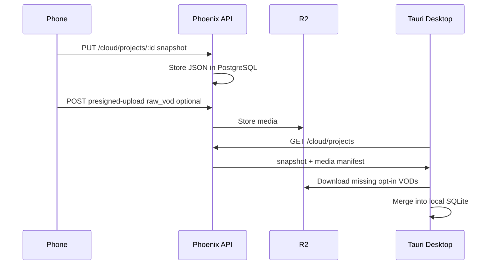

# Expo Mobile Clippster — Architecture & Implementation Plan

## Executive summary (explain like you're 5)

Imagine Clippster is a **toy workshop** with three rooms:

1. **Your phone or computer** — where you cut and decorate videos (download, trim, add words on screen).
2. **The cloud clubhouse** (`api.clippster.app`) — where your **name badge** lives, your **team** hangs out, and robots **post videos** to social media for you.
3. **A paid locker** (cloud storage) — if you pay, your projects get copied into a locker so you can open the **same project** on phone *or* computer. Big raw video files stay in your pocket unless you choose to put them in the locker too.

**Phone app = small workshop.** You can download a streamer's long video, pick the funny parts, add subtitles and text stickers, let the **server robots** find highlights (AI), then **schedule a post**. You cannot do the giant pro editor (OpenCut timeline, livestream studio, Remotion) — that's the **big workshop** on desktop.

**What runs on the phone vs in the cloud:**
- **On phone (native, fast):** FFmpeg cutting/export, video playback, drawing subtitles on preview.
- **In cloud:** login, billing, AI transcribe/detect, PostForMe posting, org/campaign data, **yt-dlp** (because YouTube won't give phones a direct download link — we ask the server for help).

---

## Platform support matrix (VOD download vs AI clip detection)

Desktop today supports six streaming platforms via [`client/src/config/platforms.ts`](client/src/config/platforms.ts): **YouTube, Kick, Twitch, Rumble, X (Twitter), PumpFun**.

Mobile splits this into two different capabilities:

### VOD download (needs server yt-dlp resolver per platform)

| Platform | Desktop today | Mobile launch (Phase 1) | Deferred | Notes |
|----------|---------------|---------------------------|----------|-------|
| **YouTube** | Yes | Yes | — | Channel browse + single-video URL |
| **Kick** | Yes | Yes | — | Channel slug / Kick URL |
| **Twitch** | Yes | Yes | — | Channel VOD list + VOD URL |
| **Rumble** | Yes | Yes | — | Same yt-dlp path as desktop |
| **X (Twitter)** | Yes | Yes | — | Timeline videos, broadcast replays, Spaces — **no user X login required** (see note below) |
| **PumpFun** | Yes | No | Phase 3+ | Desktop uses Node/LiveKit sidecar — hardest to port |
| **Manual import** | Yes | Yes | — | Camera roll / Files app; no yt-dlp needed |

**X download ≠ X posting auth:** Desktop [`twitter.rs`](client/src-tauri/src/twitter.rs) `download_twitter_vod` runs **yt-dlp + FFmpeg** with no user OAuth. Internal guest-token/GraphQL code is optional metadata enrichment for Spaces (same as yt-dlp's built-in guest access) — invisible to the user. **PostForMe / social OAuth** is a separate flow for *scheduling posts*, not for downloading VODs. Mobile Phase 1 server resolver mirrors desktop yt-dlp calls; no mobile X login for downloads.

Download flow: paste URL → server resolves stream with yt-dlp → phone downloads → FFmpeg remuxes to local MP4.

### AI clip detection & transcription (platform-agnostic)

Server APIs (`POST /api/clips/transcribe`, `/detect`, `/detect-chunked`) in [`clips_controller.ex`](server/lib/clippster_server_web/controllers/clips_controller.ex) do **not** care which platform the video came from. They process uploaded audio/video chunks + transcript. **Any video file on the phone can be detected** as long as the user has credits.

| Video source | Mobile AI detect/transcribe | When |
|--------------|----------------------------|------|
| Downloaded VOD (YouTube/Kick/Twitch/etc.) | Yes | Phase 1 |
| Manual import (camera roll / file picker) | Yes | Phase 1 |
| Org shared clips (download from R2) | Yes | Phase 4 |
| Cloud-synced project with opt-in raw VOD on R2 | Yes | Phase 5 |
| **Livestream DVR / realtime detect** (`detect-realtime`) | **No** | Desktop-only; requires live HLS recording pipeline not in mobile scope |

**Simple rule:** If you can get a video file onto the phone, AI can find clips in it. Download support only controls *how* you get the file — not whether detection works.

---

## Aspect ratios & manual framing (mobile constraints)

### Export ratios: 16:9 and 9:16 only

Desktop [`ClipBuildSettingsDialog.vue`](client/src/components/ClipBuildSettingsDialog.vue) supports 16:9, 9:16, 1:1, 4:5, and more. **Mobile exports only:**

| Ratio | Use case |
|-------|----------|
| **9:16** | TikTok, Instagram Reels, YouTube Shorts |
| **16:9** | YouTube landscape, X video, general horizontal |

User can build **one or both** per clip. All `perRatioConfigs` (subtitles, text boxes) are keyed only to `16:9` and `9:16`.

### Manual framing (required — desktop parity)

Mobile must implement the **Manual Framing Editor** pattern from [`ManualPOIEditor.vue`](client/src/components/poi/ManualPOIEditor.vue), not just a simple center-crop.

**What the user does (same mental model as desktop):**

1. **Source panel** — on the wide source video, draw one or more **crop regions** (speaker cam, gameplay, etc.) as normalized rectangles
2. **Target panel** — see how those regions compose into the **16:9 or 9:16** output frame; drag to reposition; preview watermarks, subtitles, and text box on the export frame
3. **Segment timeline** — when framing changes mid-clip (e.g. switch from face cam to gameplay), add **time-based segment configs** (`SegmentRegionConfig[]`)
4. **Source frame options** — `Scale 16:9` / `Use 16:9` with optional blur letterbox (same `ManualSourceFrameMode` as desktop)

**Data model (must match desktop for cloud sync + export):**

- Stored in `projects.active_vod_preset_config` as [`ActiveVodPresetConfig`](client/src/types/index.ts)
- Framing body: [`ManualFramingConfig`](client/src/types/index.ts) — `regions[]`, `segmentConfigs[]`, `sourceFrameMode`, `sourceTransform`, `targetAspectRatio`
- Each region: [`ManualRegion`](client/src/types/index.ts) — `source` rect + `output` rect (normalized 0–1)

**Mobile UX adaptation:** Side-by-side desktop panels become a **tabbed or stacked** layout (Source | Target) with touch drag/resize on Skia overlays. AI B-roll inside ManualPOIEditor stays **desktop-only** for v1.

**Export:** `packages/clip-export` feeds `ManualFramingConfig` into FFmpeg filter graphs (same contract as Rust [`clips/orchestrator.rs`](client/src-tauri/src/clips/orchestrator.rs)) for the selected ratio(s).

---

## What the repo audit found

### Current state
| Area | Today | Mobile impact |
|------|-------|---------------|
| Clients | Tauri+Vue (`client/`), Phoenix (`server/`), landing web | **No mobile app exists** |
| Product docs | [`.planning/REQUIREMENTS.md`](.planning/REQUIREMENTS.md), [`docs/universal-app-plan.md`](docs/universal-app-plan.md) explicitly hide editor on web | Mobile is **greenfield**; desktop stays primary |
| Local data | 92 SQLite migrations in [`client/src-tauri/migrations/`](client/src-tauri/migrations/) — projects, clips, segments, transcripts, builds | Mobile needs **subset schema** via `expo-sqlite` |
| Cloud data | PostgreSQL + R2 — org assets, shared clips, portfolio, scheduled posts | **Reusable as-is** for org/social features |
| Project sync | **Does not exist** — editor library is local-only | **New backend subsystem required** for hybrid cloud |
| VOD download | yt-dlp + FFmpeg in Rust ([`youtube.rs`](client/src-tauri/src/youtube.rs), [`downloads.rs`](client/src-tauri/src/downloads.rs)) — YouTube, Kick, Twitch, Rumble, Twitter, PumpFun | yt-dlp **cannot run on-device**; FFmpeg **must be native** |
| Minimal editor | [`ProjectWorkspaceDialog.vue`](client/src/components/ProjectWorkspaceDialog.vue) — segment trim, subtitles, text box | Replicate data model + touch UI; reference logic in [`clipTextBox.ts`](client/src/utils/clipTextBox.ts), [`subtitleVisibleWords.ts`](client/src/utils/subtitleVisibleWords.ts) |
| Clip export | Rust [`clips/orchestrator.rs`](client/src-tauri/src/clips/orchestrator.rs) → FFmpeg filter graphs | Port **FFmpeg CLI arg generation** to shared TS; execute via native FFmpeg |
| PostForMe | Server-only ([`post_for_me.ex`](server/lib/clippster_server/social/providers/post_for_me.ex)) | Mobile uses same [`schedulingApi.ts`](client/src/services/schedulingApi.ts) patterns |
| Analytics | [`analytics.ts`](client/src/services/analytics.ts) → `POST /analytics/track` | Copy as-is |
| Auth | JWT, wallet/Google/email | Mobile: **SecureStore** + deep links; add CORS/origin for mobile |

### In-scope for mobile v1 (per your request)
- Download VODs (platform-limited initially)
- Minimal editing = ProjectWorkspace parity (segments, subtitles, text box)
- **Manual framing editor** — same capability as desktop [`ManualPOIEditor.vue`](client/src/components/poi/ManualPOIEditor.vue) (crop regions on source, arrange in target frame, per-segment framing, subtitle/text positioning on export preview)
- **Export aspect ratios: `16:9` and `9:16` only** — no 1:1, 4:5, or other desktop ratios on mobile
- Server AI detection + transcription (existing credit APIs)
- PostForMe scheduling + analytics
- Clipper profiles, org clipping (shared clips, campaigns), schedule posting
- Local storage default; **hybrid paid cloud** (projects/edits sync; raw VOD opt-in upload)

### Explicitly out of scope for v1
- OpenCut full NLE ([`client/src/editor/`](client/src/editor/))
- Livestream DVR, streaming studio, PumpFun Node sidecar
- Remotion export sidecar
- Desktop admin panel
- Full feature parity with 90+ SQLite migrations (carry only what minimal editor + download need)
- **Export ratios beyond 16:9 and 9:16** (desktop supports 1:1, 4:5, etc. via [`ClipBuildSettingsDialog.vue`](client/src/components/ClipBuildSettingsDialog.vue))
- **AI B-roll panel** inside ManualPOIEditor (desktop-only for v1; core manual regions/framing still required)

---

## Target architecture



---

## Monorepo layout (proposed)

```
clippster-mono/
  apps/
    mobile/                    # NEW Expo app (dev client + EAS Build)
  packages/
    shared-types/              # SubtitleSettings, ClipTextBoxState, API DTOs
    api-client/                # Extracted from client/src/services/*Api.ts
    clip-export/               # FFmpeg arg builders (from Rust orchestrator contract)
    sqlite-schema/             # Subset migrations shared mobile + future Tauri sync
  client/                      # Tauri (add cloud sync consumer later)
  server/                      # Add cloud project + yt-dlp resolver routes
```

Root [`package.json`](package.json) gains workspace scripts: `yarn mobile`, `yarn mobile:ios`, `yarn mobile:android`.

---

## Tech stack decisions

### UI — "shadcn for Expo"
**Recommendation: [React Native Reusables](https://github.com/founded-labs/react-native-reusables) + [NativeWind v4](https://www.nativewind.dev/)**

Why: Same copy-paste ownership model as desktop's Radix/shadcn stack; Tailwind mental model matches [`client/`](client/) styling. Alternative: **gluestack-ui v2** if you want a CLI + universal web later.

Navigation: **Expo Router** (file-based, deep links for OAuth).

### SQLite
**`expo-sqlite`** with a **subset** of desktop tables:

| Table group | Mobile needs |
|-------------|--------------|
| `projects`, `raw_videos`, `clips`, `clip_versions`, `clip_segments` | Core workspace |
| `transcripts`, transcript word storage | Subtitles + AI |
| `clip_builds` | Export history |
| `creator_profiles` (local) | Optional; org profiles from server |
| Skip | `video_editor_*`, livestream DVR, studio scenes, 50+ editor tables |

Schema version tracked; migrations in `packages/sqlite-schema/`.

### FFmpeg (native — required)
**`ffmpeg-expo`** (or maintained fork) via **Expo config plugin**.

- Requires **Expo Dev Client** / EAS Build — **not Expo Go**
- Handles: remux after download, clip concat, subtitle burn-in (ASS or drawtext), text overlay PNG composite, thumbnail, **export for 16:9 and 9:16 only**
- Mirror desktop build contract from [`useClipBuildPipeline.ts`](client/src/composables/useClipBuildPipeline.ts)

### yt-dlp (server — not on device)
Python yt-dlp **cannot ship inside iOS/Android apps** reliably.

**New server endpoint group** (e.g. `POST /api/media/resolve-url`):
1. Mobile sends platform URL + quality prefs
2. Server runs yt-dlp (Fly machine or dedicated worker with yt-dlp binary)
3. Returns time-limited direct stream URL(s) + metadata (duration, title, thumbnails)
4. Mobile downloads via `expo-file-system` + optional `expo-background-task`
5. FFmpeg remuxes to local MP4 if needed

Reuse parsing logic patterns from [`youtube.rs`](client/src-tauri/src/youtube.rs) / [`downloads.rs`](client/src-tauri/src/downloads.rs) as reference; implement in Elixir via `System.cmd` or Port to yt-dlp.

**Phased download rollout:** Phase 1 = **YouTube, Kick, Twitch, Rumble, X** + manual import (full desktop yt-dlp parity except PumpFun). Phase 3+ = PumpFun only (LiveKit/Node sidecar).

### AI detection (server — your choice)
Existing APIs (no mobile-specific backend):
- `POST /api/clips/transcribe`
- `POST /api/clips/detect` / `detect-chunked`
- WebSocket progress ([`useProgressSocket.ts`](client/src/composables/useProgressSocket.ts))
- Credits via `GET /api/credits/balance`

Mobile flow: upload VOD segment or presigned R2 upload → server processes → poll/WS → write results to local SQLite.

---

## What must be extracted into React Native (native) for performance

| Layer | Stay in JS (Expo) | Extract to native |
|-------|-------------------|-------------------|
| UI / forms / navigation | Yes | — |
| SQLite CRUD | Yes (`expo-sqlite` is native-backed) | Only if profiling shows jank (unlikely) |
| API / auth | Yes | SecureStore wrapper |
| **Video playback** | `expo-video` (wraps AVPlayer/ExoPlayer) | Already native |
| **Subtitle/text preview overlays** | Orchestration in JS | **`@shopify/react-native-skia`** for 60fps text rendering on top of video |
| **Clip export / remux / burn-in** | Build FFmpeg arg strings in shared TS | **`ffmpeg-expo`** executes on native thread; expose progress callbacks |
| **Background downloads** | Queue logic in JS | **`expo-file-system`** + **`expo-task-manager`** / iOS `NSURLSession` background |
| **Thumbnail generation** | Trigger from JS | FFmpeg native frame extract |
| yt-dlp | — | **Server only** |
| ASS subtitle rasterization | Desktop uses resvg in Rust | Mobile: FFmpeg `ass` filter or Skia → PNG → overlay filter |

**Do NOT port Rust orchestrator to JS execution** — port only the **command recipe** (inputs/outputs JSON) and run via native FFmpeg.

---

## Hybrid cloud storage (new — biggest backend addition)

Your choice: **projects + edits sync; raw VOD opt-in**.

### Server additions (Phoenix)

New domain: `ClippsterServer.CloudProjects`

**PostgreSQL tables (conceptual):**
- `cloud_projects` — id, user_id, name, schema_version, device_updated_at, deleted_at
- `cloud_project_snapshots` — JSON blob of syncable state (clips, segments, subtitle_settings, clip_text_overlay, transcript refs)
- `cloud_media_assets` — project_id, asset_type (`raw_vod` | `built_clip` | `thumbnail`), r2_key, size_bytes, optional, upload_status
- `user_storage_quotas` — tier, bytes_used, bytes_limit (ties to subscription)

**R2 layout:** `users/{user_id}/projects/{project_id}/{asset_id}.mp4`

**API surface (new):**
- `GET/POST /api/cloud/projects` — list/create
- `GET/PUT /api/cloud/projects/:id` — fetch/push snapshot (CRDT or last-write-wins with `device_id` + `updated_at`)
- `POST /api/cloud/projects/:id/media/presigned-upload` — opt-in VOD upload
- `GET /api/cloud/projects/:id/media/:asset_id/presigned-download`
- `POST /api/cloud/projects/:id/sync` — delta sync endpoint

**Tauri desktop changes (phase 2 of cloud):**
- New sync client in [`client/src/services/`](client/src/services/) — on login, merge cloud projects into local SQLite
- Conflict UI when same project edited on two devices
- "Upload raw VOD to cloud" toggle per project

**Billing:** New subscription add-on or tier flag on existing user subscription ([`SUBSCRIPTION_PLAN.md`](docs/completed/SUBSCRIPTION_PLAN.md) pattern) — storage quota enforcement in `user_storage_quotas`.



---

## Mobile feature modules (mapped to existing code)

### 1. Auth & account
- Mirror [`client/src/stores/auth.js`](client/src/stores/auth.js) + [`api.ts`](client/src/services/api.ts)
- `X-Client-Platform: mobile`
- Google OAuth via `expo-auth-session`; email login; wallet optional later
- Server: add mobile deep-link origins in [`router.ex`](server/lib/clippster_server_web/router.ex) CORS

### 2. Download VODs
- UI: channel URL input → server resolve → download queue
- Reference: [`useDownloads.ts`](client/src/composables/useDownloads.ts) state machine
- Local `raw_videos` row + file path in app sandbox

### 3. Workspace editor (ProjectWorkspace parity)

Screens:
- **Project list** — local + cloud badge
- **Workspace** — video preview + simplified timeline (segment in/out handles)
- **Manual framing editor** — mobile adaptation of [`ManualPOIEditor.vue`](client/src/components/poi/ManualPOIEditor.vue):
  - **Source panel** ([`POISourcePanel.vue`](client/src/components/poi/POISourcePanel.vue)): draw/move/resize crop regions on the 16:9 (or source) video
  - **Target panel** ([`POITargetPanel.vue`](client/src/components/poi/POITargetPanel.vue)): live preview of how regions compose into **16:9 or 9:16** output; drag subtitle + text box on export frame
  - **Segment timeline** ([`POISegmentTimeline`](client/src/components/poi/)): time-based framing keyframes (`SegmentRegionConfig[]`) when crop changes mid-clip
  - **Source frame modes**: `scale` / `use16x9` / blur letterbox (same `ManualSourceFrameMode` as desktop)
  - Persist to `projects.active_vod_preset_config` as [`ActiveVodPresetConfig`](client/src/types/index.ts) with [`ManualFramingConfig`](client/src/types/index.ts) (`regions`, `segmentConfigs`, `sourceTransform`, etc.)
- **Aspect ratio toggle** — user picks **16:9** (landscape) or **9:16** (portrait) per build; `perRatioConfigs` on subtitles/text boxes only keyed for these two ratios
- **Subtitles sheet** — preset picker + properties ([`SubtitleEditorDialog.vue`](client/src/components/SubtitleEditorDialog.vue), [`SubtitlePropertiesPanel.vue`](client/src/components/SubtitlePropertiesPanel.vue))
- **Text box sheet** — [`ClipTextBoxPropertiesPanel.vue`](client/src/components/ClipTextBoxPropertiesPanel.vue) equivalent

Touch adaptations:
- Drag handles → larger hit targets; pinch for subtitle font size; two-finger pan/zoom on source framing
- Reuse [`clipTextBox.ts`](client/src/utils/clipTextBox.ts), [`types/index.ts`](client/src/types/index.ts) (`ManualRegion`, `ManualFramingConfig`, `ActiveVodPresetConfig`) via `packages/shared-types`
- Skia canvas for source/target framing overlays (same role as desktop POI region components)

### 4. AI pipeline
- Upload: presigned R2 (reuse [`presignedUploadApi.ts`](client/src/services/presignedUploadApi.ts) patterns)
- Transcribe + detect via server; write to local SQLite
- Progress: Phoenix WS

### 5. Build & export
- `packages/clip-export` builds FFmpeg args from clip + segments + `active_vod_preset_config` framing + subtitle_settings + clip_text_overlay
- User selects **one or both** of `16:9` and `9:16` per build (no other ratios)
- Native FFmpeg run → `clip_builds` row(s) → local MP4 per selected ratio
- Optional: upload built clip to R2 for scheduling

### 6. PostForMe + scheduling + analytics
- Reuse API shapes from [`schedulingApi.ts`](client/src/services/schedulingApi.ts), [`socialAccountsApi.ts`](client/src/services/socialAccountsApi.ts)
- OAuth: mobile deep link instead of Tauri `start_post_for_me_oauth`
- Analytics: [`analytics.ts`](client/src/services/analytics.ts)
- UI: schedule picker, post list with metrics (from `ScheduledPost.analytics`)

### 7. Profiles, orgs, campaigns
- Clipper profile: [`clipperProfileApi.ts`](client/src/services/clipperProfileApi.ts) — already server-backed
- Org shared clips: [`orgAssetSync.ts`](client/src/services/orgAssetSync.ts) pattern → download to device for editing
- Campaigns: [`campaignApi.ts`](client/src/services/campaignApi.ts) — submit built clips

---

## Phased delivery (recommended)

### Phase 0 — Foundation (4–6 weeks)
- Expo app scaffold, Dev Client, EAS profiles
- `packages/shared-types`, `packages/api-client`
- Auth, navigation shell, SecureStore JWT
- `expo-sqlite` subset schema + project list (local only)
- NativeWind + React Native Reusables design tokens aligned with Clippster brand

### Phase 1 — Download + AI (4–6 weeks)
- Server yt-dlp resolver (YouTube, Kick, Twitch, **Rumble, X**)
- Mobile download queue + FFmpeg remux
- Server AI transcribe + detect integration
- Basic project workspace screen (playback only)

### Phase 2 — Minimal editor (6–8 weeks)
- Segment timeline (trim/split/merge)
- **Manual framing editor** (POI source + target panels, segment-based regions, 16:9/9:16 toggle)
- Skia subtitle + text box overlays on export preview
- Properties sheets
- Native FFmpeg export for **16:9 and 9:16**

### Phase 3 — Distribution (3–4 weeks)
- PostForMe OAuth via deep links
- Schedule/cancel posts, analytics display
- Built clip upload for scheduling

### Phase 4 — Org & profiles (3–4 weeks)
- Clipper profile CRUD
- Org shared clips inbox, campaign submit flow
- Org asset cache for branding on export

### Phase 5 — Hybrid cloud sync (6–10 weeks, parallelizable after Phase 1)
- Server cloud project tables + R2 media manifest
- Mobile sync client (push/pull)
- Tauri sync client (read/write same API)
- Storage subscription + quota enforcement
- Opt-in raw VOD upload

**Total rough estimate: 26–38 weeks** for a small team (2–3 engineers); Phases 1–3 deliver a usable app without cloud sync.

---

## Key risks & mitigations

| Risk | Mitigation |
|------|------------|
| yt-dlp ToS / breakage | Server-side only; cache resolved URLs briefly; monitor yt-dlp releases |
| iOS background download limits | Warn users; support foreground download; use iOS background URL session |
| FFmpeg binary size (APK/IPA) | ffmpeg-expo LGPL build; strip unused codecs; ABI splits on Android |
| Cloud sync conflicts | `device_id` + `updated_at` LWW; future: per-field merge for segments |
| Schema drift mobile vs desktop | `packages/sqlite-schema` version field; server stores `schema_version` |
| Reimplementing Rust export bugs | Golden tests: same input JSON → compare FFmpeg args + output SSIM on sample clips |

---

## Success criteria (v1 launch)

- User logs in with same account as desktop
- Downloads a YouTube VOD on phone, runs AI detect, trims a clip, **sets manual framing (crop regions) for 9:16**, adds subtitles + text box, exports 9:16 (and/or 16:9) MP4
- Schedules post via PostForMe; sees analytics in app
- Creates/edits clipper profile; receives org shared clip; submits to campaign
- With cloud subscription: project edits appear on desktop after sync; raw VOD uploads only when opted in

---

## Files to study first when implementation starts

| Purpose | Path |
|---------|------|
| Minimal editor orchestrator | [`client/src/components/ProjectWorkspaceDialog.vue`](client/src/components/ProjectWorkspaceDialog.vue) |
| Export data shapes | [`client/src/utils/clipTextBox.ts`](client/src/utils/clipTextBox.ts), [`client/src/types/index.ts`](client/src/types/index.ts) |
| Build pipeline | [`client/src/composables/useClipBuildPipeline.ts`](client/src/composables/useClipBuildPipeline.ts), [`client/src-tauri/src/clips/orchestrator.rs`](client/src-tauri/src/clips/orchestrator.rs) |
| API patterns | [`client/src/services/api.ts`](client/src/services/api.ts), all `*Api.ts` |
| Server routes | [`server/lib/clippster_server_web/router.ex`](server/lib/clippster_server_web/router.ex) |
| Product requirements | [`.planning/REQUIREMENTS.md`](.planning/REQUIREMENTS.md), [`docs/universal-app-plan.md`](docs/universal-app-plan.md) |
